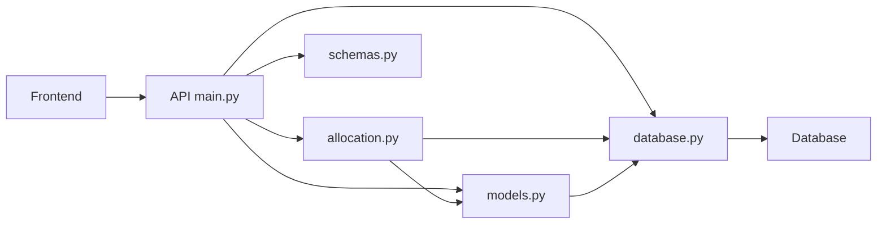
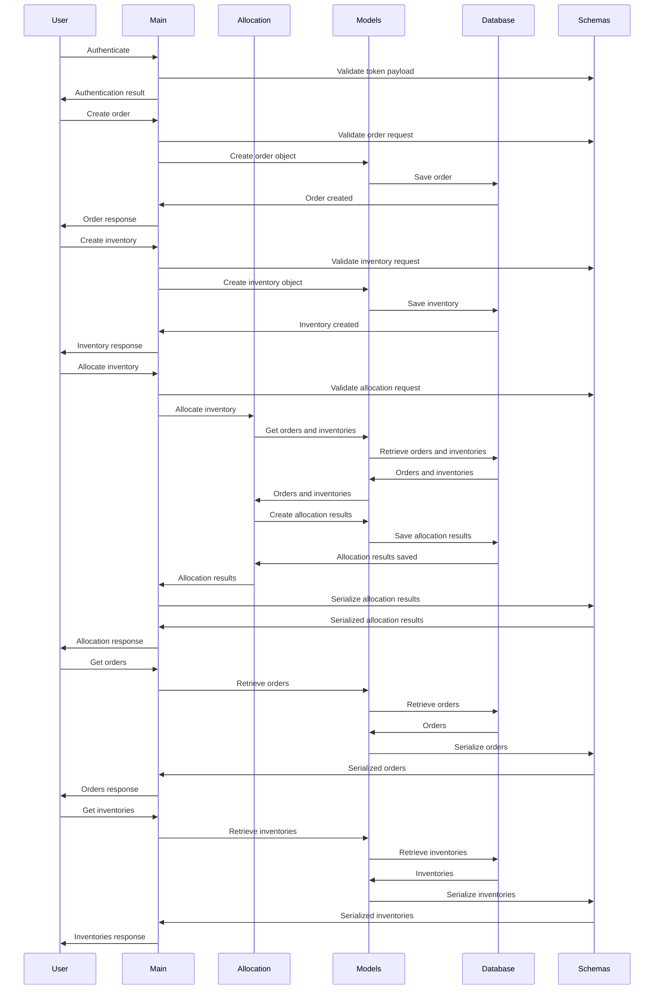
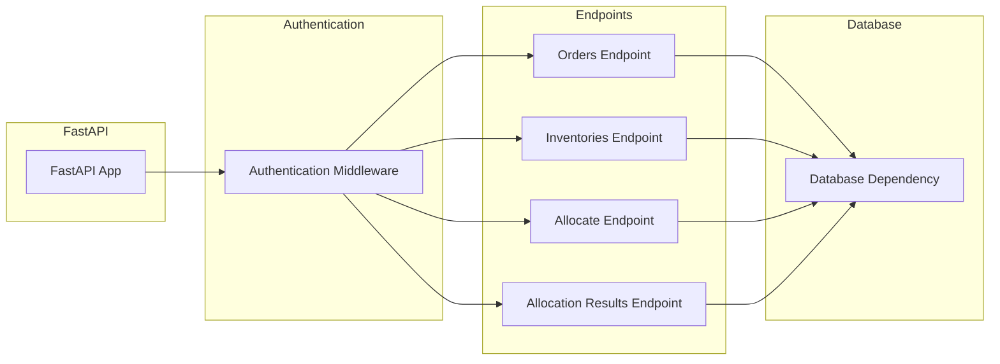
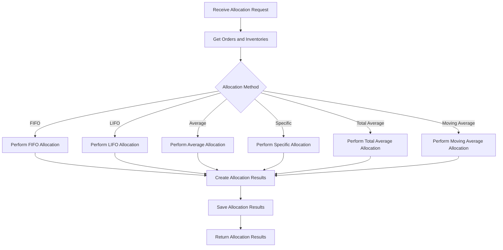
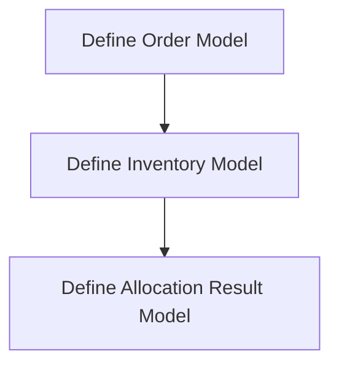
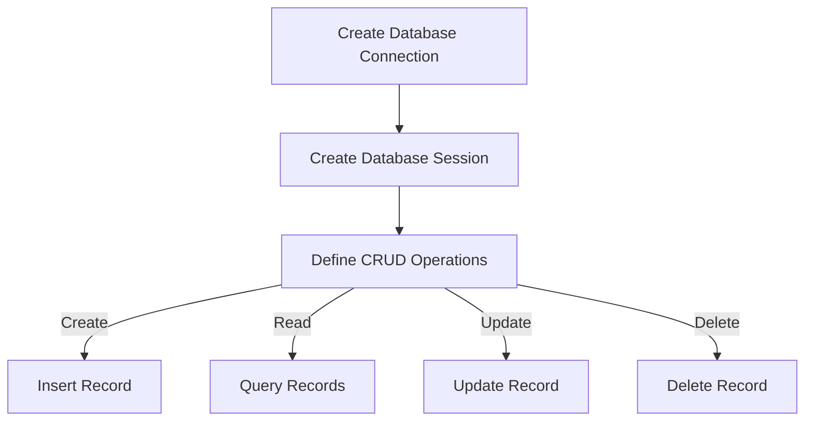
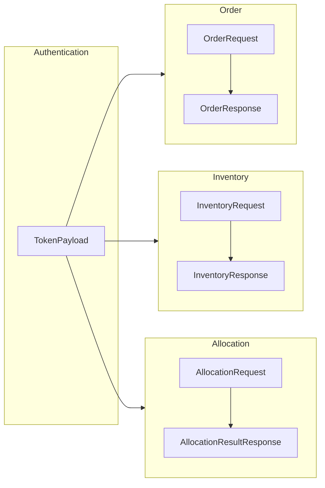

## プログラム設計書 - 在庫引当機能

### 1. 概要
   - 本プログラムは、受注から一般的な6種類の在庫引当を実施するためのバックエンドシステムを提供する。
   - プログラミング言語はPython、フレームワークはFastAPI、データベースはAmazon RDSのPostgreSQLを使用する。
   - デプロイ先はAWS Lambdaとする。

### 2. 機能要件
   - 受注データの登録、取得
   - 在庫データの登録、取得
   - 在庫引当の実行（先入先出法、後入先出法、平均法、個別法、総平均法、移動平均法）
   - 引当結果の保存、取得

### 3. システムアーキテクチャ
   - APIサーバー：FastAPIを使用してRESTfulなAPIエンドポイントを提供する。
   - データベース：Amazon RDSのPostgreSQLを使用してデータを永続化する。
   - ORM：SQLAlchemyを使用してデータベースとのやり取りを行う。
   - AWS Lambda：APIエンドポイントをサーバーレスで実行する。
   - Amazon API Gateway：APIエンドポイントへのアクセスを管理する。

### 4. データモデル
   - Order（受注）：order_id, item_code, quantity
   - Inventory（在庫）：item_code, quantity, receipt_date, unit_price
   - AllocationResult（引当結果）：allocation_id, order_id, item_code, allocated_quantity, allocated_price, allocation_date
   - Item（商品マスタ）：item_code, item_name, category, unit_price

### 5. APIエンドポイント
   - POST /orders：受注データの登録
   - GET /orders：受注データの取得
   - POST /inventories：在庫データの登録
   - GET /inventories：在庫データの取得
   - POST /allocate：在庫引当の実行
   - GET /allocation-results：引当結果の取得

### 6. 在庫引当ロジック
   - 先入先出法（FIFO）：最も古い在庫から順番に引き当てる。
   - 後入先出法（LIFO）：最も新しい在庫から順番に引き当てる。
   - 平均法：在庫の平均単価で引き当てる。
   - 個別法：受注に対応する在庫を個別に引き当てる。
   - 総平均法：全ての在庫の平均単価で引き当てる。
   - 移動平均法：引当時点での在庫の平均単価で引き当てる。

### 7. ブロック図
このブロック図は、アプリケーションの主要なコンポーネントとそれらの相互関係を示しています。



    1. フロントエンド（Frontend）:
     - ユーザーインターフェースを提供し、ユーザーの操作を処理します。
     - バックエンドのAPIと通信して、データの送受信を行います。

    2. API (main.py):
     - FastAPIを使用して実装されたWebAPIアプリケーションのメインエントリーポイントです。
     - 受信したリクエストを処理し、適切なレスポンスを返します。
     - 他のモジュール（`allocation.py`, `models.py`, `database.py`, `schemas.py`）と連携して、必要な処理を行います。

    3. allocation.py:
    - 在庫引当ロジックを実装したモジュールです。
    - 引当方法（FIFO、LIFO、平均法など）に基づいて、在庫の引当を行います。
    - `models.py`と`database.py`を使用して、必要なデータの取得と保存を行います。

    4. models.py:
    - データベースのテーブルに対応するデータモデルを定義するモジュールです。
    - SQLAlchemyを使用して、データベースとのマッピングを行います。
    - `database.py`と連携して、データベースとのやり取りを行います。

    5. database.py:
    - データベース接続とセッション管理を行うモジュールです。
    - SQLAlchemyを使用して、データベースとの接続を確立し、セッションを管理します。
    - `models.py`と連携して、データベースとのやり取りを行います。

    6. schemas.py:
    - APIのリクエストとレスポンスのデータ構造を定義するモジュールです。
    - Pydanticを使用して、データの検証とシリアライズ/デシリアライズを行います。
    - APIとのデータのやり取りに使用されます。

    7. Database:
    - アプリケーションのデータを永続的に保存するためのデータベースです。
    - PostgreSQLが使用されます。
    - `database.py`を介してアプリケーションとやり取りします。

これらのコンポーネントが連携して、在庫管理システムの在庫引当機能を提供します。フロントエンドからのリクエストがAPIに送信され、APIは適切なモジュールと連携して処理を行います。`allocation.py`は在庫引当ロジックを実装し、`models.py`と`database.py`を使用してデータベースとのやり取りを行います。`schemas.py`は、APIとのデータのやり取りに使用されます。


### 8. シーケンス図
このシーケンス図は、利用者とシステム内の各コンポーネント間のやり取りを示しています。

1. 利用者は、Mainを介して認証を行います。Mainは、Schemasを使用してトークンのペイロードを検証し、認証結果を利用者に返します。

2. 利用者は、Mainを介して注文を作成します。Mainは、Schemasを使用して注文リクエストを検証し、Modelsを使用して注文オブジェクトを作成します。注文はDatabaseに保存され、レスポンスが利用者に返されます。

3. 利用者は、Mainを介して在庫を作成します。Mainは、Schemasを使用して在庫リクエストを検証し、Modelsを使用して在庫オブジェクトを作成します。在庫はDatabaseに保存され、レスポンスが利用者に返されます。

4. 利用者は、Mainを介して在庫の割り当てを行います。Mainは、Schemasを使用して割り当てリクエストを検証し、Allocationを呼び出して在庫の割り当てを行います。Allocationは、Modelsを使用して注文と在庫を取得し、割り当て結果を作成します。割り当て結果はDatabaseに保存され、Schemasを使用してシリアライズされ、レスポンスが利用者に返されます。

5. 利用者は、Mainを介して注文を取得します。Mainは、Modelsを使用して注文を取得し、Schemasを使用してシリアライズされた注文をレスポンスとして利用者に返します。

6. 利用者は、Mainを介して在庫を取得します。Mainは、Modelsを使用して在庫を取得し、Schemasを使用してシリアライズされた在庫をレスポンスとして利用者に返します。

このシーケンス図は、システムの各コンポーネントがどのように相互作用するかを示しています。利用者とMainの間でリクエストとレスポンスのやり取りが行われ、Mainは他のコンポーネントと連携して必要な処理を行います。




### 9. エラーハンドリング
   - APIリクエストのバリデーションエラー：400 Bad Request
   - 受注データ、在庫データが見つからない場合：404 Not Found
   - サーバー内部エラー：500 Internal Server Error

### 10. セキュリティ
AWS Cognitoを利用して、APIエンドポイントへのアクセス時にユーザー認証を実施する。
API Gatewayにカスタム認可者を設定し、AWS Cognitoのユーザープールとの連携を行う。
ユーザーがAPIにアクセスする際は、まずAWS Cognitoでユーザー認証を行い、有効なJWTトークンを取得する必要がある。
API Gatewayは、リクエストヘッダーに含まれるJWTトークンを検証し、有効な場合にのみAPIエンドポイントへのアクセスを許可する。
JWTトークンには、ユーザーの識別情報や権限情報を含め、細粒度のアクセス制御を行う。
データベースへのアクセスはIAMロールで制限し、最小権限の原則に従ってアクセス権を設定する。
これにより、APIエンドポイントへのアクセスにはユーザー認証が必要となり、認証されたユーザーのみがAPIを利用できるようになります。また、JWTトークンを使用することで、ユーザーの識別情報や権限情報に基づいたアクセス制御が可能になります。

AWS Cognitoとの連携には、以下の手順が必要です。

AWS Cognitoでユーザープールを作成し、アプリクライアントを設定する。
API Gatewayにカスタム認可者を設定し、AWS Cognitoのユーザープールとの連携を行う。
アプリケーションでは、AWS Cognitoのユーザープールに対してユーザー登録とログインを行い、JWTトークンを取得する。
APIリクエストを送信する際は、取得したJWTトークンをリクエストヘッダーに含めて送信する。
API Gatewayは、リクエストヘッダーに含まれるJWTトークンを検証し、有効な場合にのみAPIエンドポイントへのアクセスを許可する。

### 11. テスト
   - ユニットテスト：各機能の単体テストを実施する。
   - 統合テスト：APIエンドポイントの統合テストを実施する。
   - テストデータ：テスト用の受注データ、在庫データ、商品マスタデータを準備する。

### 12. デプロイ
    - AWS Serverless Application Model（SAM）を使用してデプロイを管理する。
    - AWS CodePipelineとAWS CodeBuildを使用してCI/CDパイプラインを構築する。

### 13. 外部ライブラリ
    - FastAPI：APIフレームワーク
    - SQLAlchemy：ORMライブラリ
    - PyJWT：JWTトークンの生成と検証
    - pytest：テストフレームワーク

以上が、在庫管理システムの在庫引当機能を提供するWebAPIアプリケーションのプログラム仕様書です。本仕様書に基づいて、詳細な実装を進めていきます。


## 2.プログラム

main.pyファイルは、APIの中心的な役割を果たしています。認証、エンドポイントの定義、データベース操作、エラー処理、ログ出力などの機能を提供し、アプリケーションの全体的な動作を制御しています
1.インポートとアプリケーションの初期化：
    - 必要なモジュールとクラスをインポートしています。
    - FastAPIアプリケーションを作成し、app変数に割り当てています。
    - 認証スキームとしてHTTPBearerを使用しています。
2.ロガーの設定：
    - loggingモジュールを使用してロガーを設定しています。
    - ログレベルをINFOに設定し、ログメッセージのフォーマットを指定しています。
3.認証ミドルウェア：
    - authenticate_user関数は、JWTトークンを検証し、ユーザーを認証します。
    - トークンが有効な場合、TokenPayloadインスタンスを返します。
    - トークンが無効な場合、HTTPExceptionを発生させます。
4.APIエンドポイント：
    - /ordersエンドポイント：注文の作成と取得を処理します。
    - /inventoriesエンドポイント：在庫の作成と取得を処理します。
    - /allocateエンドポイント：在庫の割り当てを処理します。
    - /allocation-resultsエンドポイント：割り当て結果の取得を処理します。
5.エラー処理とログ出力：
    - 各エンドポイントでは、処理をtryブロックで囲み、例外が発生した場合のエラー処理を行っています。
    - エラーが発生した場合、適切なHTTPExceptionを発生させ、エラーメッセージをログに記録します。
    - 処理が正常に完了した場合、関連する情報をログに出力します。
6.データベース操作：
    - get_db関数を使用して、データベースセッションを取得します。
    - 各エンドポイントでは、データベースセッションを使用してデータベース操作を実行します。
    - エラーが発生した場合、データベースのロールバックを行います。
7.依存関係の注入：
    - Dependsを使用して、エンドポイントの依存関係を注入しています。
    - 認証ミドルウェアとデータベースセッションは、各エンドポイントで自動的に解決されます。
    - このmain.pyファイルは、APIの中心的な役割を果たしています。認証、エンドポイントの定義、データベース操作、エラー処理、ログ出力などの機能を提供し、アプリケーションの全体的な動作を制御しています。

ブロック図
このブロック図では、main.pyの主要なコンポーネントとその関連性を示しています。

    - FastAPI: FastAPIアプリケーションを表します。
    - Authentication: 認証ミドルウェアを表します。
    - Endpoints: 各APIエンドポイントを表します。
    - Database: データベース依存関係を表します。
認証ミドルウェアは、すべてのAPIエンドポイントに適用されます。各APIエンドポイントは、データベース依存関係を使用してデータベースとやり取りします。



`main.py`：
```python
from fastapi import FastAPI, HTTPException, Depends
from fastapi.security import HTTPBearer
from jose import jwt, JWTError
from sqlalchemy.orm import Session
from schemas import TokenPayload, OrderRequest, InventoryRequest, AllocationRequest
from models import Order, Inventory, AllocationResult
from database import get_db
from allocation import allocate_inventory
from utils import COGNITO_JWKS_URL, COGNITO_AUDIENCE, COGNITO_ISSUER
import logging

app = FastAPI()

auth_scheme = HTTPBearer()

# ロガーの設定
logger = logging.getLogger(__name__)
logger.setLevel(logging.INFO)
handler = logging.StreamHandler()
handler.setFormatter(logging.Formatter('%(asctime)s - %(name)s - %(levelname)s - %(message)s'))
logger.addHandler(handler)

async def authenticate_user(auth_token: str = Depends(auth_scheme)):
    try:
        payload = jwt.decode(auth_token.credentials, COGNITO_JWKS_URL, audience=COGNITO_AUDIENCE, issuer=COGNITO_ISSUER)
        token_data = TokenPayload(**payload)
        return token_data
    except JWTError as e:
        logger.error(f"Invalid authentication token: {e}")
        raise HTTPException(status_code=401, detail="Invalid authentication token")

@app.post("/orders", dependencies=[Depends(authenticate_user)])
def create_order(order: OrderRequest, db: Session = Depends(get_db)):
    try:
        db_order = Order(item_code=order.item_code, quantity=order.quantity)
        db.add(db_order)
        db.commit()
        db.refresh(db_order)
        logger.info(f"Order created: {db_order}")
        return db_order
    except Exception as e:
        logger.error(f"Error creating order: {e}")
        db.rollback()
        raise HTTPException(status_code=500, detail="Internal server error")

@app.get("/orders", dependencies=[Depends(authenticate_user)])
def get_orders(db: Session = Depends(get_db)):
    try:
        orders = db.query(Order).all()
        logger.info(f"Retrieved {len(orders)} orders")
        return orders
    except Exception as e:
        logger.error(f"Error retrieving orders: {e}")
        raise HTTPException(status_code=500, detail="Internal server error")

@app.post("/inventories", dependencies=[Depends(authenticate_user)])
def create_inventory(inventory: InventoryRequest, db: Session = Depends(get_db)):
    try:
        db_inventory = Inventory(item_code=inventory.item_code, quantity=inventory.quantity)
        db.add(db_inventory)
        db.commit()
        db.refresh(db_inventory)
        logger.info(f"Inventory created: {db_inventory}")
        return db_inventory
    except Exception as e:
        logger.error(f"Error creating inventory: {e}")
        db.rollback()
        raise HTTPException(status_code=500, detail="Internal server error")

@app.get("/inventories", dependencies=[Depends(authenticate_user)])
def get_inventories(db: Session = Depends(get_db)):
    try:
        inventories = db.query(Inventory).all()
        logger.info(f"Retrieved {len(inventories)} inventories")
        return inventories
    except Exception as e:
        logger.error(f"Error retrieving inventories: {e}")
        raise HTTPException(status_code=500, detail="Internal server error")

@app.post("/allocate", dependencies=[Depends(authenticate_user)])
def allocate(allocation: AllocationRequest, db: Session = Depends(get_db)):
    try:
        allocation_result = allocate_inventory(allocation.order_id, allocation.item_code, allocation.quantity, db)
        logger.info(f"Allocation completed: {allocation_result}")
        return allocation_result
    except Exception as e:
        logger.error(f"Error allocating inventory: {e}")
        db.rollback()
        raise HTTPException(status_code=500, detail="Internal server error")

@app.get("/allocation-results", dependencies=[Depends(authenticate_user)])
def get_allocation_results(db: Session = Depends(get_db)):
    try:
        allocation_results = db.query(AllocationResult).all()
        logger.info(f"Retrieved {len(allocation_results)} allocation results")
        return allocation_results
    except Exception as e:
        logger.error(f"Error retrieving allocation results: {e}")
        raise HTTPException(status_code=500, detail="Internal server error")
```

`allocation.py`は、在庫引当処理のロジックを実装する在庫引当プログラムです。このプログラムは、受注データと在庫データに基づいて、指定された引当方法を使用して在庫の引当を行います。
主な処理の流れは以下の通りです：
1. `allocate_inventory`関数が呼び出され、データベースセッションと引当方法が渡されます。
2. 受注データと在庫データをデータベースから取得します。
3. 各受注に対して、指定された引当方法に基づいて在庫の引当を行います。引当方法には、先入先出法（FIFO）、後入先出法（LIFO）、平均法、個別法、総平均法、移動平均法があります。
4. 引当処理では、受注の数量に対して、在庫から必要な数量を割り当てます。割り当てられた数量と金額は、`allocated_quantity`と`allocated_price`に記録されます。
5. 引当処理中に、在庫の数量が不足する場合は、可能な限り割り当てを行い、残りの数量は未割当のままとなります。
6. 引当処理が完了した後、引当結果を`AllocationResult`オブジェクトとして作成し、`allocation_results`リストに追加します。
7. 引当処理中に例外が発生した場合は、エラーメッセージをログに出力し、例外を再度発生させます。
8. 全ての受注に対する引当処理が完了した後、`allocation_results`リストに格納された引当結果をデータベースに一括で保存します。
9. 最後に、引当結果のリストを返します。
`allocation.py`では、引当方法ごとに異なるロジックが実装されています。各引当方法は、在庫の割当方法や計算方法が異なります。
また、このプログラムではログ出力も行われます。引当処理が正常に完了した場合は、引当結果の詳細をログに出力します。引当処理中にエラーが発生した場合は、エラーメッセージをログに出力します。
`allocation.py`は、在庫引当処理の中核となるロジックを提供し、受注データと在庫データに基づいて適切な在庫の割当を行います。このプログラムは、`main.py`から呼び出され、在庫引当機能を実現するために使用されます。


この`allocation.py`ファイルは、在庫の割り当てロジックを実装しています。

主要な部分を説明します：

1. インポートとロガーの設定：
   - 必要なモジュールとクラスをインポートしています。
   - `logging`モジュールを使用してロガーを設定し、ログレベルとフォーマットを指定しています。

2. `allocate_inventory`関数：
   - この関数は、指定された割り当て方法に基づいて在庫を注文に割り当てます。
   - 引数として、データベースセッション（`db`）と割り当て方法（`allocation_method`）を受け取ります。

3. 割り当て方法の実装：
   - 関数内では、指定された割り当て方法に応じて、在庫を注文に割り当てるロジックが実装されています。
   - 以下の割り当て方法が利用可能です：
     - "FIFO"：先入先出法に基づいて在庫を割り当てます。
     - "LIFO"：後入先出法に基づいて在庫を割り当てます。
     - "AVERAGE"：平均価格に基づいて在庫を割り当てます。
     - "SPECIFIC"：特定の在庫アイテムを割り当てます。
     - "TOTAL_AVERAGE"：全ての在庫の平均価格に基づいて割り当てます。
     - "MOVING_AVERAGE"：移動平均価格に基づいて割り当てます。

4. 割り当て結果の保存：
   - 割り当てが完了すると、`AllocationResult`オブジェクトが作成され、割り当て結果のリストに追加されます。
   - 割り当て結果には、注文ID、商品コード、割り当て数量、割り当て価格、割り当て日付が含まれます。

5. エラー処理とログ出力：
   - 割り当て処理中に例外が発生した場合、エラーメッセージをログに記録し、例外を再度発生させます。
   - 割り当てが正常に完了した場合、割り当て結果の詳細をログに出力します。

6. データベースへの保存とコミット：
   - 割り当て結果のリストを`bulk_save_objects`メソッドを使用してデータベースに一括保存します。
   - `commit`メソッドを呼び出して、変更をデータベースにコミットします。

7. 割り当て結果の返却：
   - 割り当て結果のリストを呼び出し元に返却します。

この`allocation.py`ファイルは、在庫割り当てのコアロジックを提供します。異なる割り当て方法を実装し、注文に対して在庫を割り当てます。割り当て結果はデータベースに保存され、ログに記録されます。このファイルは、`main.py`から呼び出され、在庫割り当てプロセスの中心的な役割を果たします。

`allocation.py`：
```python
from sqlalchemy.orm import Session
from models import Order, Inventory, AllocationResult
from datetime import datetime
import logging

logger = logging.getLogger(__name__)
logger.setLevel(logging.INFO)

handler = logging.StreamHandler()
handler.setLevel(logging.INFO)
formatter = logging.Formatter("%(asctime)s - %(name)s - %(levelname)s - %(message)s")
handler.setFormatter(formatter)
logger.addHandler(handler)

def allocate_inventory(db: Session, allocation_method: str):
    orders = db.query(Order).all()
    inventories = db.query(Inventory).all()
    
    allocation_results = []
    
    for order in orders:
        allocated_quantity = 0
        allocated_price = 0
        
        try:
            if allocation_method == "FIFO":
                for inventory in inventories:
                    if inventory.item_code == order.item_code and inventory.quantity > 0:
                        if inventory.quantity >= order.quantity - allocated_quantity:
                            allocated_quantity += order.quantity - allocated_quantity
                            allocated_price += (order.quantity - allocated_quantity) * inventory.unit_price
                            inventory.quantity -= order.quantity - allocated_quantity
                        else:
                            allocated_quantity += inventory.quantity
                            allocated_price += inventory.quantity * inventory.unit_price
                            inventory.quantity = 0
                        
                        if allocated_quantity == order.quantity:
                            break
            
            elif allocation_method == "LIFO":
                for inventory in reversed(inventories):
                    if inventory.item_code == order.item_code and inventory.quantity > 0:
                        if inventory.quantity >= order.quantity - allocated_quantity:
                            allocated_quantity += order.quantity - allocated_quantity
                            allocated_price += (order.quantity - allocated_quantity) * inventory.unit_price
                            inventory.quantity -= order.quantity - allocated_quantity
                        else:
                            allocated_quantity += inventory.quantity
                            allocated_price += inventory.quantity * inventory.unit_price
                            inventory.quantity = 0
                        
                        if allocated_quantity == order.quantity:
                            break
            
            elif allocation_method == "AVERAGE":
                total_quantity = sum(inventory.quantity for inventory in inventories if inventory.item_code == order.item_code)
                total_price = sum(inventory.quantity * inventory.unit_price for inventory in inventories if inventory.item_code == order.item_code)
                
                if total_quantity >= order.quantity:
                    average_price = total_price / total_quantity
                    allocated_quantity = order.quantity
                    allocated_price = order.quantity * average_price
                    
                    for inventory in inventories:
                        if inventory.item_code == order.item_code:
                            if inventory.quantity >= order.quantity:
                                inventory.quantity -= order.quantity
                                order.quantity = 0
                            else:
                                order.quantity -= inventory.quantity
                                inventory.quantity = 0
                            
                            if order.quantity == 0:
                                break
            
            elif allocation_method == "SPECIFIC":
                for inventory in inventories:
                    if inventory.item_code == order.item_code and inventory.quantity >= order.quantity:
                        allocated_quantity = order.quantity
                        allocated_price = order.quantity * inventory.unit_price
                        inventory.quantity -= order.quantity
                        break
            
            elif allocation_method == "TOTAL_AVERAGE":
                total_quantity = sum(inventory.quantity for inventory in inventories)
                total_price = sum(inventory.quantity * inventory.unit_price for inventory in inventories)
                
                if total_quantity >= order.quantity:
                    average_price = total_price / total_quantity
                    allocated_quantity = order.quantity
                    allocated_price = order.quantity * average_price
                    
                    for inventory in inventories:
                        if inventory.quantity >= order.quantity:
                            inventory.quantity -= order.quantity
                            order.quantity = 0
                        else:
                            order.quantity -= inventory.quantity
                            inventory.quantity = 0
                        
                        if order.quantity == 0:
                            break
            
            elif allocation_method == "MOVING_AVERAGE":
                total_quantity = 0
                total_price = 0
                
                for inventory in inventories:
                    if inventory.item_code == order.item_code:
                        total_quantity += inventory.quantity
                        total_price += inventory.quantity * inventory.unit_price
                        
                        if total_quantity >= order.quantity:
                            average_price = total_price / total_quantity
                            allocated_quantity = order.quantity
                            allocated_price = order.quantity * average_price
                            
                            inventory.quantity -= order.quantity
                            break
            
            else:
                raise ValueError("Invalid allocation method")
            
            allocation_result = AllocationResult(
                order_id=order.order_id,
                item_code=order.item_code,
                allocated_quantity=allocated_quantity,
                allocated_price=allocated_price,
                allocation_date=datetime.now().date()
            )
            
            allocation_results.append(allocation_result)
            
            logger.info(f"Allocation completed for order {order.order_id}. Allocated quantity: {allocated_quantity}, Allocated price: {allocated_price}")
        
        except Exception as e:
            logger.error(f"Error during allocation for order {order.order_id}: {str(e)}")
            raise
    
    db.bulk_save_objects(allocation_results)
    db.commit()
    
    return allocation_results
```

この`models.py`ファイルは、SQLAlchemyを使用してデータベースのテーブル構造を定義しています。
1. インポート：
   - `sqlalchemy`モジュールから必要なクラスをインポートしています。
   - `database`モジュールから`Base`クラスをインポートしています。

2. `Order`クラス：
   - 注文情報を表すテーブルを定義しています。
   - `__tablename__`属性で、テーブル名を指定しています。
   - 以下のカラムを定義しています：
     - `order_id`：注文IDを表す主キーカラム（文字列型）
     - `item_code`：商品コードを表すカラム（文字列型）
     - `quantity`：数量を表すカラム（整数型）
   - `allocation_results`属性で、`AllocationResult`クラスとのリレーションシップを定義しています。

3. `Inventory`クラス：
   - 在庫情報を表すテーブルを定義しています。
   - `__tablename__`属性で、テーブル名を指定しています。
   - 以下のカラムを定義しています：
     - `id`：在庫IDを表す主キーカラム（整数型）
     - `item_code`：商品コードを表すカラム（文字列型）
     - `quantity`：数量を表すカラム（整数型）
     - `receipt_date`：入荷日を表すカラム（日付型）
     - `unit_price`：単価を表すカラム（浮動小数点型）

4. `AllocationResult`クラス：
   - 割り当て結果情報を表すテーブルを定義しています。
   - `__tablename__`属性で、テーブル名を指定しています。
   - 以下のカラムを定義しています：
     - `id`：割り当て結果IDを表す主キーカラム（整数型）
     - `order_id`：注文IDを表す外部キーカラム（文字列型）
     - `item_code`：商品コードを表すカラム（文字列型）
     - `allocated_quantity`：割り当て数量を表すカラム（整数型）
     - `allocated_price`：割り当て価格を表すカラム（浮動小数点型）
     - `allocation_date`：割り当て日付を表すカラム（日付型）
   - `order`属性で、`Order`クラスとのリレーションシップを定義しています。

この`models.py`ファイルは、アプリケーションで使用されるデータベースのテーブル構造を定義しています。`Order`クラスは注文情報を、`Inventory`クラスは在庫情報を、`AllocationResult`クラスは割り当て結果情報を表しています。これらのクラスは、SQLAlchemyのORM（Object-Relational Mapping）機能を利用して、Pythonのオブジェクトとデータベースのテーブル間のマッピングを行います。



```python
from sqlalchemy import Column, Integer, String, Date, Float, ForeignKey
from sqlalchemy.orm import relationship
from database import Base

class Order(Base):
    __tablename__ = "orders"

    order_id = Column(String, primary_key=True, index=True)
    item_code = Column(String, index=True)
    quantity = Column(Integer)

    allocation_results = relationship("AllocationResult", back_populates="order")

class Inventory(Base):
    __tablename__ = "inventories"

    id = Column(Integer, primary_key=True, index=True)
    item_code = Column(String, index=True)
    quantity = Column(Integer)
    receipt_date = Column(Date)
    unit_price = Column(Float)

class AllocationResult(Base):
    __tablename__ = "allocation_results"

    id = Column(Integer, primary_key=True, index=True)
    order_id = Column(String, ForeignKey("orders.order_id"))
    item_code = Column(String, index=True)
    allocated_quantity = Column(Integer)
    allocated_price = Column(Float)
    allocation_date = Column(Date)

    order = relationship("Order", back_populates="allocation_results")
```


`database.py`ファイルは、データベース接続の設定と初期化を行っています。

主要な部分を説明します：

1. インポート：
   - `sqlalchemy`モジュールから必要なクラスをインポートしています。
   - `os`モジュールをインポートしています。

2. 環境変数の取得：
   - `os.environ.get()`を使用して、環境変数からデータベース接続情報を取得しています。
   - 以下の環境変数が使用されています：
     - `DB_HOST`：データベースのホスト名
     - `DB_PORT`：データベースのポート番号
     - `DB_NAME`：データベース名
     - `DB_USER`：データベースのユーザー名
     - `DB_PASSWORD`：データベースのパスワード

3. データベース接続URLの作成：
   - 取得した環境変数を使用して、SQLAlchemyのデータベース接続URLを作成しています。
   - URLの形式は、`postgresql://ユーザー名:パスワード@ホスト名:ポート番号/データベース名`です。

4. エンジンの作成：
   - `create_engine()`関数を使用して、データベースエンジンを作成しています。
   - エンジンは、データベースとの接続を管理するためのオブジェクトです。

5. セッションの作成：
   - `sessionmaker()`関数を使用して、セッションファクトリを作成しています。
   - セッションファクトリは、データベースとのセッションを作成するためのオブジェクトです。
   - `autocommit`と`autoflush`をFalseに設定し、エンジンをバインドしています。

6. ベースクラスの作成：
   - `declarative_base()`関数を使用して、SQLAlchemyのベースクラスを作成しています。
   - ベースクラスは、モデルクラスの基底クラスとして使用されます。

この`database.py`ファイルは、データベース接続の設定と初期化を行うための中心的な役割を果たしています。環境変数からデータベース接続情報を取得し、SQLAlchemyのエンジンとセッションを作成します。また、SQLAlchemyのベースクラスを提供し、モデルクラスの基底クラスとして使用されます。

他のファイルでは、この`database.py`ファイルから必要なオブジェクトをインポートして使用します。例えば、`models.py`ファイルでは`Base`クラスを継承してモデルクラスを定義し、`main.py`ファイルでは`SessionLocal`を使用してデータベースセッションを取得します。



`database.py`：
```python
from sqlalchemy import create_engine
from sqlalchemy.ext.declarative import declarative_base
from sqlalchemy.orm import sessionmaker
import os

DB_HOST = os.environ.get("DB_HOST")
DB_PORT = os.environ.get("DB_PORT")
DB_NAME = os.environ.get("DB_NAME")
DB_USER = os.environ.get("DB_USER")
DB_PASSWORD = os.environ.get("DB_PASSWORD")

SQLALCHEMY_DATABASE_URL = f"postgresql://{DB_USER}:{DB_PASSWORD}@{DB_HOST}:{DB_PORT}/{DB_NAME}"

engine = create_engine(SQLALCHEMY_DATABASE_URL)
SessionLocal = sessionmaker(autocommit=False, autoflush=False, bind=engine)

Base = declarative_base()
```

`schemas.py`ファイルは、Pydanticを使用してデータの検証とシリアライゼーションを行うためのスキーマを定義しています。

1. インポート：
   - `pydantic`モジュールから`BaseModel`クラスをインポートしています。
   - `datetime`モジュールをインポートしています。
   - `typing`モジュールから`List`をインポートしています。

2. `TokenPayload`クラス：
   - JWTトークンのペイロードを表すスキーマを定義しています。
   - トークンに含まれる情報をプロパティとして定義しています。

3. `OrderRequest`クラス：
   - 注文リクエストのスキーマを定義しています。
   - 注文リクエストに必要な情報（商品コードと数量）をプロパティとして定義しています。

4. `InventoryRequest`クラス：
   - 在庫リクエストのスキーマを定義しています。
   - 在庫リクエストに必要な情報（商品コードと数量）をプロパティとして定義しています。

5. `AllocationRequest`クラス：
   - 割り当てリクエストのスキーマを定義しています。
   - 割り当てリクエストに必要な情報（注文ID、商品コード、数量）をプロパティとして定義しています。

6. `OrderResponse`クラス：
   - 注文レスポンスのスキーマを定義しています。
   - 注文レスポンスに含まれる情報（ID、商品コード、数量）をプロパティとして定義しています。
   - `Config`クラスで`orm_mode`を`True`に設定し、ORMオブジェクトからデータを読み取ることを指定しています。

7. `InventoryResponse`クラス：
   - 在庫レスポンスのスキーマを定義しています。
   - 在庫レスポンスに含まれる情報（ID、商品コード、数量）をプロパティとして定義しています。
   - `Config`クラスで`orm_mode`を`True`に設定し、ORMオブジェクトからデータを読み取ることを指定しています。

8. `AllocationResultResponse`クラス：
   - 割り当て結果レスポンスのスキーマを定義しています。
   - 割り当て結果レスポンスに含まれる情報（ID、注文ID、商品コード、割り当て数量、割り当て日付）をプロパティとして定義しています。
   - `Config`クラスで`orm_mode`を`True`に設定し、ORMオブジェクトからデータを読み取ることを指定しています。

この`schemas.py`ファイルは、アプリケーション内で使用されるデータの構造を定義するためのスキーマを提供しています。これらのスキーマは、リクエストの検証、レスポンスのシリアライゼーション、およびORMオブジェクトとの相互変換に使用されます。

例えば、`OrderRequest`スキーマは注文リクエストの検証に使用され、`OrderResponse`スキーマは注文レスポンスのシリアライゼーションに使用されます。また、`Config`クラスの`orm_mode`を`True`に設定することで、ORMオブジェクトからデータを読み取ることができます。



`schemas.py`：
```python
from pydantic import BaseModel
from datetime import datetime
from typing import List

class TokenPayload(BaseModel):
    sub: str
    cognito:username: str
    email: str
    email_verified: bool
    given_name: str
    family_name: str
    roles: List[str]
    iss: str
    aud: str
    exp: int
    iat: int

class OrderRequest(BaseModel):
    item_code: str
    quantity: int

class InventoryRequest(BaseModel):
    item_code: str
    quantity: int

class AllocationRequest(BaseModel):
    order_id: int
    item_code: str
    quantity: int

class OrderResponse(BaseModel):
    id: int
    item_code: str
    quantity: int

    class Config:
        orm_mode = True

class InventoryResponse(BaseModel):
    id: int
    item_code: str
    quantity: int

    class Config:
        orm_mode = True

class AllocationResultResponse(BaseModel):
    id: int
    order_id: int
    item_code: str
    allocated_quantity: int
    allocation_date: datetime

    class Config:
        orm_mode = True

```

