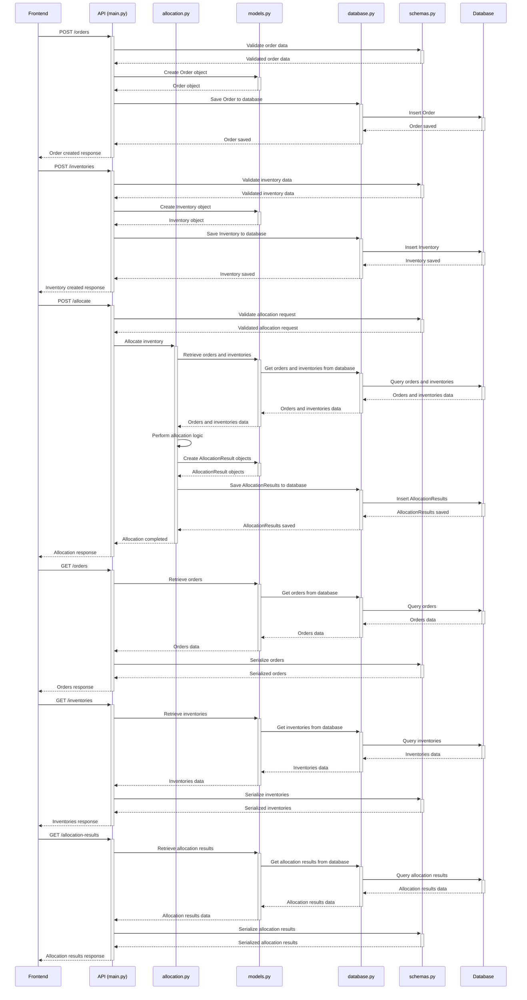
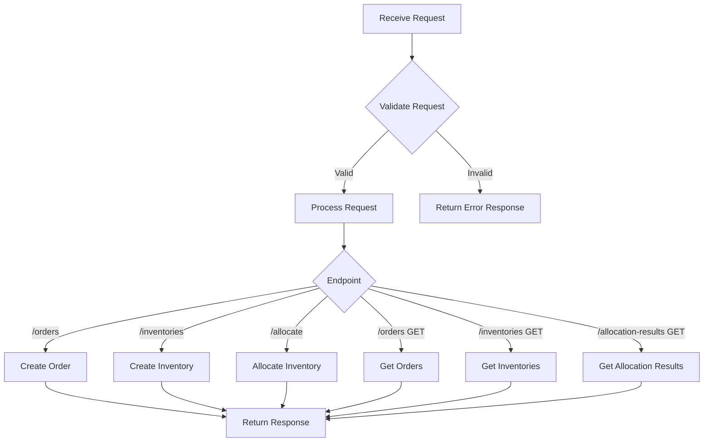
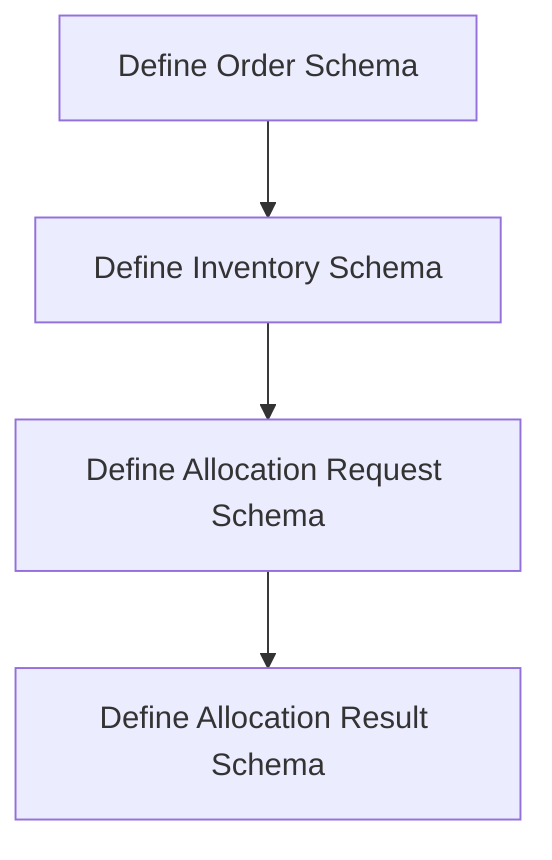

## プログラム設計書 - 在庫引当機能

### 1. 概要
   - 本プログラムは、受注から一般的な6種類の在庫引当を実施するためのバックエンドシステムを提供する。
   - プログラミング言語はPython、フレームワークはFastAPI、データベースはAmazon RDSのPostgreSQLを使用する。
   - デプロイ先はAWS Lambdaとする。

### 2. 機能要件
   - 受注データの登録、取得
   - 在庫データの登録、取得
   - 在庫引当の実行（先入先出法、後入先出法、平均法、個別法、総平均法、移動平均法）
   - 引当結果の保存、取得

### 3. システムアーキテクチャ
   - APIサーバー：FastAPIを使用してRESTfulなAPIエンドポイントを提供する。
   - データベース：Amazon RDSのPostgreSQLを使用してデータを永続化する。
   - ORM：SQLAlchemyを使用してデータベースとのやり取りを行う。
   - AWS Lambda：APIエンドポイントをサーバーレスで実行する。
   - Amazon API Gateway：APIエンドポイントへのアクセスを管理する。

### 4. データモデル
   - Order（受注）：order_id, item_code, quantity
   - Inventory（在庫）：item_code, quantity, receipt_date, unit_price
   - AllocationResult（引当結果）：allocation_id, order_id, item_code, allocated_quantity, allocated_price, allocation_date
   - Item（商品マスタ）：item_code, item_name, category, unit_price

### 5. APIエンドポイント
   - POST /orders：受注データの登録
   - GET /orders：受注データの取得
   - POST /inventories：在庫データの登録
   - GET /inventories：在庫データの取得
   - POST /allocate：在庫引当の実行
   - GET /allocation-results：引当結果の取得

### 6. 在庫引当ロジック
   - 先入先出法（FIFO）：最も古い在庫から順番に引き当てる。
   - 後入先出法（LIFO）：最も新しい在庫から順番に引き当てる。
   - 平均法：在庫の平均単価で引き当てる。
   - 個別法：受注に対応する在庫を個別に引き当てる。
   - 総平均法：全ての在庫の平均単価で引き当てる。
   - 移動平均法：引当時点での在庫の平均単価で引き当てる。

### 7. ブロック図
このブロック図は、アプリケーションの主要なコンポーネントとそれらの相互関係を示しています。


    1. フロントエンド（Frontend）:
     - ユーザーインターフェースを提供し、ユーザーの操作を処理します。
     - バックエンドのAPIと通信して、データの送受信を行います。

    2. API (main.py):
     - FastAPIを使用して実装されたWebAPIアプリケーションのメインエントリーポイントです。
     - 受信したリクエストを処理し、適切なレスポンスを返します。
     - 他のモジュール（`allocation.py`, `models.py`, `database.py`, `schemas.py`）と連携して、必要な処理を行います。

    3. allocation.py:
    - 在庫引当ロジックを実装したモジュールです。
    - 引当方法（FIFO、LIFO、平均法など）に基づいて、在庫の引当を行います。
    - `models.py`と`database.py`を使用して、必要なデータの取得と保存を行います。

    4. models.py:
    - データベースのテーブルに対応するデータモデルを定義するモジュールです。
    - SQLAlchemyを使用して、データベースとのマッピングを行います。
    - `database.py`と連携して、データベースとのやり取りを行います。

    5. database.py:
    - データベース接続とセッション管理を行うモジュールです。
    - SQLAlchemyを使用して、データベースとの接続を確立し、セッションを管理します。
    - `models.py`と連携して、データベースとのやり取りを行います。

    6. schemas.py:
    - APIのリクエストとレスポンスのデータ構造を定義するモジュールです。
    - Pydanticを使用して、データの検証とシリアライズ/デシリアライズを行います。
    - APIとのデータのやり取りに使用されます。

    7. Database:
    - アプリケーションのデータを永続的に保存するためのデータベースです。
    - PostgreSQLが使用されます。
    - `database.py`を介してアプリケーションとやり取りします。

これらのコンポーネントが連携して、在庫管理システムの在庫引当機能を提供します。フロントエンドからのリクエストがAPIに送信され、APIは適切なモジュールと連携して処理を行います。`allocation.py`は在庫引当ロジックを実装し、`models.py`と`database.py`を使用してデータベースとのやり取りを行います。`schemas.py`は、APIとのデータのやり取りに使用されます。


### 8. シーケンス図

このシーケンス図は、フロントエンドアプリケーションとバックエンドのAPIおよびデータベースの間のインタラクションを示しています。

    1. フロントエンドアプリケーションは、受注データを`/orders`エンドポイントに送信します。APIは受注データを検証し、データベースに保存します。

    2. フロントエンドアプリケーションは、在庫データを`/inventories`エンドポイントに送信します。APIは在庫データを検証し、データベースに保存します。

    3. フロントエンドアプリケーションは、`/allocate`エンドポイントに在庫引当のリクエストを送信します。APIはリクエストを検証し、`allocation.py`モジュールを呼び出して在庫引当処理を実行します。`allocation.py`は、`models.py`と`database.py`を使用して、必要なデータを取得し、引当ロジックを適用します。引当結果は、データベースに保存されます。

    4. フロントエンドアプリケーションは、`/orders`エンドポイントにGETリクエストを送信して、受注データを取得します。APIは`models.py`と`database.py`を使用してデータを取得し、`schemas.py`を使用してシリアライズされた応答を返します。

    5. フロントエンドアプリケーションは、`/inventories`エンドポイントにGETリクエストを送信して、在庫データを取得します。APIは`models.py`と`database.py`を使用してデータを取得し、`schemas.py`を使用してシリアライズされた応答を返します。

    6. フロントエンドアプリケーションは、`/allocation-results`エンドポイントにGETリクエストを送信して、引当結果を取得します。APIは`models.py`と`database.py`を使用してデータを取得し、`schemas.py`を使用してシリアライズされた応答を返します。

このシーケンス図は、アプリケーションの主要なフローを示しています。実際のアプリケーションでは、エラーハンドリング、認証、認可などの追加の手順が含まれる場合があります。


### 9. エラーハンドリング
   - APIリクエストのバリデーションエラー：400 Bad Request
   - 受注データ、在庫データが見つからない場合：404 Not Found
   - サーバー内部エラー：500 Internal Server Error

### 10. セキュリティ
   - APIエンドポイントにはAWS Lambdaの認証機能を適用する。
   - データベースへのアクセスはIAMロールで制限する。

### 11. テスト
   - ユニットテスト：各機能の単体テストを実施する。
   - 統合テスト：APIエンドポイントの統合テストを実施する。
   - テストデータ：テスト用の受注データ、在庫データ、商品マスタデータを準備する。

### 12. デプロイ
    - AWS Serverless Application Model（SAM）を使用してデプロイを管理する。
    - AWS CodePipelineとAWS CodeBuildを使用してCI/CDパイプラインを構築する。

### 13. 外部ライブラリ
    - FastAPI：APIフレームワーク
    - SQLAlchemy：ORMライブラリ
    - PyJWT：JWTトークンの生成と検証
    - pytest：テストフレームワーク

以上が、在庫管理システムの在庫引当機能を提供するWebAPIアプリケーションのプログラム仕様書です。本仕様書に基づいて、詳細な実装を進めていきます。


## 2.プログラム

`main.py`は、FastAPIを使用してWebAPIエンドポイントを定義するメインプログラムです。このプログラムは、在庫管理システムの在庫引当機能を提供するためのAPIエンドポイントを定義し、リクエストの処理とレスポンスの返却を行います。

主な処理の流れは以下の通りです：
  1. FastAPIのインスタンスを作成します。
  2. ロガーを設定し、ログ出力の設定を行います。
  3. データベースセッションを取得するための依存関係を定義します。
  4. 受注データの登録と取得のためのエンドポイントを定義します。
     - `create_order`エンドポイントでは、受注データをデータベースに登録します。
     - `get_orders`エンドポイントでは、登録された受注データを取得します。
  5. 在庫データの登録と取得のためのエンドポイントを定義します。
     - `create_inventory`エンドポイントでは、在庫データをデータベースに登録します。
     - `get_inventories`エンドポイントでは、登録された在庫データを取得します。
  6. 在庫引当処理の実行のためのエンドポイントを定義します。
     - `allocate`エンドポイントでは、指定された引当方法を使用して在庫引当処理を実行します。
     - 引当処理の実行には、`allocation.py`の`allocate_inventory`関数を呼び出します。
  7. 引当結果の取得のためのエンドポイントを定義します。
     - `get_allocation_results`エンドポイントでは、引当処理の結果を取得します。
  8. エラーハンドリングのためのエクセプションハンドラを定義します。
     - `http_exception_handler`は、HTTPExceptionが発生した場合のエラー応答を返します。
  9. AWS Lambda用のエントリーポイントを定義します。
     - `lambda_handler`関数は、AWS Lambdaからの呼び出しを受け取り、FastAPIアプリケーションを実行します。

`main.py`では、各エンドポイントの処理内で発生した例外をキャッチし、適切なHTTPステータスコードとエラーメッセージを返すようにしています。また、例外の詳細をログに出力しています。
このプログラムは、APIエンドポイントを介して、受注データと在庫データの登録・取得、在庫引当処理の実行、引当結果の取得などの機能を提供します。APIリクエストに応じて、適切な処理を行い、結果をレスポンスとして返却します。
`main.py`は、在庫管理システムのWebAPIの中核となるプログラムであり、他のモジュール（`allocation.py`、`models.py`、`database.py`、`schemas.py`）と連携して、在庫引当機能を実現します。




`main.py`：
```python
from fastapi import FastAPI, HTTPException, Depends
from sqlalchemy.orm import Session
from models import Order, Inventory, AllocationResult, Item
from database import SessionLocal, engine
from schemas import OrderRequest, InventoryRequest, AllocationRequest
from allocation import allocate_inventory
import logging

app = FastAPI()

# ロガーの設定
logger = logging.getLogger(__name__)
logger.setLevel(logging.INFO)

handler = logging.StreamHandler()
handler.setLevel(logging.INFO)
formatter = logging.Formatter("%(asctime)s - %(name)s - %(levelname)s - %(message)s")
handler.setFormatter(formatter)
logger.addHandler(handler)

def get_db():
    db = SessionLocal()
    try:
        yield db
    finally:
        db.close()

@app.post("/orders")
def create_order(order: OrderRequest, db: Session = Depends(get_db)):
    try:
        db_order = Order(order_id=order.order_id, item_code=order.item_code, quantity=order.quantity)
        db.add(db_order)
        db.commit()
        db.refresh(db_order)
        logger.info(f"Order created: {db_order}")
        return db_order
    except Exception as e:
        logger.error(f"Error creating order: {str(e)}")
        raise HTTPException(status_code=500, detail="Internal Server Error")

@app.get("/orders")
def get_orders(db: Session = Depends(get_db)):
    try:
        orders = db.query(Order).all()
        logger.info(f"Retrieved {len(orders)} orders")
        return orders
    except Exception as e:
        logger.error(f"Error retrieving orders: {str(e)}")
        raise HTTPException(status_code=500, detail="Internal Server Error")

@app.post("/inventories")
def create_inventory(inventory: InventoryRequest, db: Session = Depends(get_db)):
    try:
        db_inventory = Inventory(item_code=inventory.item_code, quantity=inventory.quantity,
                                 receipt_date=inventory.receipt_date, unit_price=inventory.unit_price)
        db.add(db_inventory)
        db.commit()
        db.refresh(db_inventory)
        logger.info(f"Inventory created: {db_inventory}")
        return db_inventory
    except Exception as e:
        logger.error(f"Error creating inventory: {str(e)}")
        raise HTTPException(status_code=500, detail="Internal Server Error")

@app.get("/inventories")
def get_inventories(db: Session = Depends(get_db)):
    try:
        inventories = db.query(Inventory).all()
        logger.info(f"Retrieved {len(inventories)} inventories")
        return inventories
    except Exception as e:
        logger.error(f"Error retrieving inventories: {str(e)}")
        raise HTTPException(status_code=500, detail="Internal Server Error")

@app.post("/allocate")
def allocate(allocation: AllocationRequest, db: Session = Depends(get_db)):
    try:
        result = allocate_inventory(db, allocation.allocation_method)
        logger.info(f"Allocation completed. Results: {result}")
        return result
    except ValueError as e:
        logger.error(f"Invalid allocation method: {str(e)}")
        raise HTTPException(status_code=400, detail="Invalid allocation method")
    except Exception as e:
        logger.error(f"Error during allocation: {str(e)}")
        raise HTTPException(status_code=500, detail="Internal Server Error")

@app.get("/allocation-results")
def get_allocation_results(db: Session = Depends(get_db)):
    try:
        allocation_results = db.query(AllocationResult).all()
        logger.info(f"Retrieved {len(allocation_results)} allocation results")
        return allocation_results
    except Exception as e:
        logger.error(f"Error retrieving allocation results: {str(e)}")
        raise HTTPException(status_code=500, detail="Internal Server Error")

@app.exception_handler(HTTPException)
async def http_exception_handler(request, exc):
    logger.error(f"HTTP Exception: {exc.detail}")
    return JSONResponse(
        status_code=exc.status_code,
        content={"message": exc.detail},
    )

def lambda_handler(event, context):
    return app(event, context)
```

`allocation.py`は、在庫引当処理のロジックを実装する在庫引当プログラムです。このプログラムは、受注データと在庫データに基づいて、指定された引当方法を使用して在庫の引当を行います。
主な処理の流れは以下の通りです：
1. `allocate_inventory`関数が呼び出され、データベースセッションと引当方法が渡されます。
2. 受注データと在庫データをデータベースから取得します。
3. 各受注に対して、指定された引当方法に基づいて在庫の引当を行います。引当方法には、先入先出法（FIFO）、後入先出法（LIFO）、平均法、個別法、総平均法、移動平均法があります。
4. 引当処理では、受注の数量に対して、在庫から必要な数量を割り当てます。割り当てられた数量と金額は、`allocated_quantity`と`allocated_price`に記録されます。
5. 引当処理中に、在庫の数量が不足する場合は、可能な限り割り当てを行い、残りの数量は未割当のままとなります。
6. 引当処理が完了した後、引当結果を`AllocationResult`オブジェクトとして作成し、`allocation_results`リストに追加します。
7. 引当処理中に例外が発生した場合は、エラーメッセージをログに出力し、例外を再度発生させます。
8. 全ての受注に対する引当処理が完了した後、`allocation_results`リストに格納された引当結果をデータベースに一括で保存します。
9. 最後に、引当結果のリストを返します。
`allocation.py`では、引当方法ごとに異なるロジックが実装されています。各引当方法は、在庫の割当方法や計算方法が異なります。
また、このプログラムではログ出力も行われます。引当処理が正常に完了した場合は、引当結果の詳細をログに出力します。引当処理中にエラーが発生した場合は、エラーメッセージをログに出力します。
`allocation.py`は、在庫引当処理の中核となるロジックを提供し、受注データと在庫データに基づいて適切な在庫の割当を行います。このプログラムは、`main.py`から呼び出され、在庫引当機能を実現するために使用されます。


`allocation.py`：
```python
from sqlalchemy.orm import Session
from models import Order, Inventory, AllocationResult
from datetime import datetime
import logging

logger = logging.getLogger(__name__)
logger.setLevel(logging.INFO)

handler = logging.StreamHandler()
handler.setLevel(logging.INFO)
formatter = logging.Formatter("%(asctime)s - %(name)s - %(levelname)s - %(message)s")
handler.setFormatter(formatter)
logger.addHandler(handler)

def allocate_inventory(db: Session, allocation_method: str):
    orders = db.query(Order).all()
    inventories = db.query(Inventory).all()
    
    allocation_results = []
    
    for order in orders:
        allocated_quantity = 0
        allocated_price = 0
        
        try:
            if allocation_method == "FIFO":
                for inventory in inventories:
                    if inventory.item_code == order.item_code and inventory.quantity > 0:
                        if inventory.quantity >= order.quantity - allocated_quantity:
                            allocated_quantity += order.quantity - allocated_quantity
                            allocated_price += (order.quantity - allocated_quantity) * inventory.unit_price
                            inventory.quantity -= order.quantity - allocated_quantity
                        else:
                            allocated_quantity += inventory.quantity
                            allocated_price += inventory.quantity * inventory.unit_price
                            inventory.quantity = 0
                        
                        if allocated_quantity == order.quantity:
                            break
            
            elif allocation_method == "LIFO":
                for inventory in reversed(inventories):
                    if inventory.item_code == order.item_code and inventory.quantity > 0:
                        if inventory.quantity >= order.quantity - allocated_quantity:
                            allocated_quantity += order.quantity - allocated_quantity
                            allocated_price += (order.quantity - allocated_quantity) * inventory.unit_price
                            inventory.quantity -= order.quantity - allocated_quantity
                        else:
                            allocated_quantity += inventory.quantity
                            allocated_price += inventory.quantity * inventory.unit_price
                            inventory.quantity = 0
                        
                        if allocated_quantity == order.quantity:
                            break
            
            elif allocation_method == "AVERAGE":
                total_quantity = sum(inventory.quantity for inventory in inventories if inventory.item_code == order.item_code)
                total_price = sum(inventory.quantity * inventory.unit_price for inventory in inventories if inventory.item_code == order.item_code)
                
                if total_quantity >= order.quantity:
                    average_price = total_price / total_quantity
                    allocated_quantity = order.quantity
                    allocated_price = order.quantity * average_price
                    
                    for inventory in inventories:
                        if inventory.item_code == order.item_code:
                            if inventory.quantity >= order.quantity:
                                inventory.quantity -= order.quantity
                                order.quantity = 0
                            else:
                                order.quantity -= inventory.quantity
                                inventory.quantity = 0
                            
                            if order.quantity == 0:
                                break
            
            elif allocation_method == "SPECIFIC":
                for inventory in inventories:
                    if inventory.item_code == order.item_code and inventory.quantity >= order.quantity:
                        allocated_quantity = order.quantity
                        allocated_price = order.quantity * inventory.unit_price
                        inventory.quantity -= order.quantity
                        break
            
            elif allocation_method == "TOTAL_AVERAGE":
                total_quantity = sum(inventory.quantity for inventory in inventories)
                total_price = sum(inventory.quantity * inventory.unit_price for inventory in inventories)
                
                if total_quantity >= order.quantity:
                    average_price = total_price / total_quantity
                    allocated_quantity = order.quantity
                    allocated_price = order.quantity * average_price
                    
                    for inventory in inventories:
                        if inventory.quantity >= order.quantity:
                            inventory.quantity -= order.quantity
                            order.quantity = 0
                        else:
                            order.quantity -= inventory.quantity
                            inventory.quantity = 0
                        
                        if order.quantity == 0:
                            break
            
            elif allocation_method == "MOVING_AVERAGE":
                total_quantity = 0
                total_price = 0
                
                for inventory in inventories:
                    if inventory.item_code == order.item_code:
                        total_quantity += inventory.quantity
                        total_price += inventory.quantity * inventory.unit_price
                        
                        if total_quantity >= order.quantity:
                            average_price = total_price / total_quantity
                            allocated_quantity = order.quantity
                            allocated_price = order.quantity * average_price
                            
                            inventory.quantity -= order.quantity
                            break
            
            else:
                raise ValueError("Invalid allocation method")
            
            allocation_result = AllocationResult(
                order_id=order.order_id,
                item_code=order.item_code,
                allocated_quantity=allocated_quantity,
                allocated_price=allocated_price,
                allocation_date=datetime.now().date()
            )
            
            allocation_results.append(allocation_result)
            
            logger.info(f"Allocation completed for order {order.order_id}. Allocated quantity: {allocated_quantity}, Allocated price: {allocated_price}")
        
        except Exception as e:
            logger.error(f"Error during allocation for order {order.order_id}: {str(e)}")
            raise
    
    db.bulk_save_objects(allocation_results)
    db.commit()
    
    return allocation_results
```

`models.py`では、以下の処理を行っています：
このソースコードは、SQLAlchemyを使用してデータベースのテーブルに対応するデータモデルを定義しています。

1. `Order`モデル:
   - 受注データを表すモデルです。
   - `order_id`（主キー）、`item_code`、`quantity`の属性を持ちます。
   - `AllocationResult`モデルとの関連を定義しています。

2. `Inventory`モデル:
   - 在庫データを表すモデルです。
   - `id`（主キー）、`item_code`、`quantity`、`receipt_date`、`unit_price`の属性を持ちます。

3. `AllocationResult`モデル:
   - 引当結果データを表すモデルです。
   - `id`（主キー）、`order_id`（外部キー）、`item_code`、`allocated_quantity`、`allocated_price`、`allocation_date`の属性を持ちます。
   - `Order`モデルとの関連を定義しています。

これらのモデルは、`Base`クラスを継承しており、`Base`クラスは`database.py`で定義されています。

各モデルは、対応するデータベースのテーブルとマッピングされます。属性は、テーブルのカラムに対応します。主キーや外部キー、インデックスなどの制約も定義されています。

`relationship`を使用して、モデル間の関連を定義しています。例えば、`Order`モデルと`AllocationResult`モデルの間には、一対多の関連があります。

これらのモデルを使用して、データベースとのやり取りを行います。クエリを実行してデータを取得したり、新しいレコードを作成したり、既存のレコードを更新したりすることができます。


```python
from sqlalchemy import Column, Integer, String, Date, Float, ForeignKey
from sqlalchemy.orm import relationship
from database import Base

class Order(Base):
    __tablename__ = "orders"

    order_id = Column(String, primary_key=True, index=True)
    item_code = Column(String, index=True)
    quantity = Column(Integer)

    allocation_results = relationship("AllocationResult", back_populates="order")

class Inventory(Base):
    __tablename__ = "inventories"

    id = Column(Integer, primary_key=True, index=True)
    item_code = Column(String, index=True)
    quantity = Column(Integer)
    receipt_date = Column(Date)
    unit_price = Column(Float)

class AllocationResult(Base):
    __tablename__ = "allocation_results"

    id = Column(Integer, primary_key=True, index=True)
    order_id = Column(String, ForeignKey("orders.order_id"))
    item_code = Column(String, index=True)
    allocated_quantity = Column(Integer)
    allocated_price = Column(Float)
    allocation_date = Column(Date)

    order = relationship("Order", back_populates="allocation_results")
```


`database.py`では、以下の処理を行っています：
1. 環境変数からデータベースの接続情報を取得します。
2. SQLAlchemyのエンジンを作成し、データベースセッションを設定します。
3. `declarative_base`を使用して、データベースモデルの基底クラスを作成します。


`database.py`：
```python
from sqlalchemy import create_engine
from sqlalchemy.ext.declarative import declarative_base
from sqlalchemy.orm import sessionmaker
import os

DB_HOST = os.environ.get("DB_HOST")
DB_PORT = os.environ.get("DB_PORT")
DB_NAME = os.environ.get("DB_NAME")
DB_USER = os.environ.get("DB_USER")
DB_PASSWORD = os.environ.get("DB_PASSWORD")

SQLALCHEMY_DATABASE_URL = f"postgresql://{DB_USER}:{DB_PASSWORD}@{DB_HOST}:{DB_PORT}/{DB_NAME}"

engine = create_engine(SQLALCHEMY_DATABASE_URL)
SessionLocal = sessionmaker(autocommit=False, autoflush=False, bind=engine)

Base = declarative_base()
```

`schemas.py`では、以下の処理を行っています：
1. Pydanticを使用して、APIリクエストとレスポンスのデータ構造を定義します。
2. `OrderRequest`、`InventoryRequest`、`AllocationRequest`は、それぞれ受注データ、在庫データ、引当リクエストのスキーマを定義します。
3. `OrderResponse`、`InventoryResponse`、`AllocationResultResponse`は、それぞれ受注データ、在庫データ、引当結果のレスポンススキーマを定義します。
4. `Config`クラスの`orm_mode = True`設定により、SQLAlchemyのORMモデルからPydanticモデルへの変換が可能になります。


`schemas.py`：
```python
from pydantic import BaseModel
from datetime import date

class OrderRequest(BaseModel):
    order_id: str
    item_code: str
    quantity: int

class InventoryRequest(BaseModel):
    item_code: str
    quantity: int
    receipt_date: date
    unit_price: float

class AllocationRequest(BaseModel):
    allocation_method: str

class OrderResponse(BaseModel):
    order_id: str
    item_code: str
    quantity: int

    class Config:
        orm_mode = True

class InventoryResponse(BaseModel):
    item_code: str
    quantity: int
    receipt_date: date
    unit_price: float

    class Config:
        orm_mode = True

class AllocationResultResponse(BaseModel):
    allocation_id: int
    order_id: str
    item_code: str
    allocated_quantity: int
    allocated_price: float
    allocation_date: date

    class Config:
        orm_mode = True
```