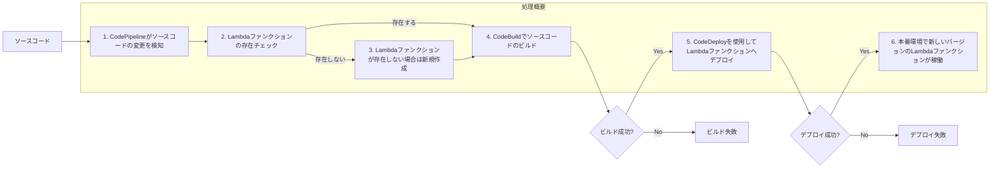
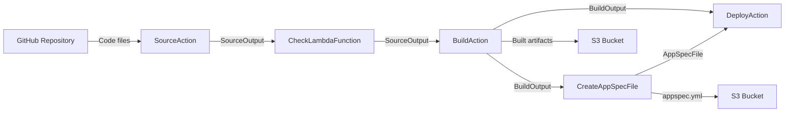

# CI/CD Pipeline for Lambda

## 1. はじめに

本設計書では、AWS Lambda環境におけるCI/CDパイプラインの構築について説明します。CI/CDパイプラインを導入することで、Lambdaファンクションの開発、テスト、デプロイを自動化し、効率的かつ安全にアプリケーションを運用することができます。

CI/CDパイプラインの主要なコンポーネントは以下の通りです。

1. AWS CodeCommit：ソースコードのバージョン管理
2. AWS CodeBuild：ソースコードのビルドとテスト
3. AWS CodeDeploy：Lambdaファンクションへのデプロイ
4. AWS CodePipeline：CI/CDプロセス全体の管理とオーケストレーション

本設計書では、これらのサービスを使用してLambda環境のCI/CDパイプラインを構築する方法を説明します。インフラストラクチャのコード化（Infrastructure as Code、IaC）の手法を用いて、パイプラインの構成をCloudFormationテンプレートで定義します。これにより、パイプラインの構築と管理を自動化し、再現性と一貫性を確保することができます。

## 2. 前提条件

- AWSアカウントを持っていること
- AWS CLIがインストールされていること
- AWS CloudFormationの基本的な知識があること

## 3. アーキテクチャ概要

### 3.1 アーキテクチャ概要
以下の図は、CI/CDパイプラインのアーキテクチャ概要と処理の流れを示しています。



処理の流れ:
1. AWS CodePipelineがソースコードの変更を検知します。
2. Lambdaファンクションの存在チェックを行います。
3. Lambdaファンクションが存在しない場合は、新規作成します。
4. AWS CodeBuildを使用してソースコードのビルドを行います。
5. ビルドが成功した場合、AWS CodeDeployを使用してLambdaファンクションへデプロイします。
6. デプロイが成功すると、本番環境で新しいバージョンのLambdaファンクションが稼働します。

ビルドまたはデプロイが失敗した場合は、それぞれのエラー処理が行われます。

### 3.2 入出力ファイルの概要
この図式では、CodePipelineのStagesを通じて渡されるファイル（Artifacts）と、IaCで定義されている実際のファイル名との関連を表現しています。



1. GitHubリポジトリからSourceActionへコードファイルが渡されます。これらのファイルは `SourceOutput` としてCheckLambdaFunctionステージへ渡されます。

2. CheckLambdaFunctionステージからBuildActionへ `SourceOutput` が渡されます。

3. BuildActionではコードがビルドされ、ビルドされたアーティファクトが `BuildOutput` としてDeployActionとCreateAppSpecFileアクションへ渡されます。また、ビルドされたアーティファクトはS3バケット（`ArtifactStoreBucket`）に保存されます。

4. CreateAppSpecFileアクションでは `appspec.yml` ファイルが生成され、`AppSpecFile` としてDeployActionへ渡されます。また、`appspec.yml` ファイルはS3バケット（`ArtifactStoreBucket`）の `appspec.yml` オブジェクトキーに保存されます。

5. DeployActionでは `BuildOutput` と `AppSpecFile` を受け取り、CodeDeployを使ってLambda関数にデプロイします。

## 4. CI/CD Pipelineの構成

### 4.1. ディレクトリ構造

```
project-root/
└── Backend/src/
      └── lambda_functions
└── Backend/env/env_src
        └── CICDPipelineForLambda.yml
        └── CICDparamerters.json
        └── CICDLambdaCreateOnPipeline.yml
└── configuration/
    └── buildspec.yml
    └── appspec.yml
```

- `Backend/src/lambda_function`: Lambdaファンクションのソースコード
- `Backend/env/env_src/CICDPipelineForLambda.yml`: CICD Pipeline生成用IaC
- `Backend/env/env_src/CICDparamerters.json`: CICD Pipeline生成用パラメータファイル
- `Backend/env/env_src/CICDLambdaCreateOnPipeline.yml`: CICD Pipelineから呼び出されてLambda生成用IaC
- `Backend/env/env_src/LambdaParameters.json`: Lambda生成用パラメータファイル
- `buildspec.yml`: CodeBuildのビルド仕様ファイル
- `appspec.yml`: Codedeployのビルド仕様ファイル


## 5. リソース定義

### 5.1. AWS::IAM::Role

#### 5.1.1. CodeBuildServiceRole

| プロパティ名 | 説明 | 設定値 |
|------------|------|-------|
| AssumeRolePolicyDocument | CodeBuildサービスロールの信頼ポリシー | CodeBuildを信頼 |
| Policies | CodeBuildサービスロールに付与するポリシー | CodeBuildServiceRolePolicy |

CodeBuildServiceRolePolicy:
```yaml
PolicyName: CodeBuildServiceRolePolicy
PolicyDocument:
  Version: '2012-10-17'
  Statement:
    - Effect: Allow
      Action:
        - 's3:GetObject'
        - 's3:GetObjectVersion'
        - 's3:PutObject'
      Resource: 'arn:aws:s3:::${ArtifactStoreBucket}/*'
    - Effect: Allow
      Action:
        - 'logs:CreateLogGroup'
        - 'logs:CreateLogStream'
        - 'logs:PutLogEvents'
      Resource: '*'
    - Effect: Allow
      Action:
        - 'lambda:UpdateFunctionCode'
      Resource: !Sub 'arn:aws:lambda:${AWS::Region}:${AWS::AccountId}:function:${ProjectName}'
```

#### 5.1.2. CodePipelineServiceRole

| プロパティ名 | 説明 | 設定値 |
|------------|------|-------|
| AssumeRolePolicyDocument | CodePipelineサービスロールの信頼ポリシー | CodePipelineを信頼 |
| Policies | CodePipelineサービスロールに付与するポリシー | CodePipelineServiceRolePolicy |

CodePipelineServiceRolePolicy:
```yaml
PolicyName: CodePipelineServiceRolePolicy
PolicyDocument:
  Version: '2012-10-17'
  Statement:
    - Effect: Allow
      Action:
        - 'iam:PassRole'
      Resource: '*'
    - Effect: Allow
      Action:
        - 'codebuild:BatchGetBuilds'
        - 'codebuild:StartBuild'
      Resource: '*'
    - Effect: Allow
      Action:
        - 's3:GetObject'
        - 's3:GetObjectVersion'
        - 's3:PutObject'
      Resource: 'arn:aws:s3:::${ArtifactStoreBucket}/*'
```

#### 5.1.3. CodeDeployServiceRole

| プロパティ名 | 説明 | 設定値 |
|------------|------|-------|
| AssumeRolePolicyDocument | CodeDeployサービスロールの信頼ポリシー | CodeDeployを信頼 |
| Policies | CodeDeployサービスロールに付与するポリシー | CodeDeployServiceRolePolicy |

CodeDeployServiceRolePolicy:
```yaml
PolicyName: CodeDeployServiceRolePolicy
PolicyDocument:
  Version: '2012-10-17'
  Statement:
    - Effect: Allow
      Action:
        - 'lambda:UpdateFunctionCode'
        - 'lambda:UpdateFunctionConfiguration'
        - 'lambda:GetFunction'
        - 'lambda:GetFunctionConfiguration'
        - 'lambda:CreateFunction'
        - 'lambda:DeleteFunction'
        - 'lambda:PublishVersion'
        - 'lambda:UpdateAlias'
        - 'lambda:GetAlias'
        - 'lambda:ListAliases'
      Resource: !Sub 'arn:aws:lambda:${AWS::Region}:${AWS::AccountId}:function:${ProjectName}'
    - Effect: Allow
      Action:
        - 's3:GetObject'
      Resource: 'arn:aws:s3:::${ArtifactStoreBucket}/*'
```

### 5.2. AWS::CodeBuild::Project

| プロパティ名 | 説明 | 設定値 |
|------------|------|-------|
| Name | CodeBuildプロジェクト名 | `${ProjectName}-build` |
| Description | CodeBuildプロジェクトの説明 | `Build project for ${ProjectDescription}` |
| ServiceRole | CodeBuildサービスロール | !Ref CodeBuildServiceRole |
| Artifacts | ビルドアーティファクトの設定 | Type: CODEPIPELINE |
| Environment | ビルド環境の設定 | Type: LINUX_CONTAINER, ComputeType: BUILD_GENERAL1_SMALL, Image: 'aws/codebuild/standard:4.0' |
| Source | ソースの設定 | Type: CODEPIPELINE, BuildSpec: 'buildspec.yml' |

### 5.3. AWS::CodePipeline::Pipeline

| プロパティ名 | 説明 | 設定値 |
|------------|------|-------|
| Name | CodePipelineの名前 | `${ProjectName}-pipeline` |
| RoleArn | CodePipelineサービスロール | !GetAtt CodePipelineServiceRole.Arn |
| ArtifactStore | アーティファクトストアの設定 | Type: S3, Location: !Ref ArtifactStoreBucket |
| Stages | パイプラインのステージ定義 | Source, Build, Deploy |

### 5.4. AWS::CodeDeploy::Application

| プロパティ名 | 説明 | 設定値 |
|------------|------|-------|
| ApplicationName | CodeDeployアプリケーションの名前 | `${ProjectName}-app` |
| ComputePlatform | アプリケーションが実行されるコンピューティングプラットフォーム | Lambda |

### 5.5. AWS::CodeDeploy::DeploymentGroup

| プロパティ名 | 説明 | 設定値 |
|------------|------|-------|
| ApplicationName | CodeDeployアプリケーションの名前 | !Ref CodeDeployApplication |
| DeploymentGroupName | CodeDeployデプロイメントグループの名前 | `${ProjectName}-group` |
| ServiceRoleArn | CodeDeployサービスロールのARN | !GetAtt CodeDeployServiceRole.Arn |
| DeploymentConfig | デプロイメント設定 | CodeDeployDefault.LambdaAllAtOnce |
| DeploymentStyle | デプロイメントスタイル | BLUE_GREEN |
| AutoRollbackConfiguration | 自動ロールバック設定 | Enabled: true, Events: [DEPLOYMENT_FAILURE, DEPLOYMENT_STOP_ON_ALARM] |
| AlarmConfiguration | アラーム設定 | Enabled: true, Alarms: [LambdaErrorsAlarm, LambdaThrottlesAlarm] |

### 5.6. AWS::CodeDeploy::DeploymentConfig

| プロパティ名            | 説明                                                 | 設定値                     |
|------------------------|------------------------------------------------------|----------------------------|
| DeploymentConfigName   | デプロイメント設定の名前                                | `${ProjectName}-config`    |
| MinimumHealthyHosts    | デプロイメント中に維持する必要がある最小限の正常なホスト数   | Type: FLEET_PERCENT, Value: 50 |
| TrafficRoutingConfig   | トラフィックルーティング設定                             | Type: AllAtOnce, Interval: 0, Percentage: 100 |

上記の設定では、TrafficRoutingConfigのTypeをAllAtOnceに変更し、IntervalとPercentageの値を調整しました。これにより、デプロイメント中に新しいバージョンに100%のトラフィックが一括で切り替わるようになります。

### 5.7. AWS::S3::Bucket

| プロパティ名 | 説明 | 設定値 |
|------------|------|-------|
| BucketName | バケット名 | `${ProjectName}-artifact-store` |

## 6. BuildSpec.ymlの詳細説明

BuildSpec.ymlは、AWS CodeBuildで使用されるビルド仕様ファイルです。このファイルには、ビルドプロセスの各ステップが定義されています。以下は、提供されたBuildSpec.ymlの内容に基づいて、各ステップの目的と実行内容を詳しく説明します。

### 6.1. version

BuildSpecのバージョンを0.2に指定しています。これにより、BuildSpecの構文と機能のバージョンが定義されます。

### 6.2. phases

ビルドプロセスは、以下の4つのフェーズで構成されています。

#### 6.2.1. install

このフェーズでは、ビルドに必要なツールとライブラリをインストールします。

1. Python 3.8をランタイムとして指定します。
2. `pip install awscli`コマンドを使用して、AWS Command Line Interface（CLI）をインストールします。
3. `aws codeartifact get-authorization-token`コマンドを実行して、CodeArtifactの認証トークンを取得し、`CODEARTIFACT_AUTH_TOKEN`環境変数に格納します。
4. `aws codeartifact get-repository-endpoint`コマンドを実行して、CodeArtifactリポジトリのエンドポイントURLを取得し、`CODEARTIFACT_REPOSITORY_URL`環境変数に格納します。
5. `pip install -r ./configuration/requirements.txt --quiet`コマンドを使用して、`requirements.txt`ファイルに記載された依存関係をインストールします。

#### 6.2.2. pre_build

このフェーズでは、ビルド前の準備作業として単体テストを実行します。

1. "Starting Unit tests..."というメッセージを表示します。
2. `pytest Backend/tests/UT_src`コマンドを実行して、`Backend/tests/UT_src`ディレクトリ内の単体テストを実行します。
3. "Unit tests Completed..."というメッセージを表示します。

#### 6.2.3. build

このフェーズでは、Lambdaファンクションのソースコードをパッケージ化します。

1. `ls Backend`、`ls Backend/src`、`ls configuration`コマンドを実行して、関連するディレクトリの内容を表示します。
2. `zip -r ${ProjectName}.zip ./Backend/src`コマンドを使用して、`Backend/src`ディレクトリ内のファイルを`${ProjectName}.zip`という名前のzipファイルにパッケージ化します。

#### 6.2.4. post_build

このフェーズでは、Lambdaファンクションのデプロイと設定ファイルの更新を行います。また、AWS CodeDeployで使用する`appspec.yml`ファイルを生成します。

1. `aws lambda update-function-code`コマンドを使用して、パッケージ化されたLambdaファンクションのコードをデプロイします。
2. `aws lambda update-function-configuration`コマンドを使用して、Lambdaファンクションの設定を更新します。
3. `appspec.yml`ファイルを生成し、CodeDeployで使用するデプロイメント設定を定義します。
4. `appspec.yml`ファイルをアーティファクトとしてアップロードします。

## 7. AWS CodeDeployの定義

AWS CodeDeployは、AWS Lambda、Amazon EC2、オンプレミスサーバー、およびその他のサービスへのアプリケーションデプロイを自動化するサービスです。CodeDeployを使用すると、アプリケーションの新しいバージョンを確実かつ迅速にデプロイできます。

### 7.1. AWS::CodeDeploy::Application

AWS::CodeDeploy::Applicationリソースは、CodeDeployアプリケーションを作成します。

| プロパティ名            | 説明                                                 | 設定値                     |
|------------------------|------------------------------------------------------|----------------------------|
| ApplicationName        | CodeDeployアプリケーションの名前                       | `${ProjectName}-app`       |
| ComputePlatform        | アプリケーションが実行されるコンピューティングプラットフォーム | Lambda                     |

### 7.2. AWS::CodeDeploy::DeploymentGroup

AWS::CodeDeploy::DeploymentGroupリソースは、CodeDeployデプロイメントグループを作成します。デプロイメントグループは、アプリケーションの新しいリビジョンをデプロイする際のターゲットとなるインスタンスのグループを定義します。

| プロパティ名            | 説明                                                 | 設定値                     |
|------------------------|------------------------------------------------------|----------------------------|
| ApplicationName        | CodeDeployアプリケーションの名前                       | !Ref CodeDeployApplication |
| DeploymentGroupName    | CodeDeployデプロイメントグループの名前                  | `${ProjectName}-group`     |
| ServiceRoleArn         | CodeDeployサービスロールのARN                          | !GetAtt CodeDeployServiceRole.Arn |
| DeploymentConfig       | デプロイメント設定                                      | CodeDeployDefault.LambdaAllAtOnce |
| DeploymentStyle        | デプロイメントスタイル                                  | BLUE_GREEN                 |
| AutoRollbackConfiguration | 自動ロールバック設定                                  | Enabled: true, Events: [DEPLOYMENT_FAILURE, DEPLOYMENT_STOP_ON_ALARM] |
| AlarmConfiguration     | アラーム設定                                           | Enabled: true, Alarms: [LambdaErrorsAlarm, LambdaThrottlesAlarm] |

### 7.3. AWS::CodeDeploy::DeploymentConfig

AWS::CodeDeploy::DeploymentConfigリソースは、デプロイメント設定を作成します。デプロイメント設定は、デプロイメントプロセス中にトラフィックがどのようにシフトされるかを定義します。

| プロパティ名            | 説明                                                 | 設定値                     |
|------------------------|------------------------------------------------------|----------------------------|
| DeploymentConfigName   | デプロイメント設定の名前                                | `${ProjectName}-config`    |
| MinimumHealthyHosts    | デプロイメント中に維持する必要がある最小限の正常なホスト数   | Type: FLEET_PERCENT, Value: 50 |
| TrafficRoutingConfig   | トラフィックルーティング設定                             | Type: TimeBasedLinear, Interval: 10, Percentage: 25 |

### 7.4. AWS::IAM::Role (CodeDeployServiceRole)

CodeDeployサービスロールの定義。CodeDeployがAWSリソースにアクセスするために必要な権限を付与します。

| プロパティ名            | 説明                                                 | 設定値                     |
|------------------------|------------------------------------------------------|----------------------------|
| AssumeRolePolicyDocument| CodeDeployサービスロールの信頼ポリシー                 | CodeDeployを信頼           |
| Policies               | CodeDeployサービスロールに付与するポリシー              | 必要な権限を付与            |

以上が、AWS CodeDeployに関連するIaCリソースの定義です。これらのリソースを使用して、CodeDeployアプリケーション、デプロイメントグループ、デプロイメント設定、およびサービスロールを作成し、AWS Lambdaへのデプロイメントを自動化することができます。

## 8. CodeArtifactの定義
CodeArtifactは、パッケージ管理のためのリポジトリサービスです。BuildSpec.ymlのinstallフェーズでCodeArtifactを設定し、依存関係をインストールします。

### 8.1. CodeArtifactの設定手順
1. AWS Management Consoleにログインし、CodeArtifactサービスを開きます。
2. 新しいドメインを作成するか、既存のドメインを選択します。
3. ドメイン内に新しいリポジトリを作成します。
4. リポジトリの接続情報（認証トークンとエンドポイントURL）を取得します。
5. BuildSpec.ymlのinstallフェーズに、CodeArtifactの設定コマンドを追加します。

## 9. 結論
本ドキュメントでは、在庫配分システムのLambdaファンクションのCI/CDパイプラインの設計について説明しました。このパイプラインは、GitHubにプッシュされたソースコードを自動的に取得し、ビルド、テスト、デプロイを行います。IaCを使用して環境構成を管理することで、環境間の設定の一貫性を保証し、手動でのデプロイプロセスに関連するエラーを最小限に抑えることができます。

また、BuildSpec.ymlファイルの詳細な説明を提供し、各ビルドステップの目的と実行内容を明確にしました。CodeArtifactの役割と設定方法についても説明し、パッケージ管理のベストプラクティスを示しました。

このCI/CDパイプラインの設計は、開発チームがコードの品質を維持しながら、迅速かつ安全に在庫配分システムのLambdaファンクションをデプロイするために役立ちます。今後、プロジェクトの要件に応じてパイプラインを拡張および最適化していくことができます。