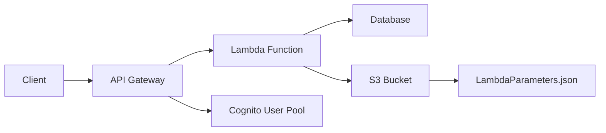

### 1. テンプレート説明:
このCloudFormationテンプレートは、AWS Lambda上でFastAPIアプリケーションをデプロイするための環境を構築します。主要なコンポーネントは以下の通りです。

- FastAPIFunction: FastAPIアプリケーションのコードを実行するLambda関数です。東京リージョンにデプロイされます。
  - 環境変数として、`PARAMETER_FILE_PATH`が設定されています。これは、パラメータファイルのパスを指定します。
- LambdaExecutionRole: Lambda関数の実行に必要な権限を持つIAMロールです。S3からパラメータファイルを取得するための権限が含まれています。
- APIGateway: FastAPIアプリケーションのエンドポイントを提供するAPI Gatewayです。東京リージョンにデプロイされます。
- APIGatewayAuthorizer: Cognito User Poolsを使用してAPIリクエストを認証するためのオーソライザーです。
- APIGatewayResource: API Gatewayのリソースを定義します。
- APIGatewayMethod: API Gatewayのメソッドを定義し、Lambda関数との統合を設定します。
- APIGatewayDeployment: API Gatewayの変更を指定されたステージ名でデプロイします。

#### 1.1 ネットワーク図:



#### 1.2 テンプレート:

```yaml
AWSTemplateFormatVersion: '2010-09-09'
Description: 'FastAPI application on AWS Lambda'

Parameters:
  ParameterFilePath:
    Type: String
    Default: 's3://my-parameter-bucket/LambdaParameters.json'

Resources:
  FastAPIFunction:
    Type: 'AWS::Lambda::Function'
    Properties:
      FunctionName: 'FastAPIFunction'
      Runtime: 'python3.8'
      Handler: 'main.handler'
      Code:
        S3Bucket: !Ref LambdaCodeBucket
        S3Key: !Ref LambdaCodeKey
      Environment:
        Variables:
          PARAMETER_FILE_PATH: !Ref ParameterFilePath
      Role: !GetAtt LambdaExecutionRole.Arn
      Timeout: 30
      MemorySize: 128
      FunctionRegion: 'ap-northeast-1'

  LambdaExecutionRole:
    Type: 'AWS::IAM::Role'
    Properties:
      AssumeRolePolicyDocument:
        Version: '2012-10-17'
        Statement:
          - Effect: Allow
            Principal:
              Service: lambda.amazonaws.com
            Action: 'sts:AssumeRole'
      Policies:
        - PolicyName: 'LambdaExecutionPolicy'
          PolicyDocument:
            Version: '2012-10-17'
            Statement:
              - Effect: Allow
                Action:
                  - 'logs:CreateLogGroup'
                  - 'logs:CreateLogStream'
                  - 'logs:PutLogEvents'
                Resource: 'arn:aws:logs:*:*:*'
              - Effect: Allow
                Action:
                  - 's3:GetObject'
                Resource: !Sub 'arn:aws:s3:::my-parameter-bucket/LambdaParameters.json'

  APIGateway:
    Type: 'AWS::ApiGateway::RestApi'
    Properties:
      Name: 'FastAPIGateway'
      EndpointConfiguration:
        Types:
          - REGIONAL
        VpcEndpointIds: []

  APIGatewayAuthorizer:
    Type: 'AWS::ApiGateway::Authorizer'
    Properties:
      Name: 'CognitoAuthorizer'
      Type: 'COGNITO_USER_POOLS'
      ProviderARNs:
        - !Ref CognitoUserPoolArn
      RestApiId: !Ref APIGateway
      IdentitySource: 'method.request.header.Authorization'

  APIGatewayResource:
    Type: 'AWS::ApiGateway::Resource'
    Properties:
      ParentId: !GetAtt APIGateway.RootResourceId
      PathPart: '{proxy+}'
      RestApiId: !Ref APIGateway

  APIGatewayMethod:
    Type: 'AWS::ApiGateway::Method'
    Properties:
      HttpMethod: ANY
      ResourceId: !Ref APIGatewayResource
      RestApiId: !Ref APIGateway
      AuthorizationType: COGNITO_USER_POOLS
      AuthorizerId: !Ref APIGatewayAuthorizer
      Integration:
        Type: AWS_PROXY
        IntegrationHttpMethod: POST
        Uri: !Sub 'arn:aws:apigateway:ap-northeast-1:lambda:path/2015-03-31/functions/${FastAPIFunction.Arn}/invocations'

  APIGatewayDeployment:
    Type: 'AWS::ApiGateway::Deployment'
    DependsOn:
      - APIGatewayMethod
    Properties:
      RestApiId: !Ref APIGateway
      StageName: !Ref APIGatewayStageName

Outputs:
  APIGatewayInvokeURL:
    Value: !Sub 'https://${APIGateway}.execute-api.ap-northeast-1.amazonaws.com/${APIGatewayStageName}'
```

### 2. パラメータファイル説明:

`LambdaParameters.json`ファイルには、CloudFormationテンプレートで使用するパラメータの値が定義されています。パラメータの説明は以下の通りです。

- `CognitoUserPoolArn`: Cognito User Poolの ARN。ユーザー認証に使用されます。
- `CognitoUserPoolClientId`: Cognito User Poolクライアントの ID。
- `DatabaseSecretArn`: データベースの認証情報を含む Secrets Manager のシークレットの ARN。
- `LambdaCodeBucket`: Lambda関数のコードが保存されているS3バケットの名前。
- `LambdaCodeKey`: Lambda関数のコードが保存されているS3オブジェクトのキー。
- `APIGatewayStageName`: API Gatewayのステージ名。

パラメータファイルを使用する手順:

1. `LambdaParameters.json`ファイルを作成し、適切な値を設定します。

2. `LambdaParameters.json`ファイルをS3バケットにアップロードします。

3. CloudFormationテンプレートを使用してスタックを作成または更新します。

4. Lambda関数のコード内で、`PARAMETER_FILE_PATH`環境変数を使用して`LambdaParameters.json`ファイルを読み込み、必要なパラメータを取得します。

`LambdaParameters.json`:

```json
{
  "CognitoUserPoolArn": "arn:aws:cognito-idp:ap-northeast-1:123456789012:userpool/ap-northeast-1_abcdefghi",
  "CognitoUserPoolClientId": "abcdefghijklmnopqrstuvwxy",
  "DatabaseSecretArn": "arn:aws:secretsmanager:ap-northeast-1:123456789012:secret:MyDatabaseSecret-abcdef",
  "LambdaCodeBucket": "my-lambda-code-bucket",
  "LambdaCodeKey": "fastapi-app/lambda_function.zip",
  "APIGatewayStageName": "prod"
}
```