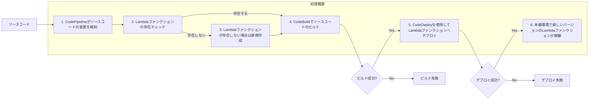

以下の図は、CI/CDパイプラインのアーキテクチャ概要と処理の流れを示しています。

処理の流れ:
1. AWS CodePipelineがソースコードの変更を検知します。
2. Lambdaファンクションの存在チェックを行います。
3. Lambdaファンクションが存在しない場合は、新規作成します。
4. AWS CodeBuildを使用してソースコードのビルドを行います。
5. ビルドが成功した場合、AWS CodeDeployを使用してLambdaファンクションへデプロイします。
6. デプロイが成功すると、本番環境で新しいバージョンのLambdaファンクションが稼働します。

ビルドまたはデプロイが失敗した場合は、それぞれのエラー処理が行われます。