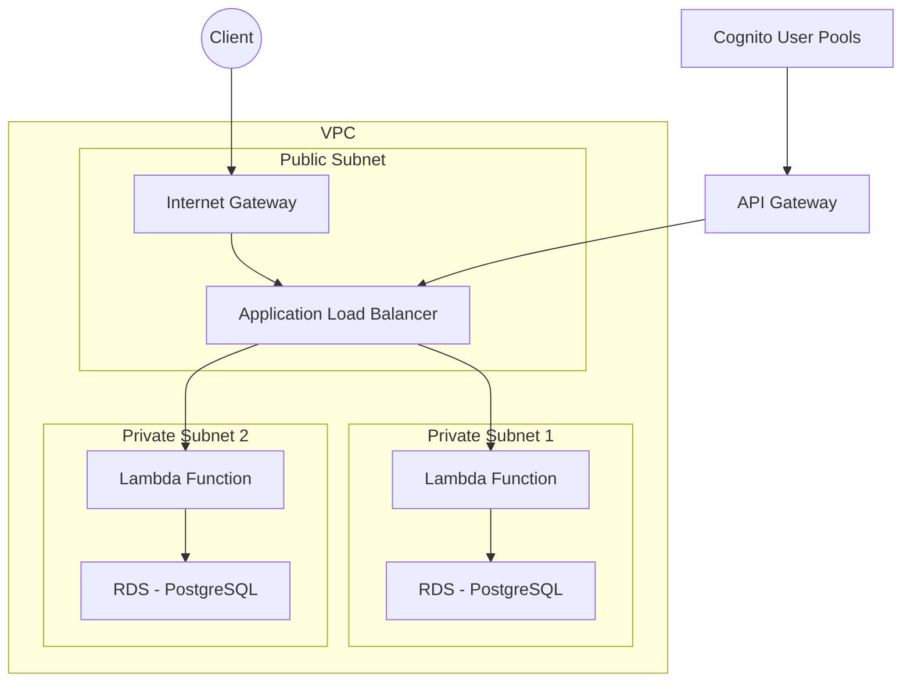
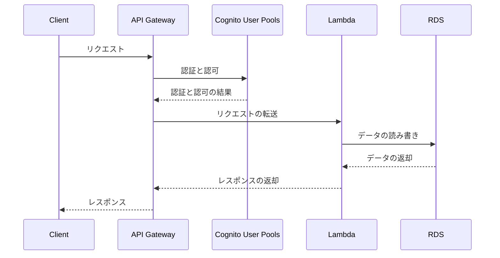

Note）本設計書及びプログラムの最新版はGitHubの[Rayoo-Nakano/InventoryAllocation](https://github.com/Rayoo-Nakano/InventoryAllocation "Rayoo-Nakano/InventoryAllocation")に常時更新しています。

# システムアーキテクチャ設計書

## 1. 概要
本設計書は、AWS上に構築されるシステムのアーキテクチャについて説明します。このシステムは、東京リージョンのVPC内にパブリックサブネットとプライベートサブネットを持ち、RDS（PostgreSQL）、API Gateway、Cognito User Poolsを活用して、セキュアかつスケーラブルなアプリケーションを提供します。

## 2. アーキテクチャ概要
このアプリケーションは、以下のAWSリソースを使用して構築されます：

このアーキテクチャの説明:
- VPCは、パブリックサブネットとプライベートサブネットで構成されています。
- パブリックサブネットには、インターネットゲートウェイ（IGW）とアプリケーションロードバランサー（ALB）が配置されています。
- プライベートサブネットには、RDSインスタンス（RDS1とRDS2）が配置されています。
- Lambda関数（Lambda1とLambda2）は、図ではプライベートサブネット内に配置されていますが、実際にはAWS Lambdaサービスによって管理されており、VPC外部で実行されます。
- クライアントからのリクエストは、インターネットゲートウェイ（IGW）を経由してアプリケーションロードバランサー（ALB）に到達します。
- ALBは、トラフィックをLambda関数（Lambda1とLambda2）に分散します。
- Lambda関数は、対応するRDSインスタンス（RDS1とRDS2）と通信し、必要なデータ処理を実行します。
- 処理結果はLambda関数からALBを経由してクライアントに返されます。
- API Gatewayは、アプリケーション用のAPIエンドポイントを提供します。
- Cognito User Poolsは、ユーザー認証と認可を処理し、API Gatewayへのセキュアなアクセスを提供します。

## 4. コンポーネント
### パラメータ (parameters.json)
環境構築時に以下のパラメータを使用します：

| パラメータ名 | 説明 | デフォルト値 |
|-------------|------|-------------|
| EnvironmentName | 環境名 | dev |
| VpcCIDR | VPCのCIDRブロック | 10.0.0.0/16 |
| PublicSubnet1CIDR | パブリックサブネット1のCIDRブロック | 10.0.1.0/24 |
| PrivateSubnet1CIDR | プライベートサブネット1のCIDRブロック | 10.0.2.0/24 |
| PrivateSubnet2CIDR | プライベートサブネット2のCIDRブロック | (パラメータ) |
| DBMasterUsername | RDSマスターユーザー名 | mydbuser |
| DBMasterUserPassword | RDSマスターパスワード | mydbpassword |

### 4.1 VPC
| コンポーネント | 名称 | 説明 | 設定値 |
|--------------|------|------|--------|
| VPC | dev-VPC | アプリケーション全体を含むバーチャルプライベートクラウド | CIDR: 10.0.0.0/16 |
| パブリックサブネット | dev-Public-Subnet-1 | インターネットアクセス可能なサブネット | CIDR: 10.0.1.0/24, AZ: ap-northeast-1a |
| プライベートサブネット | dev-Private-Subnet-1 | インターネットアクセスができないサブネット | CIDR: 10.0.2.0/24, AZ: ap-northeast-1a |
| プライベートサブネット | dev-Private-Subnet-2 | インターネットアクセスができないサブネット | CIDR: (パラメータ), AZ: ap-northeast-1c |
| インターネットゲートウェイ | dev-IGW | VPCをインターネットに接続 | - |
| NATゲートウェイ | NatGateway1 | プライベートサブネットからインターネットへのアクセスを提供 | - |

### 4.2 RDS (PostgreSQL)
| コンポーネント | 名称 | 説明 | 設定値 |
|--------------|------|------|--------|
| RDS (PostgreSQL) | RDSInstance | アプリケーションデータを保存 | インスタンスクラス: db.t3.micro, ストレージ: 20GB, マスターユーザー名: mydbuser, マスターパスワード: mydbpassword |

### 4.3 API Gateway
| コンポーネント | 名称 | 説明 | 設定値 |
|--------------|------|------|--------|
| API Gateway | dev-API | アプリケーション用のAPI Gateway | リソース: items, orders |

### 4.4 Cognito User Pools
| コンポーネント | 名称 | 説明 | 設定値 |
|--------------|------|------|--------|
| Cognito ユーザープール | dev-UserPool | ユーザー認証と認可を処理 | ユーザープール名: dev-UserPool |

## 5. ロール関係
| コンポーネント | ロール名称 | ロール |
|--------------|----------|--------|
| VPC | VPCRole | アプリケーション全体のネットワーク環境を提供 |
| パブリックサブネット | PublicSubnetRole | インターネットアクセス可能なリソースを配置 |
| プライベートサブネット | PrivateSubnetRole | インターネットアクセスを制限し、セキュリティを強化 |
| インターネットゲートウェイ | InternetGatewayRole | VPCとインターネット間の通信を可能にする |
| NATゲートウェイ | NATGatewayRole | プライベートサブネットからインターネットへのアクセスを提供 |
| RDS (PostgreSQL) | RDSInstanceRole | アプリケーションデータを保存 |
| API Gateway | APIGatewayRole | アプリケーション用のAPIエンドポイントを提供 |
| Cognito ユーザープール | CognitoUserPoolRole | ユーザー認証と認可を処理 |

## 6. データフロー

このデータフロー図は、システム内のコンポーネント間のデータの流れを示しています。クライアントからのリクエストは、API Gateway、Cognito User Pools、Lambda、RDSを経由して処理され、最終的にクライアントにレスポンスが返されます。

## 7. スケーラビリティと保守性
- API Gatewayは、トラフィックに応じて自動的にスケールアップまたはスケールダウンします。
- RDSは、必要に応じて手動でスケーリングできます。
- Lambda関数は、トラフィックに応じて自動的にスケールアップまたはスケールダウンします。
- 各コンポーネントは独立しており、必要に応じて個別に更新または変更できます。

## 8. セキュリティ
- RDSはプライベートサブネットに配置され、インターネットから直接アクセスできません。
- API GatewayとCognito User Poolsは、APIエンドポイントへのセキュアなアクセスを提供します。
- Lambda関数は、VPC外部で実行されるため、VPC内のリソースへのアクセスを制限できます。

## 9. 結論
このアーキテクチャ設計は、スケーラビリティ、保守性、セキュリティを考慮しながら、AWS上でモダンなアプリケーションを構築するための基盤を提供します。各コンポーネントは、それぞれの役割を果たし、全体としてシームレスに連携します。Lambda関数の追加により、アプリケーションのロジックを柔軟に実装し、スケーラビリティを向上させることができます。