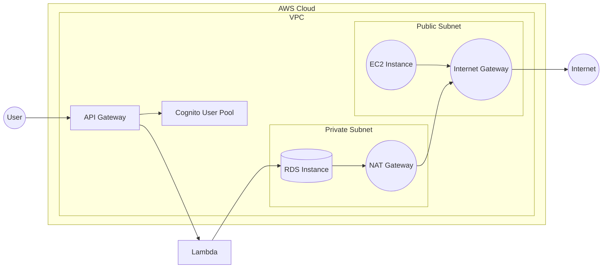

## 環境構築概要

このAWS CloudFormationテンプレートは、東京リージョンにVPC、パブリックサブネットとプライベートサブネット、RDSインスタンス、およびCognitoでバックアップされたAPI Gatewayを作成するために使用されます。

主要なコンポーネント:

1. VPC: 10.0.0.0/16のCIDRブロックを持つVirtualPrivateCloudを作成します。

2. パブリックサブネット: 10.0.1.0/24のCIDRブロックを持つパブリックサブネットを作成します。このサブネットには、インターネットゲートウェイ経由でインターネットアクセスができます。

3. プライベートサブネット: 10.0.2.0/24のCIDRブロックを持つプライベートサブネットを作成します。このサブネットは、NATゲートウェイ経由でインターネットアクセスができます。

4. インターネットゲートウェイ: VPCにアタッチされ、パブリックサブネットにインターネットアクセスを提供します。

5. NATゲートウェイ: プライベートサブネットにインターネットアクセスを提供します。

6. RDSインスタンス: プライベートサブネットに配置されたPostgreSQLデータベースインスタンスを作成します。

7. API Gateway: アプリケーション用のRESTful APIを作成します。

8. Cognito: ユーザー認証とAPIアクセス制御のためのCognitoユーザープールを作成します。

このテンプレートは、パラメータ化されており、外部のテキストファイルからパラメータを読み込むことができます。これにより、環境に応じてリソースをカスタマイズすることができます。

### ネットワーク図:



この図は、テンプレートによって作成されるリソースとそれらの関係を示しています。ユーザーはAPI Gatewayを介してアプリケーションにアクセスし、API GatewayはCognitoを使用してユーザーを認証します。認証されたリクエストは、Lambda関数によって処理され、必要に応じてRDSデータベースとやり取りします。パブリックサブネットのEC2インスタンスはインターネットゲートウェイを介してインターネットにアクセスでき、プライベートサブネットのRDSインスタンスはNATゲートウェイを介してインターネットにアクセスできます。


### テンプレート
```yaml
AWSTemplateFormatVersion: '2010-09-09'
Description: 'AWS CloudFormation template for creating a VPC with public and private subnets, an RDS instance, and an API Gateway backed by Cognito in the Tokyo region.'

Parameters:
  EnvironmentName:
    Type: String

  VpcCIDR:
    Type: String

  PublicSubnet1CIDR:
    Type: String

  PrivateSubnet1CIDR:
    Type: String

  DBMasterUsername:
    Type: String

  DBMasterUserPassword:
    Type: String
    NoEcho: true

Resources:
  # VPCの定義
  VPC:
    Type: 'AWS::EC2::VPC'
    Properties:
      CidrBlock: !Ref VpcCIDR
      EnableDnsHostnames: true
      EnableDnsSupport: true
      Tags:
        - Key: Name
          Value: !Sub '${EnvironmentName}-VPC'

  # インターネットゲートウェイの定義
  InternetGateway:
    Type: 'AWS::EC2::InternetGateway'
    Properties:
      Tags:
        - Key: Name
          Value: !Sub '${EnvironmentName}-IGW'

  # インターネットゲートウェイをVPCにアタッチ
  InternetGatewayAttachment:
    Type: 'AWS::EC2::VPCGatewayAttachment'
    Properties:
      VpcId: !Ref VPC
      InternetGatewayId: !Ref InternetGateway

  # パブリックサブネット1の定義
  PublicSubnet1:
    Type: 'AWS::EC2::Subnet'
    Properties:
      VpcId: !Ref VPC
      AvailabilityZone: ap-northeast-1a
      CidrBlock: !Ref PublicSubnet1CIDR
      MapPublicIpOnLaunch: true
      Tags:
        - Key: Name
          Value: !Sub '${EnvironmentName}-Public-Subnet-1'

  # プライベートサブネット1の定義
  PrivateSubnet1:
    Type: 'AWS::EC2::Subnet'
    Properties:
      VpcId: !Ref VPC
      AvailabilityZone: ap-northeast-1a
      CidrBlock: !Ref PrivateSubnet1CIDR
      MapPublicIpOnLaunch: false
      Tags:
        - Key: Name
          Value: !Sub '${EnvironmentName}-Private-Subnet-1'

  # NATゲートウェイ用のElastic IPの定義
  NatGateway1EIP:
    Type: 'AWS::EC2::EIP'
    DependsOn: InternetGatewayAttachment
    Properties:
      Domain: vpc

  # NATゲートウェイの定義
  NatGateway1:
    Type: 'AWS::EC2::NatGateway'
    Properties:
      AllocationId: !GetAtt NatGateway1EIP.AllocationId
      SubnetId: !Ref PublicSubnet1

  # パブリックルートテーブルの定義
  PublicRouteTable:
    Type: 'AWS::EC2::RouteTable'
    Properties:
      VpcId: !Ref VPC
      Tags:
        - Key: Name
          Value: !Sub '${EnvironmentName}-Public-Route-Table'

  # パブリックルートの定義 (デフォルトルート)
  DefaultPublicRoute:
    Type: 'AWS::EC2::Route'
    DependsOn: InternetGatewayAttachment
    Properties:
      RouteTableId: !Ref PublicRouteTable
      DestinationCidrBlock: 0.0.0.0/0
      GatewayId: !Ref InternetGateway

  # パブリックサブネット1をパブリックルートテーブルに関連付け
  PublicSubnet1RouteTableAssociation:
    Type: 'AWS::EC2::SubnetRouteTableAssociation'
    Properties:
      SubnetId: !Ref PublicSubnet1
      RouteTableId: !Ref PublicRouteTable

  # プライベートルートテーブル1の定義
  PrivateRouteTable1:
    Type: 'AWS::EC2::RouteTable'
    Properties:
      VpcId: !Ref VPC
      Tags:
        - Key: Name
          Value: !Sub '${EnvironmentName}-Private-Route-Table-1'

  # プライベートルート1の定義 (デフォルトルート)
  DefaultPrivateRoute1:
    Type: 'AWS::EC2::Route'
    Properties:
      RouteTableId: !Ref PrivateRouteTable1
      DestinationCidrBlock: 0.0.0.0/0
      NatGatewayId: !Ref NatGateway1

  # プライベートサブネット1をプライベートルートテーブル1に関連付け
  PrivateSubnet1RouteTableAssociation:
    Type: 'AWS::EC2::SubnetRouteTableAssociation'
    Properties:
      SubnetId: !Ref PrivateSubnet1
      RouteTableId: !Ref PrivateRouteTable1

  # RDSセキュリティグループの定義
  RDSSecurityGroup:
    Type: 'AWS::EC2::SecurityGroup'
    Properties:
      GroupDescription: 'Security group for RDS'
      VpcId: !Ref VPC
      SecurityGroupIngress:
        - IpProtocol: tcp
          FromPort: 5432
          ToPort: 5432
          SourceSecurityGroupId: !Ref LambdaSecurityGroup

  # RDSサブネットグループの定義
  RDSSubnetGroup:
    Type: 'AWS::RDS::DBSubnetGroup'
    Properties:
      DBSubnetGroupDescription: 'Subnet group for RDS'
      SubnetIds:
        - !Ref PrivateSubnet1

  # RDSインスタンスの定義
  RDSInstance:
    Type: 'AWS::RDS::DBInstance'
    Properties:
      Engine: postgres
      EngineVersion: 14.1
      DBInstanceClass: db.t3.micro
      AllocatedStorage: 20
      StorageType: gp2
      MultiAZ: false
      MasterUsername: !Ref DBMasterUsername
      MasterUserPassword: !Ref DBMasterUserPassword
      VPCSecurityGroups:
        - !Ref RDSSecurityGroup
      DBSubnetGroupName: !Ref RDSSubnetGroup

  # API Gatewayの定義
  APIGateway:
    Type: 'AWS::ApiGateway::RestApi'
    Properties:
      Name: !Sub '${EnvironmentName}-API'
      Description: 'API Gateway for my application'

  # API Gateway Authorizerの定義 (Cognitoユーザープールを使用)
  APIGatewayAuthorizer:
    Type: 'AWS::ApiGateway::Authorizer'
    Properties:
      RestApiId: !Ref APIGateway
      Name: 'CognitoAuthorizer'
      Type: COGNITO_USER_POOLS
      ProviderARNs:
        - !GetAtt CognitoUserPool.Arn

  # API Gateway リソース (items) の定義
  APIGatewayResourceItems:
    Type: 'AWS::ApiGateway::Resource'
    Properties:
      RestApiId: !Ref APIGateway
      ParentId: !GetAtt APIGateway.RootResourceId
      PathPart: items

  # API Gateway リソース (orders) の定義
  APIGatewayResourceOrders:
    Type: 'AWS::ApiGateway::Resource'
    Properties:
      RestApiId: !Ref APIGateway
      ParentId: !GetAtt APIGateway.RootResourceId
      PathPart: orders

  # Cognito ユーザープールの定義
  CognitoUserPool:
    Type: 'AWS::Cognito::UserPool'
    Properties:
      UserPoolName: !Sub '${EnvironmentName}-UserPool'
      AutoVerifiedAttributes:
        - email
      UsernameAttributes:
        - email
      Schema:
        - AttributeDataType: String
          Name: email
          Required: true

  # Cognito ユーザープールクライアントの定義
  CognitoUserPoolClient:
    Type: 'AWS::Cognito::UserPoolClient'
    Properties:
      UserPoolId: !Ref CognitoUserPool
      ClientName: !Sub '${EnvironmentName}-UserPoolClient'
      ExplicitAuthFlows:
        - ADMIN_NO_SRP_AUTH
```

### パラメータ用のテキストファイルのサンプル (`parameters.json`):

```
[
  {
    "ParameterKey": "EnvironmentName",
    "ParameterValue": "dev"
  },
  {
    "ParameterKey": "VpcCIDR",
    "ParameterValue": "10.0.0.0/16"
  },
  {
    "ParameterKey": "PublicSubnet1CIDR",
    "ParameterValue": "10.0.1.0/24"
  },
  {
    "ParameterKey": "PrivateSubnet1CIDR",
    "ParameterValue": "10.0.2.0/24"
  },
  {
    "ParameterKey": "DBMasterUsername",
    "ParameterValue": "mydbuser"
  },
  {
    "ParameterKey": "DBMasterUserPassword",
    "ParameterValue": "mydbpassword"
  }
]
```

このテキストファイルを使用して、AWS CLIでスタックを作成する際に、`--parameters-file` オプションを使用してパラメータを指定できます。

```bash
aws cloudformation create-stack --stack-name my-stack --template-body file://path/to/template.yaml --parameters-file file://path/to/parameters.json
```

これにより、テンプレート内のパラメータが外部のテキストファイルから読み込まれ、スタックの作成時に適用されます。