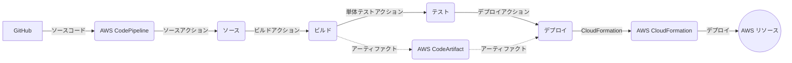
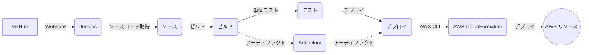

IaC (Infrastructure as Code) を使用して AWS 環境を構築し、CI/CD パイプラインを設定する方法を以下に示します。

## 1. AWS CI/CD Pipeline構築


#### CI/CD パイプラインの構成図



1. GitHub からソースコードが AWS CodePipeline に取り込まれます。

2. CodePipeline のソースアクションがソースコードを取得します。

3. ビルドアクションが AWS CodeBuild を使用してソースコードをビルドします。

4. 単体テストアクションが、ビルドされたアーティファクトに対して JUnit を使用して単体テストを実行します。

5. ビルドアクションの出力アーティファクトが AWS CodeArtifact に格納されます。

6. デプロイアクションが、CodeArtifact から取得したアーティファクトを使用して、AWS CloudFormation を介してデプロイを実行します。

7. CloudFormation がアプリケーションを AWS リソース（Lambda、API Gateway、RDS など）にデプロイします。

この図は、ソースコードが GitHub から取得され、AWS CodePipeline を通じてビルド、テスト、デプロイの各ステージが実行される流れを示しています。ビルドアーティファクトは AWS CodeArtifact に格納され、デプロイ時に取得されます。最終的に、AWS CloudFormation を使用してアプリケーションが AWS リソースにデプロイされます。


```yaml
AWSTemplateFormatVersion: '2010-09-09'
Description: 'CI/CD Pipeline for Inventory Allocation System'

Resources:
  # CodeBuild プロジェクト
  CodeBuildProject:
    Type: 'AWS::CodeBuild::Project'
    Properties:
      Name: 'inventory-allocation-build'
      Description: 'Build project for Inventory Allocation System'
      ServiceRole: !GetAtt CodeBuildServiceRole.Arn
      Artifacts:
        Type: CODEPIPELINE
      Environment:
        Type: LINUX_CONTAINER
        ComputeType: BUILD_GENERAL1_SMALL
        Image: 'aws/codebuild/standard:4.0'
      Source:
        Type: CODEPIPELINE
        BuildSpec: 'buildspec.yml'

  # CodePipeline
  CodePipeline:
    Type: 'AWS::CodePipeline::Pipeline'
    Properties:
      Name: 'inventory-allocation-pipeline'
      RoleArn: !GetAtt CodePipelineServiceRole.Arn
      Stages:
        - Name: Source
          Actions:
            - Name: SourceAction
              ActionTypeId:
                Category: Source
                Owner: ThirdParty
                Provider: GitHub
                Version: '1'
              Configuration:
                Owner: 'your-github-username'
                Repo: 'your-github-repo'
                Branch: 'main'
                OAuthToken: '{{resolve:secretsmanager:github-token}}'
              OutputArtifacts:
                - Name: SourceOutput
        - Name: Build
          Actions:
            - Name: BuildAction
              ActionTypeId:
                Category: Build
                Owner: AWS
                Provider: CodeBuild
                Version: '1'
              Configuration:
                ProjectName: !Ref CodeBuildProject
              InputArtifacts:
                - Name: SourceOutput
              OutputArtifacts:
                - Name: BuildOutput
        - Name: Test
          Actions:
            - Name: UnitTestAction
              ActionTypeId:
                Category: Test
                Owner: AWS
                Provider: CodeBuild
                Version: '1'
              Configuration:
                ProjectName: !Ref CodeBuildProject
              InputArtifacts:
                - Name: BuildOutput
        - Name: Deploy
          Actions:
            - Name: DeployAction
              ActionTypeId:
                Category: Deploy
                Owner: AWS
                Provider: CloudFormation
                Version: '1'
              Configuration:
                ActionMode: CREATE_UPDATE
                StackName: 'inventory-allocation-stack'
                TemplatePath: 'BuildOutput::template.yml'
                RoleArn: !GetAtt CloudFormationExecutionRole.Arn
              InputArtifacts:
                - Name: BuildOutput

  # CodeArtifact リポジトリ
  CodeArtifactRepository:
    Type: 'AWS::CodeArtifact::Repository'
    Properties:
      RepositoryName: 'inventory-allocation-repo'
      DomainName: 'my-domain'
      PermissionsPolicyDocument:
        Version: '2012-10-17'
        Statement:
          - Effect: Allow
            Principal: '*'
            Action:
              - 'codeartifact:GetPackageVersionAsset'
              - 'codeartifact:ReadFromRepository'
            Resource: '*'

  # 必要な IAM ロールとポリシーを定義
  CodeBuildServiceRole:
    Type: 'AWS::IAM::Role'
    Properties:
      AssumeRolePolicyDocument:
        Version: '2012-10-17'
        Statement:
          - Effect: Allow
            Principal:
              Service: 'codebuild.amazonaws.com'
            Action: 'sts:AssumeRole'
      Policies:
        - PolicyName: 'CodeBuildPolicy'
          PolicyDocument:
            Version: '2012-10-17'
            Statement:
              - Effect: Allow
                Action:
                  - 'logs:CreateLogGroup'
                  - 'logs:CreateLogStream'
                  - 'logs:PutLogEvents'
                Resource: '*'
              - Effect: Allow
                Action:
                  - 'codeartifact:GetPackageVersionAsset'
                  - 'codeartifact:PublishPackageVersion'
                  - 'codeartifact:PutPackageMetadata'
                Resource: !GetAtt CodeArtifactRepository.Arn

  CodePipelineServiceRole:
    Type: 'AWS::IAM::Role'
    Properties:
      AssumeRolePolicyDocument:
        Version: '2012-10-17'
        Statement:
          - Effect: Allow
            Principal:
              Service: 'codepipeline.amazonaws.com'
            Action: 'sts:AssumeRole'
      Policies:
        - PolicyName: 'CodePipelinePolicy'
          PolicyDocument:
            Version: '2012-10-17'
            Statement:
              - Effect: Allow
                Action:
                  - 'codebuild:BatchGetBuilds'
                  - 'codebuild:StartBuild'
                Resource: !GetAtt CodeBuildProject.Arn
              - Effect: Allow
                Action:
                  - 'codeartifact:GetPackageVersionAsset'
                  - 'codeartifact:PublishPackageVersion'
                  - 'codeartifact:PutPackageMetadata'
                Resource: !GetAtt CodeArtifactRepository.Arn
```


## 3.Jenkinsを利用した際の例
この例では、Jenkins パイプラインが GitHub からソースコードを取得し、Maven を使用してビルドとテストを行い、AWS CLI を使用して CloudFormation スタックを更新しています。AWS 認証情報は、Jenkins の認証情報管理を使用して安全に管理されます。

Jenkins を使用することで、AWS CodePipeline、AWS CodeBuild、AWS CodeArtifact と同様の CI/CD 機能を実現できます。また、Jenkins の豊富なプラグインエコシステムを活用して、パイプラインをカスタマイズし、特定のニーズに合わせて拡張することができます。



1. GitHub にプッシュされたソースコードが Webhook を介して Jenkins に通知されます。

2. Jenkins のジョブがトリガーされ、ソースコードを取得します。

3. ビルドステップでソースコードがビルドされます。

4. 単体テストステップで、ビルドされたアーティファクトに対して JUnit を使用して単体テストが実行されます。

5. ビルドアーティファクトが Artifactory などのアーティファクトリポジトリに格納されます。

6. デプロイステップで、Artifactory から取得したアーティファクトを使用して、AWS CLI を介して AWS CloudFormation スタックが更新されます。

7. CloudFormation がアプリケーションを AWS リソース（Lambda、API Gateway、RDS など）にデプロイします。

Jenkins パイプラインは、Jenkinsfile を使用して定義できます。Jenkinsfile は、パイプラインのステップとその設定を含む Groovy スクリプトです。以下は、上記の CI/CD パイプラインを表す Jenkinsfile の例です。

```groovy
pipeline {
    agent any

    stages {
        stage('Source') {
            steps {
                git 'https://github.com/your-repo.git'
            }
        }
        stage('Build') {
            steps {
                sh 'mvn clean package'
            }
        }
        stage('Test') {
            steps {
                sh 'mvn test'
            }
        }
        stage('Deploy') {
            steps {
                withAWS(credentials: 'aws-credentials', region: 'us-west-2') {
                    sh 'aws cloudformation update-stack --stack-name my-stack --template-body file://template.yml'
                }
            }
        }
    }
}
```

