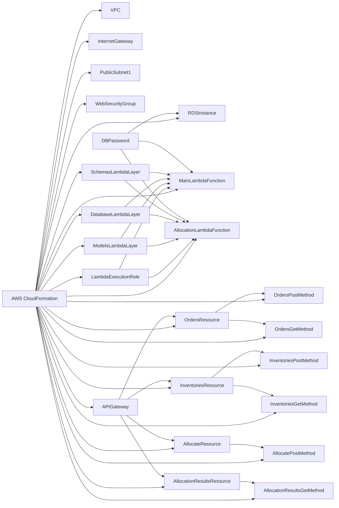

IaC (Infrastructure as Code) を使用して AWS 環境を構築し、CI/CD パイプラインを設定する方法を以下に示します。

## 1. AWS 環境の IaC (Infrastructure as Code)

#### ブロック図



ブロック図の説明:

1. AWS CloudFormationは、テンプレートに定義されたすべてのリソースを作成・管理します。

2. VPC、InternetGateway、PublicSubnet1、WebSecurityGroupは、ネットワーク関連のリソースです。

3. RDSInstanceは、PostgreSQLデータベースを表します。DBPasswordパラメータを使用してマスターユーザーのパスワードを設定します。

4. LambdaExecutionRoleは、Lambda関数の実行に必要なIAMロールです。MainLambdaFunctionとAllocationLambdaFunctionは、このロールを使用します。

5. MainLambdaFunctionは、メインのLambda関数であり、APIエンドポイントを提供します。この関数は、ModelsLambdaLayer、DatabaseLambdaLayer、およびSchemasLambdaLayerを使用します。

6. AllocationLambdaFunctionは、在庫の割り当てを行うLambda関数です。この関数も、ModelsLambdaLayer、DatabaseLambdaLayer、およびSchemasLambdaLayerを使用します。

7. ModelsLambdaLayer、DatabaseLambdaLayer、SchemasLambdaLayerは、それぞれモデル、データベース接続、スキーマを定義するLambdaレイヤーです。

8. APIGatewayは、RESTful APIを提供します。OrdersResource、InventoriesResource、AllocateResource、AllocationResultsResourceは、APIのリソースを表します。

9. 各リソースには、対応するHTTPメソッド（POST、GET）が定義されています。これらのメソッドは、Lambda関数を統合して、リクエストを処理します。

10. DBPasswordパラメータは、RDSInstanceとLambda関数に渡されます。

このブロック図は、更新されたCloudFormationテンプレートのリソースとその関係を視覚的に表現しています。Lambda関数は必要なLambdaレイヤーを使用し、APIゲートウェイを介してHTTPリクエストを受け取ります。データベースとLambda関数は、DBPasswordパラメータを使用して設定されます。

#### AWS CloudFormationテンプレート

```yaml
AWSTemplateFormatVersion: '2010-09-09'
Description: 'Inventory Allocation System Infrastructure'

Resources:
  # VPC
  VPC:
    Type: 'AWS::EC2::VPC'
    Properties:
      CidrBlock: '10.0.0.0/16'
      EnableDnsHostnames: true
      EnableDnsSupport: true
      InstanceTenancy: default
      Tags:
        - Key: Name
          Value: 'Inventory-Allocation-VPC'

  # インターネットゲートウェイ
  InternetGateway:
    Type: 'AWS::EC2::InternetGateway'
    Properties:
      Tags:
        - Key: Name
          Value: 'Inventory-Allocation-IGW'

  # サブネット
  PublicSubnet1:
    Type: 'AWS::EC2::Subnet'
    Properties:
      VpcId: !Ref VPC
      AvailabilityZone: !Select [0, !GetAZs '']
      CidrBlock: '10.0.1.0/24'
      MapPublicIpOnLaunch: true
      Tags:
        - Key: Name
          Value: 'Inventory-Allocation-Public-Subnet-1'

  # セキュリティグループ
  WebSecurityGroup:
    Type: 'AWS::EC2::SecurityGroup'
    Properties:
      GroupDescription: 'Security group for web servers'
      VpcId: !Ref VPC
      SecurityGroupIngress:
        - IpProtocol: tcp
          FromPort: 80
          ToPort: 80
          CidrIp: '0.0.0.0/0'
        - IpProtocol: tcp
          FromPort: 443
          ToPort: 443
          CidrIp: '0.0.0.0/0'

  # RDS (PostgreSQL)
  RDSInstance:
    Type: 'AWS::RDS::DBInstance'
    Properties:
      Engine: postgres
      EngineVersion: '12.7'
      DBInstanceClass: db.t3.micro
      AllocatedStorage: '20'
      StorageType: gp2
      MultiAZ: false
      PubliclyAccessible: false
      DBName: 'inventory_allocation_db'
      MasterUsername: 'admin'
      MasterUserPassword: !Ref DBPassword
      VPCSecurityGroups:
        - !Ref DBSecurityGroup

  # Lambda 関数
  LambdaExecutionRole:
    Type: 'AWS::IAM::Role'
    Properties:
      AssumeRolePolicyDocument:
        Version: '2012-10-17'
        Statement:
          - Effect: Allow
            Principal:
              Service:
                - lambda.amazonaws.com
            Action:
              - 'sts:AssumeRole'
      Path: '/'
      Policies:
        - PolicyName: 'LambdaExecutionPolicy'
          PolicyDocument:
            Version: '2012-10-17'
            Statement:
              - Effect: Allow
                Action:
                  - 'logs:CreateLogGroup'
                  - 'logs:CreateLogStream'
                  - 'logs:PutLogEvents'
                Resource: 'arn:aws:logs:*:*:*'

  MainLambdaFunction:
    Type: 'AWS::Lambda::Function'
    Properties:
      FunctionName: 'MainFunction'
      Runtime: 'python3.9'
      Handler: 'main.handler'
      Role: !GetAtt LambdaExecutionRole.Arn
      Code:
        ZipFile: |
          import os
          from fastapi import FastAPI, Depends
          from sqlalchemy.orm import Session
          from database import SessionLocal, engine
          from models import Base
          from schemas import OrderRequest, InventoryRequest, AllocationRequest
          from allocation import allocate_inventory

          Base.metadata.create_all(bind=engine)

          app = FastAPI()

          def get_db():
              db = SessionLocal()
              try:
                  yield db
              finally:
                  db.close()

          @app.post("/orders")
          def create_order(order: OrderRequest, db: Session = Depends(get_db)):
              # Create order logic

          @app.post("/inventories")
          def create_inventory(inventory: InventoryRequest, db: Session = Depends(get_db)):
              # Create inventory logic

          @app.post("/allocations")
          def allocate(allocation: AllocationRequest, db: Session = Depends(get_db)):
              # Allocate inventory logic

          def handler(event, context):
              # Lambda handler logic
      Environment:
        Variables:
          DB_HOST: !GetAtt RDSInstance.Endpoint.Address
          DB_PORT: !GetAtt RDSInstance.Endpoint.Port
          DB_NAME: 'inventory_allocation_db'
          DB_USER: 'admin'
          DB_PASSWORD: !Ref DBPassword

  AllocationLambdaFunction:
    Type: 'AWS::Lambda::Function'
    Properties:
      FunctionName: 'AllocationFunction'
      Runtime: 'python3.9'
      Handler: 'allocation.allocate_inventory'
      Role: !GetAtt LambdaExecutionRole.Arn
      Code:
        ZipFile: |
          from sqlalchemy.orm import Session
          from models import Order, Inventory, AllocationResult
          from datetime import datetime
          import logging

          logger = logging.getLogger(__name__)
          logger.setLevel(logging.INFO)

          handler = logging.StreamHandler()
          handler.setLevel(logging.INFO)
          formatter = logging.Formatter("%(asctime)s - %(name)s - %(levelname)s - %(message)s")
          handler.setFormatter(formatter)
          logger.addHandler(handler)

          def allocate_inventory(db: Session, allocation_method: str):
              # Allocation logic

  ModelsLambdaLayer:
    Type: 'AWS::Lambda::LayerVersion'
    Properties:
      LayerName: 'ModelsLayer'
      Description: 'Models layer'
      Content:
        ZipFile: |
          from sqlalchemy import Column, Integer, String, Date, Float, ForeignKey
          from sqlalchemy.orm import relationship
          from database import Base

          class Order(Base):
              # Order model

          class Inventory(Base):
              # Inventory model

          class AllocationResult(Base):
              # AllocationResult model

  DatabaseLambdaLayer:
    Type: 'AWS::Lambda::LayerVersion'
    Properties:
      LayerName: 'DatabaseLayer'
      Description: 'Database layer'
      Content:
        ZipFile: |
          from sqlalchemy import create_engine
          from sqlalchemy.ext.declarative import declarative_base
          from sqlalchemy.orm import sessionmaker
          import os

          DB_HOST = os.environ.get("DB_HOST")
          DB_PORT = os.environ.get("DB_PORT")
          DB_NAME = os.environ.get("DB_NAME")
          DB_USER = os.environ.get("DB_USER")
          DB_PASSWORD = os.environ.get("DB_PASSWORD")

          SQLALCHEMY_DATABASE_URL = f"postgresql://{DB_USER}:{DB_PASSWORD}@{DB_HOST}:{DB_PORT}/{DB_NAME}"

          engine = create_engine(SQLALCHEMY_DATABASE_URL)
          SessionLocal = sessionmaker(autocommit=False, autoflush=False, bind=engine)

          Base = declarative_base()

  SchemasLambdaLayer:
    Type: 'AWS::Lambda::LayerVersion'
    Properties:
      LayerName: 'SchemasLayer'
      Description: 'Schemas layer'
      Content:
        ZipFile: |
          from pydantic import BaseModel
          from datetime import datetime
          from typing import List

          class TokenPayload(BaseModel):
              # TokenPayload schema

          class OrderRequest(BaseModel):
              # OrderRequest schema

          class InventoryRequest(BaseModel):
              # InventoryRequest schema

          class AllocationRequest(BaseModel):
              # AllocationRequest schema

          class OrderResponse(BaseModel):
              # OrderResponse schema

          class InventoryResponse(BaseModel):
              # InventoryResponse schema

          class AllocationResultResponse(BaseModel):
              # AllocationResultResponse schema

  # API Gateway
  APIGateway:
    Type: 'AWS::ApiGateway::RestApi'
    Properties:
      Name: 'Inventory Allocation API'
      Description: 'API for Inventory Allocation System'

  # API Gateway リソース
  OrdersResource:
    Type: 'AWS::ApiGateway::Resource'
    Properties:
      RestApiId: !Ref APIGateway
      ParentId: !GetAtt APIGateway.RootResourceId
      PathPart: 'orders'

  InventoriesResource:
    Type: 'AWS::ApiGateway::Resource'
    Properties:
      RestApiId: !Ref APIGateway
      ParentId: !GetAtt APIGateway.RootResourceId
      PathPart: 'inventories'

  AllocateResource:
    Type: 'AWS::ApiGateway::Resource'
    Properties:
      RestApiId: !Ref APIGateway
      ParentId: !GetAtt APIGateway.RootResourceId
      PathPart: 'allocate'

  AllocationResultsResource:
    Type: 'AWS::ApiGateway::Resource'
    Properties:
      RestApiId: !Ref APIGateway
      ParentId: !GetAtt APIGateway.RootResourceId
      PathPart: 'allocation-results'

  # API Gateway メソッド
  # Orders リソースのメソッド
  OrdersPostMethod:
    Type: 'AWS::ApiGateway::Method'
    Properties:
      RestApiId: !Ref APIGateway
      ResourceId: !Ref OrdersResource
      HttpMethod: POST
      AuthorizationType: NONE
      Integration:
        Type: AWS_PROXY
        IntegrationHttpMethod: POST
        Uri: !Sub 'arn:aws:apigateway:${AWS::Region}:lambda:path/2015-03-31/functions/${MainLambdaFunction.Arn}/invocations'

  OrdersGetMethod:
    Type: 'AWS::ApiGateway::Method'
    Properties:
      RestApiId: !Ref APIGateway
      ResourceId: !Ref OrdersResource
      HttpMethod: GET
      AuthorizationType: NONE
      Integration:
        Type: AWS_PROXY
        IntegrationHttpMethod: POST
        Uri: !Sub 'arn:aws:apigateway:${AWS::Region}:lambda:path/2015-03-31/functions/${MainLambdaFunction.Arn}/invocations'

  # Inventories リソースのメソッド
  InventoriesPostMethod:
    Type: 'AWS::ApiGateway::Method'
    Properties:
      RestApiId: !Ref APIGateway
      ResourceId: !Ref InventoriesResource
      HttpMethod: POST
      AuthorizationType: NONE
      Integration:
        Type: AWS_PROXY
        IntegrationHttpMethod: POST
        Uri: !Sub 'arn:aws:apigateway:${AWS::Region}:lambda:path/2015-03-31/functions/${MainLambdaFunction.Arn}/invocations'

  InventoriesGetMethod:
    Type: 'AWS::ApiGateway::Method'
    Properties:
      RestApiId: !Ref APIGateway
      ResourceId: !
```


## 2. CI/CD パイプラインの IaC

#### CI/CD パイプラインの構成図


1. GitHub からソースコードが AWS CodePipeline に取り込まれます。

2. CodePipeline のソースアクションがソースコードを取得します。

3. ビルドアクションが AWS CodeBuild を使用してソースコードをビルドします。

4. 単体テストアクションが、ビルドされたアーティファクトに対して JUnit を使用して単体テストを実行します。

5. ビルドアクションの出力アーティファクトが AWS CodeArtifact に格納されます。

6. デプロイアクションが、CodeArtifact から取得したアーティファクトを使用して、AWS CloudFormation を介してデプロイを実行します。

7. CloudFormation がアプリケーションを AWS リソース（Lambda、API Gateway、RDS など）にデプロイします。

この図は、ソースコードが GitHub から取得され、AWS CodePipeline を通じてビルド、テスト、デプロイの各ステージが実行される流れを示しています。ビルドアーティファクトは AWS CodeArtifact に格納され、デプロイ時に取得されます。最終的に、AWS CloudFormation を使用してアプリケーションが AWS リソースにデプロイされます。


```yaml
AWSTemplateFormatVersion: '2010-09-09'
Description: 'CI/CD Pipeline for Inventory Allocation System'

Resources:
  # CodeBuild プロジェクト
  CodeBuildProject:
    Type: 'AWS::CodeBuild::Project'
    Properties:
      Name: 'inventory-allocation-build'
      Description: 'Build project for Inventory Allocation System'
      ServiceRole: !GetAtt CodeBuildServiceRole.Arn
      Artifacts:
        Type: CODEPIPELINE
      Environment:
        Type: LINUX_CONTAINER
        ComputeType: BUILD_GENERAL1_SMALL
        Image: 'aws/codebuild/standard:4.0'
      Source:
        Type: CODEPIPELINE
        BuildSpec: 'buildspec.yml'

  # CodePipeline
  CodePipeline:
    Type: 'AWS::CodePipeline::Pipeline'
    Properties:
      Name: 'inventory-allocation-pipeline'
      RoleArn: !GetAtt CodePipelineServiceRole.Arn
      Stages:
        - Name: Source
          Actions:
            - Name: SourceAction
              ActionTypeId:
                Category: Source
                Owner: ThirdParty
                Provider: GitHub
                Version: '1'
              Configuration:
                Owner: 'your-github-username'
                Repo: 'your-github-repo'
                Branch: 'main'
                OAuthToken: '{{resolve:secretsmanager:github-token}}'
              OutputArtifacts:
                - Name: SourceOutput
        - Name: Build
          Actions:
            - Name: BuildAction
              ActionTypeId:
                Category: Build
                Owner: AWS
                Provider: CodeBuild
                Version: '1'
              Configuration:
                ProjectName: !Ref CodeBuildProject
              InputArtifacts:
                - Name: SourceOutput
              OutputArtifacts:
                - Name: BuildOutput
        - Name: Test
          Actions:
            - Name: UnitTestAction
              ActionTypeId:
                Category: Test
                Owner: AWS
                Provider: CodeBuild
                Version: '1'
              Configuration:
                ProjectName: !Ref CodeBuildProject
              InputArtifacts:
                - Name: BuildOutput
        - Name: Deploy
          Actions:
            - Name: DeployAction
              ActionTypeId:
                Category: Deploy
                Owner: AWS
                Provider: CloudFormation
                Version: '1'
              Configuration:
                ActionMode: CREATE_UPDATE
                StackName: 'inventory-allocation-stack'
                TemplatePath: 'BuildOutput::template.yml'
                RoleArn: !GetAtt CloudFormationExecutionRole.Arn
              InputArtifacts:
                - Name: BuildOutput

  # CodeArtifact リポジトリ
  CodeArtifactRepository:
    Type: 'AWS::CodeArtifact::Repository'
    Properties:
      RepositoryName: 'inventory-allocation-repo'
      DomainName: 'my-domain'
      PermissionsPolicyDocument:
        Version: '2012-10-17'
        Statement:
          - Effect: Allow
            Principal: '*'
            Action:
              - 'codeartifact:GetPackageVersionAsset'
              - 'codeartifact:ReadFromRepository'
            Resource: '*'

  # 必要な IAM ロールとポリシーを定義
  CodeBuildServiceRole:
    Type: 'AWS::IAM::Role'
    Properties:
      AssumeRolePolicyDocument:
        Version: '2012-10-17'
        Statement:
          - Effect: Allow
            Principal:
              Service: 'codebuild.amazonaws.com'
            Action: 'sts:AssumeRole'
      Policies:
        - PolicyName: 'CodeBuildPolicy'
          PolicyDocument:
            Version: '2012-10-17'
            Statement:
              - Effect: Allow
                Action:
                  - 'logs:CreateLogGroup'
                  - 'logs:CreateLogStream'
                  - 'logs:PutLogEvents'
                Resource: '*'
              - Effect: Allow
                Action:
                  - 'codeartifact:GetPackageVersionAsset'
                  - 'codeartifact:PublishPackageVersion'
                  - 'codeartifact:PutPackageMetadata'
                Resource: !GetAtt CodeArtifactRepository.Arn

  CodePipelineServiceRole:
    Type: 'AWS::IAM::Role'
    Properties:
      AssumeRolePolicyDocument:
        Version: '2012-10-17'
        Statement:
          - Effect: Allow
            Principal:
              Service: 'codepipeline.amazonaws.com'
            Action: 'sts:AssumeRole'
      Policies:
        - PolicyName: 'CodePipelinePolicy'
          PolicyDocument:
            Version: '2012-10-17'
            Statement:
              - Effect: Allow
                Action:
                  - 'codebuild:BatchGetBuilds'
                  - 'codebuild:StartBuild'
                Resource: !GetAtt CodeBuildProject.Arn
              - Effect: Allow
                Action:
                  - 'codeartifact:GetPackageVersionAsset'
                  - 'codeartifact:PublishPackageVersion'
                  - 'codeartifact:PutPackageMetadata'
                Resource: !GetAtt CodeArtifactRepository.Arn
```


## 3.Jenkinsを利用した際の例
この例では、Jenkins パイプラインが GitHub からソースコードを取得し、Maven を使用してビルドとテストを行い、AWS CLI を使用して CloudFormation スタックを更新しています。AWS 認証情報は、Jenkins の認証情報管理を使用して安全に管理されます。

Jenkins を使用することで、AWS CodePipeline、AWS CodeBuild、AWS CodeArtifact と同様の CI/CD 機能を実現できます。また、Jenkins の豊富なプラグインエコシステムを活用して、パイプラインをカスタマイズし、特定のニーズに合わせて拡張することができます。


1. GitHub にプッシュされたソースコードが Webhook を介して Jenkins に通知されます。

2. Jenkins のジョブがトリガーされ、ソースコードを取得します。

3. ビルドステップでソースコードがビルドされます。

4. 単体テストステップで、ビルドされたアーティファクトに対して JUnit を使用して単体テストが実行されます。

5. ビルドアーティファクトが Artifactory などのアーティファクトリポジトリに格納されます。

6. デプロイステップで、Artifactory から取得したアーティファクトを使用して、AWS CLI を介して AWS CloudFormation スタックが更新されます。

7. CloudFormation がアプリケーションを AWS リソース（Lambda、API Gateway、RDS など）にデプロイします。

Jenkins パイプラインは、Jenkinsfile を使用して定義できます。Jenkinsfile は、パイプラインのステップとその設定を含む Groovy スクリプトです。以下は、上記の CI/CD パイプラインを表す Jenkinsfile の例です。

```groovy
pipeline {
    agent any

    stages {
        stage('Source') {
            steps {
                git 'https://github.com/your-repo.git'
            }
        }
        stage('Build') {
            steps {
                sh 'mvn clean package'
            }
        }
        stage('Test') {
            steps {
                sh 'mvn test'
            }
        }
        stage('Deploy') {
            steps {
                withAWS(credentials: 'aws-credentials', region: 'us-west-2') {
                    sh 'aws cloudformation update-stack --stack-name my-stack --template-body file://template.yml'
                }
            }
        }
    }
}
```

