Note）本設計書及びプログラムの最新版はGitHubの[Rayoo-Nakano/InventoryAllocation](https://github.com/Rayoo-Nakano/InventoryAllocation "Rayoo-Nakano/InventoryAllocation")に常時更新しています。

> 単体試験の目次はappからDatabase, schemasと並べていますが、早期にプログラムを安定させるには逆の方向で実施する必要があります。

# 目次
- [単体試験仕様書(test\_app.py)](#単体試験仕様書test_apppy)
- [単体試験仕様書(test\_allocation.py)](#単体試験仕様書test_allocationpy)
- [単体試験仕様書(test\_models.py)](#単体試験仕様書test_modelspy)
- [単体試験仕様書(test\_database.py)](#単体試験仕様書test_databasepy)
- [単体試験仕様書(test\_schemas.py)](#単体試験仕様書test_schemaspy)
- [カバレッジ測定手順書](#カバレッジ測定手順書)


<a id="単体試験仕様書test_apppy"></a>

# 単体試験仕様書(test_app.py)

## 1. 概要

本文書は、在庫管理システムの単体試験仕様書です。以下の図は、システムの主要なコンポーネントとそれらの関係を示しています。

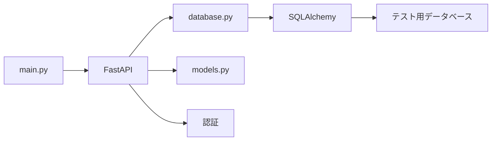

## 2. テスト環境

- テスト用のデータベースを設定し、テスト実行前にデータベースを初期化します。
- テスト用の認証トークンを生成します。

## 3. テストケース

### 3.1. 注文作成の成功テスト

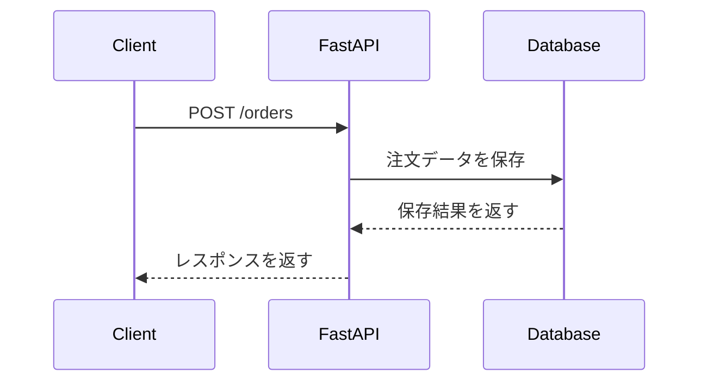

- 有効な認証トークンを使用して注文を作成します。
- レスポンスのステータスコードが200であることを確認します。
- レスポンスにIDが含まれていることを確認します。
- レスポンスの注文データが入力データと一致することを確認します。

### 3.2. 注文一覧取得の成功テスト

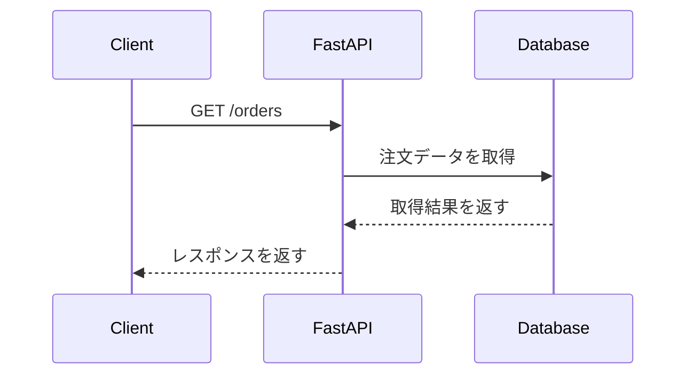

- 有効な認証トークンを使用して注文一覧を取得します。
- レスポンスのステータスコードが200であることを確認します。
- レスポンスがリスト形式であることを確認します。

### 3.3. 在庫作成の成功テスト

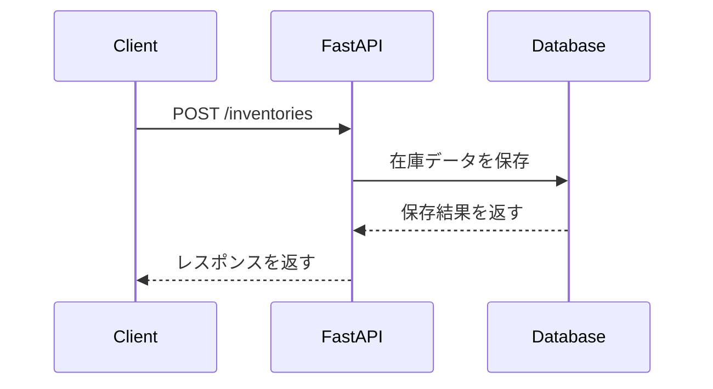

- 有効な認証トークンを使用して在庫を作成します。
- レスポンスのステータスコードが200であることを確認します。
- レスポンスにIDが含まれていることを確認します。
- レスポンスの在庫データが入力データと一致することを確認します。

### 3.4. 在庫一覧取得の成功テスト

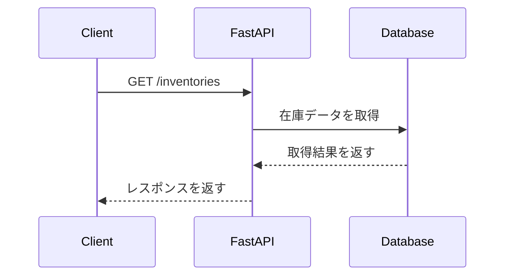

- 有効な認証トークンを使用して在庫一覧を取得します。
- レスポンスのステータスコードが200であることを確認します。
- レスポンスがリスト形式であることを確認します。

### 3.5. 在庫割り当ての成功テスト

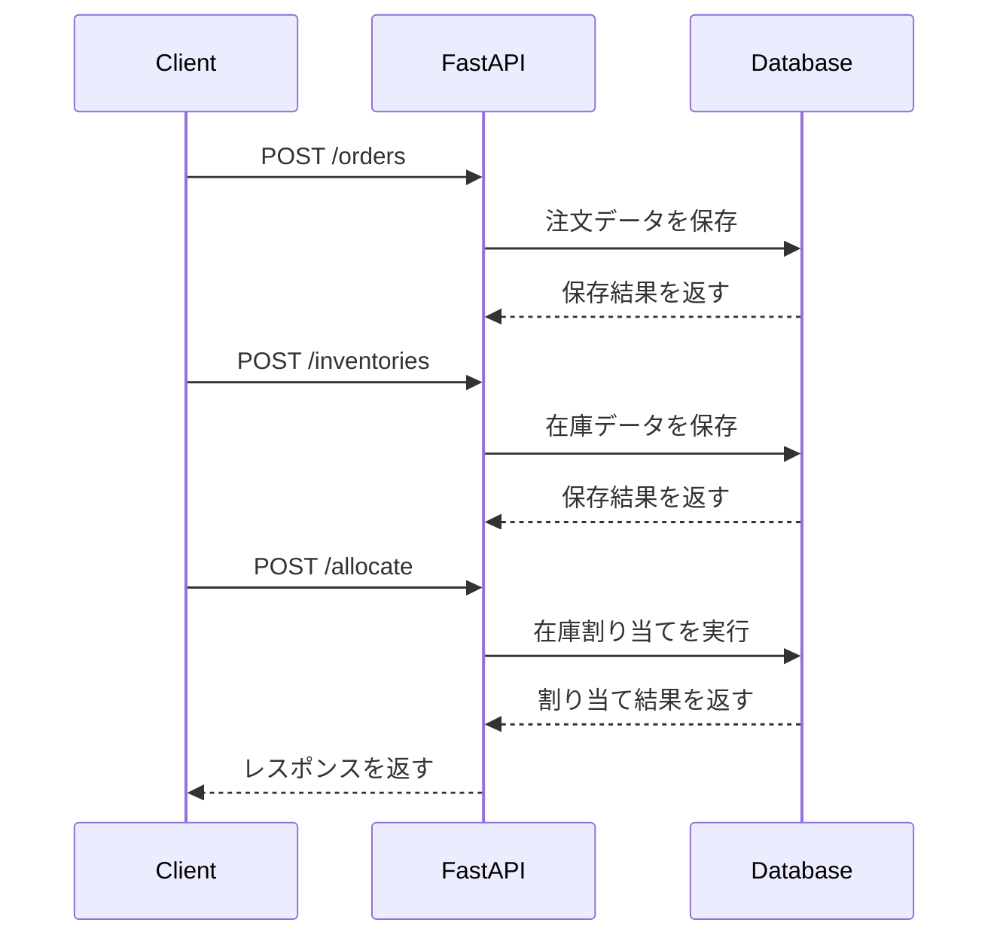

- 有効な認証トークンを使用して注文を作成します。
- 有効な認証トークンを使用して在庫を作成します。
- 有効な認証トークンを使用して在庫割り当てを実行します。
- レスポンスのステータスコードが200であることを確認します。
- レスポンスにIDが含まれていることを確認します。
- レスポンスの割り当てデータが入力データと一致することを確認します。

### 3.6. 割り当て結果一覧取得の成功テスト

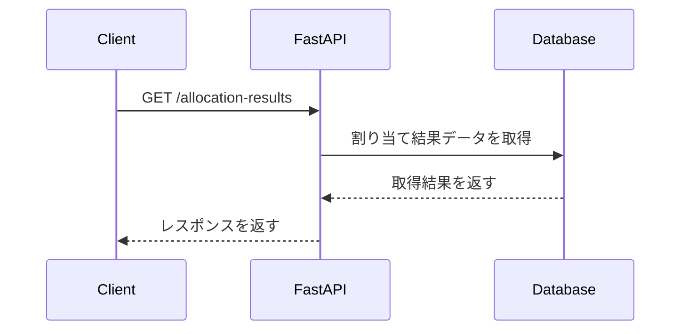

- 有効な認証トークンを使用して割り当て結果一覧を取得します。
- レスポンスのステータスコードが200であることを確認します。
- レスポンスがリスト形式であることを確認します。

### 3.7. 存在しないエンドポイントへのアクセステスト

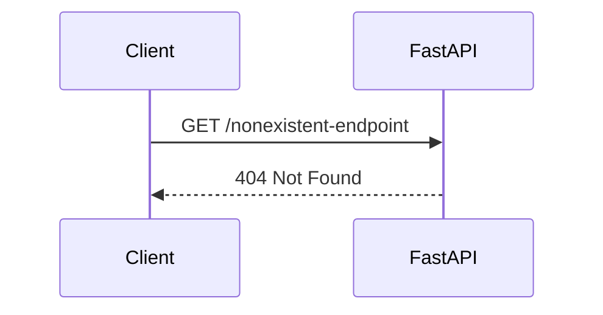

- 有効な認証トークンを使用して存在しないエンドポイントにアクセスします。
- レスポンスのステータスコードが404であることを確認します。
- レスポンスのエラーメッセージが "Not Found" であることを確認します。

### 3.8. 無効なデータでの注文作成テスト

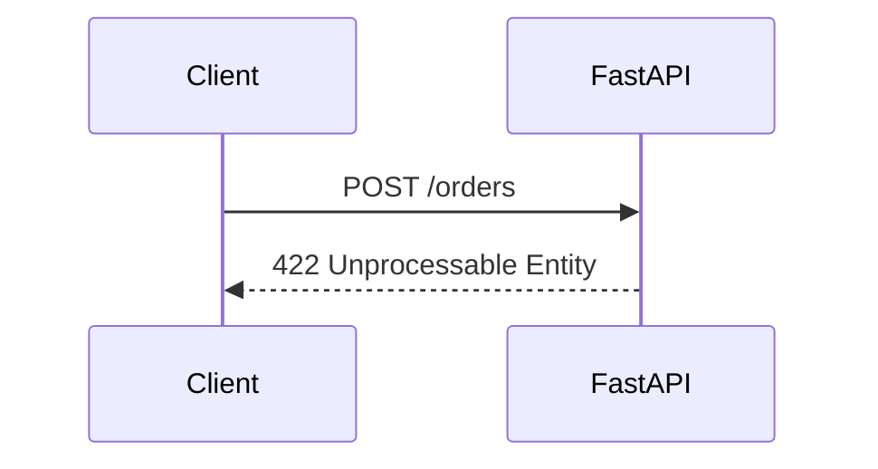

- 有効な認証トークンを使用して無効なデータで注文を作成します。
- レスポンスのステータスコードが422であることを確認します。
- レスポンスのエラーメッセージが期待される内容であることを確認します。

### 3.9. 認証失敗のテスト

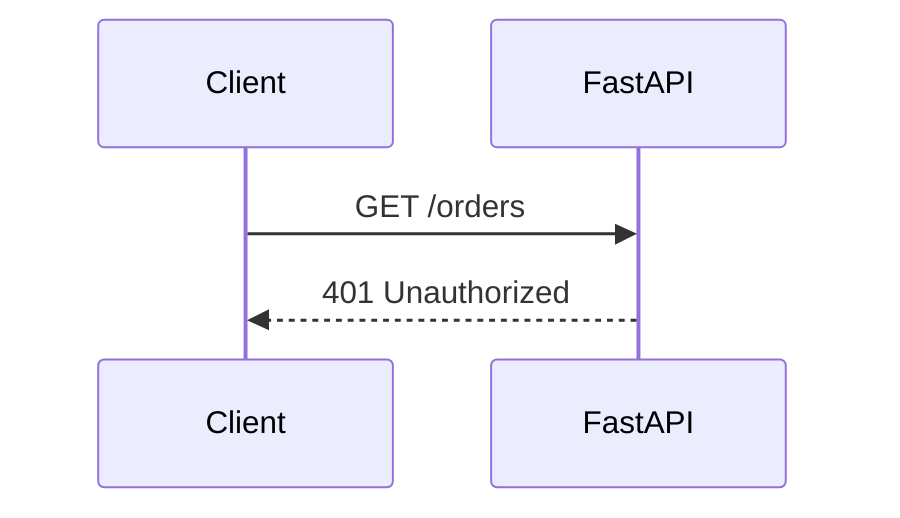

- 無効な認証トークンを使用して注文一覧を取得します。
- レスポンスのステータスコードが401であることを確認します。
- レスポンスのエラーメッセージが "無効なトークンです" であることを確認します。

## 4. 合格条件

- すべてのテストケースが成功すること。
- テストカバレッジが90%以上であること。

<a id="単体試験仕様書test_allocationpy"></a>

# 単体試験仕様書(test_allocation.py)

## 1. 概要

本文書は、在庫割り当て機能の単体試験仕様書です。以下の図は、システムの主要なコンポーネントとそれらの関係を示しています。

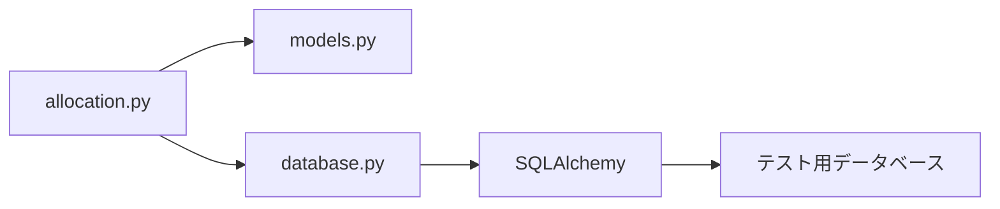

## 2. テスト環境

- テスト用のデータベースを設定し、テスト実行前にデータベースを初期化します。
- テストデータを作成し、データベースに追加します。

## 3. テストケース

### 3.1. FIFOでの在庫割り当てテスト

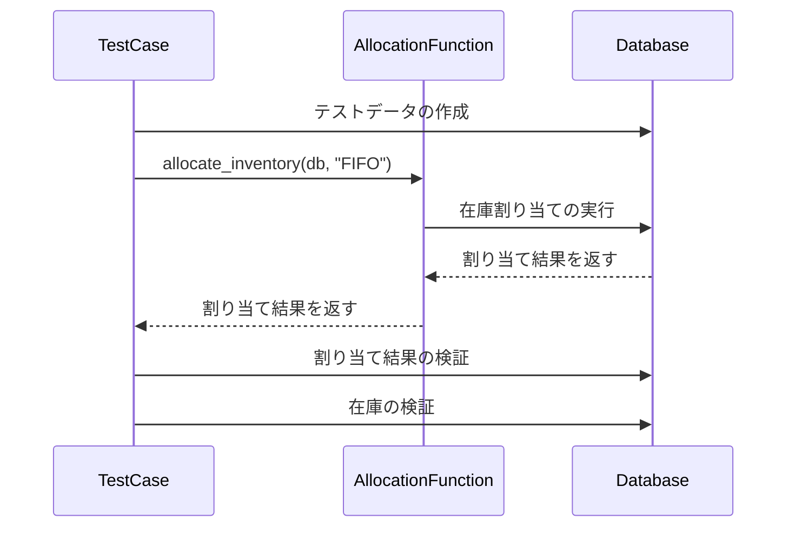

- テストデータを作成し、データベースに追加します。
- FIFOでの在庫割り当てを実行します。
- 割り当て結果を検証します。
- 在庫の状態を検証します。

### 3.2. LIFOでの在庫割り当てテスト

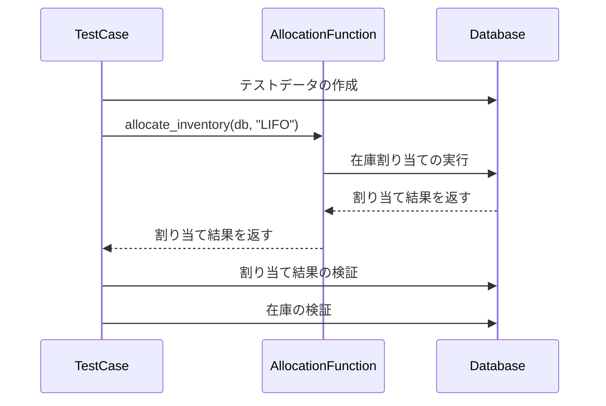

- テストデータを作成し、データベースに追加します。
- LIFOでの在庫割り当てを実行します。
- 割り当て結果を検証します。
- 在庫の状態を検証します。

### 3.3. AVERAGEでの在庫割り当てテスト

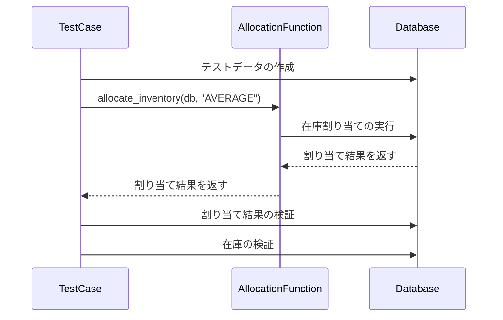

- テストデータを作成し、データベースに追加します。
- AVERAGEでの在庫割り当てを実行します。
- 割り当て結果を検証します。
- 在庫の状態を検証します。

### 3.4. SPECIFICでの在庫割り当てテスト

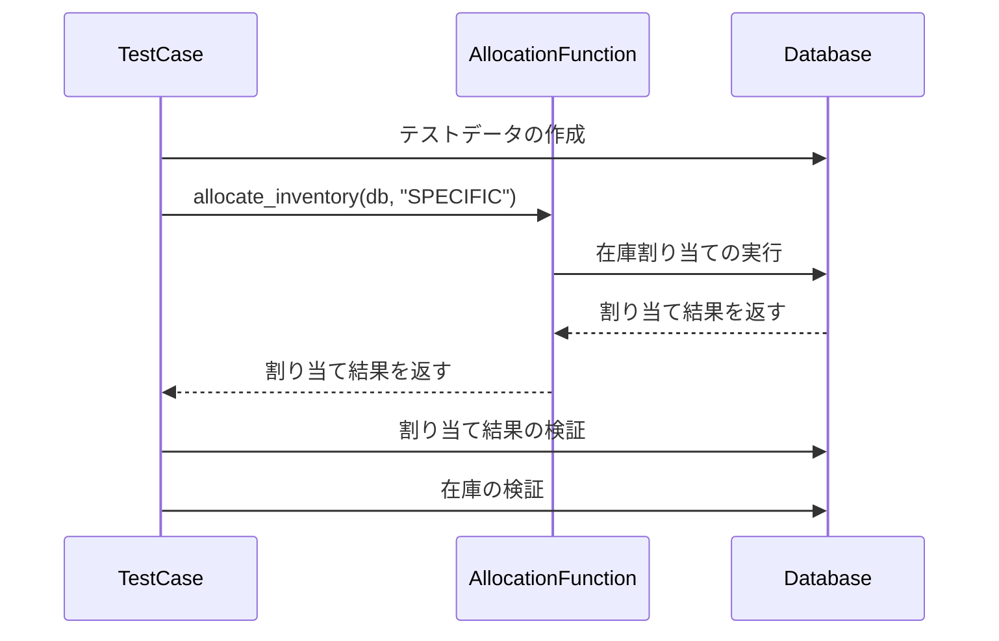

- テストデータを作成し、データベースに追加します。
- SPECIFICでの在庫割り当てを実行します。
- 割り当て結果を検証します。
- 在庫の状態を検証します。

### 3.5. TOTAL_AVERAGEでの在庫割り当てテスト

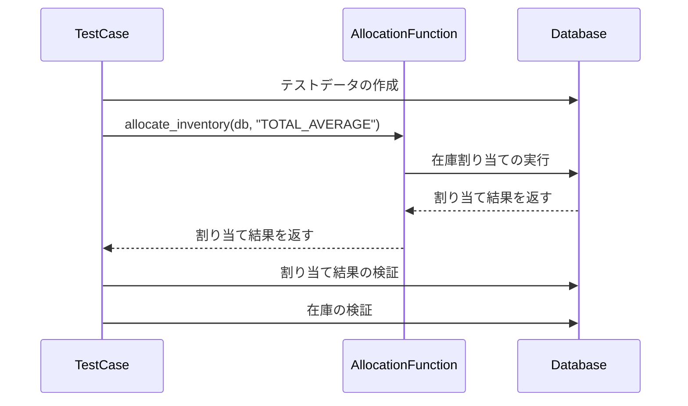

- テストデータを作成し、データベースに追加します。
- TOTAL_AVERAGEでの在庫割り当てを実行します。
- 割り当て結果を検証します。
- 在庫の状態を検証します。

### 3.6. MOVING_AVERAGEでの在庫割り当てテスト

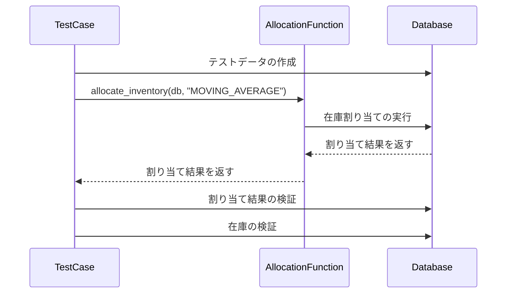

- テストデータを作成し、データベースに追加します。
- MOVING_AVERAGEでの在庫割り当てを実行します。
- 割り当て結果を検証します。
- 在庫の状態を検証します。

### 3.7. 在庫不足の場合のテスト


- テストデータを作成し、データベースに追加します。
- 在庫不足の状態で在庫割り当てを実行します。
- 割り当て結果を検証します。
- 在庫の状態を検証します。

## 4. 合格条件

- すべてのテストケースが成功すること。
- テストカバレッジが90%以上であること。


<a id="単体試験仕様書test_modelspy"></a>

# 単体試験仕様書(test_models.py)

## 1. 概要

本文書は、データベースモデルの単体試験仕様書です。以下の図は、システムの主要なコンポーネントとそれらの関係を示しています。

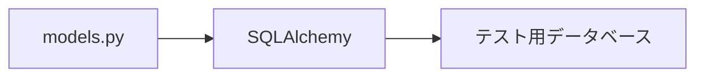

## 2. テスト環境

- テスト用のインメモリデータベースを設定し、テスト実行前にデータベースを初期化します。
- テストデータを作成し、データベースに追加します。

## 3. テストケース

### 3.1. Orderモデルの作成テスト

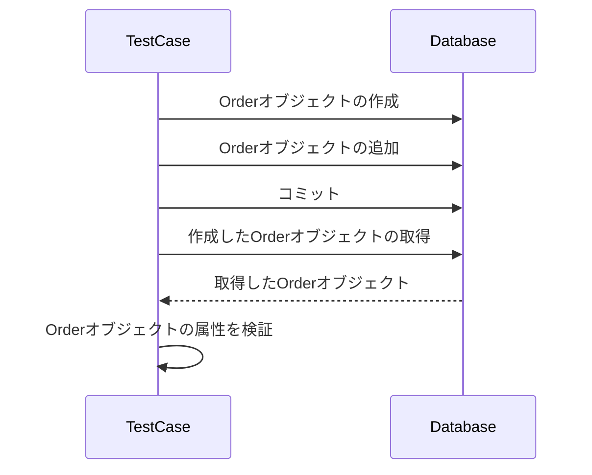

- Orderオブジェクトを作成し、データベースに追加します。
- 作成したOrderオブジェクトをデータベースから取得します。
- 取得したOrderオブジェクトの属性を検証します。

### 3.2. Inventoryモデルの作成テスト

```mermaid
sequenceDiagram
    participant TestCase
    participant Database

    TestCase->>Database: Inventoryオブジェクトの作成
    TestCase->>Database: Inventoryオブジェクトの追加
    TestCase->>Database: コミット
    TestCase->>Database: 作成したInventoryオブジェクトの取得
    Database-->>TestCase: 取得したInventoryオブジェクト
    TestCase->>TestCase: Inventoryオブジェクトの属性を検証
```

- Inventoryオブジェクトを作成し、データベースに追加します。
- 作成したInventoryオブジェクトをデータベースから取得します。
- 取得したInventoryオブジェクトの属性を検証します。

### 3.3. AllocationResultモデルの作成テスト

```mermaid
sequenceDiagram
    participant TestCase
    participant Database

    TestCase->>Database: Orderオブジェクトの作成と追加
    TestCase->>Database: コミット
    TestCase->>Database: AllocationResultオブジェクトの作成
    TestCase->>Database: AllocationResultオブジェクトの追加
    TestCase->>Database: コミット
    TestCase->>Database: 作成したAllocationResultオブジェクトの取得
    Database-->>TestCase: 取得したAllocationResultオブジェクト
    TestCase->>TestCase: AllocationResultオブジェクトの属性を検証
```

- Orderオブジェクトを作成し、データベースに追加します。
- AllocationResultオブジェクトを作成し、データベースに追加します。
- 作成したAllocationResultオブジェクトをデータベースから取得します。
- 取得したAllocationResultオブジェクトの属性を検証します。

### 3.4. OrderとAllocationResultの関連付けテスト

```mermaid
sequenceDiagram
    participant TestCase
    participant Database

    TestCase->>Database: Orderオブジェクトの作成と追加
    TestCase->>Database: コミット
    TestCase->>Database: AllocationResultオブジェクトの作成と追加
    TestCase->>Database: コミット
    TestCase->>Database: 作成したOrderオブジェクトの取得
    Database-->>TestCase: 取得したOrderオブジェクト
    TestCase->>TestCase: Orderオブジェクトに関連付けられたAllocationResultを検証
```

- Orderオブジェクトを作成し、データベースに追加します。
- AllocationResultオブジェクトを作成し、データベースに追加します。
- 作成したOrderオブジェクトをデータベースから取得します。
- 取得したOrderオブジェクトに関連付けられたAllocationResultを検証します。

## 4. 合格条件

- すべてのテストケースが成功すること。
- テストカバレッジが90%以上であること。

<a id="単体試験仕様書test_databasepy"></a>

# 単体試験仕様書(test_database.py)

## 1. 概要

本文書は、データベース接続とテーブル作成機能の単体試験仕様書です。以下の図は、システムの主要なコンポーネントとそれらの関係を示しています。

```mermaid
graph LR
    A[database.py] --> B[SQLAlchemy]
    B --> C[テスト用データベース]
```

## 2. テスト環境

### 2.1. テスト用環境変数の設定

テスト実行時に、以下のコードを使用してテスト用の環境変数を設定します。

```python
os.environ["TESTING"] = "True"
```

この環境変数は、テスト実行中であることを示すために使用されます。必要に応じて、他のテスト用の環境変数を設定することができます。

### 2.2. テスト用データベースの設定

テスト用のインメモリデータベースを設定し、テスト実行前にデータベースを初期化します。以下のコードを使用して、テスト用のデータベースセッションを作成します。

```python
SQLALCHEMY_DATABASE_URL = "sqlite:///:memory:"
engine = create_engine(SQLALCHEMY_DATABASE_URL)
TestingSessionLocal = sessionmaker(autocommit=False, autoflush=False, bind=engine)

Base.metadata.create_all(bind=engine)
```

`SQLALCHEMY_DATABASE_URL`変数には、インメモリデータベースのURLを指定します。`create_engine`関数を使用してデータベースエンジンを作成し、`sessionmaker`関数を使用してテスト用のデータベースセッションを作成します。

`Base.metadata.create_all`関数を呼び出して、テスト用のデータベースにテーブルを作成します。

## 3. テストケース

### 3.1. データベースセッションの取得テスト

```mermaid
sequenceDiagram
    participant TestCase
    participant GetDBFunction

    TestCase->>GetDBFunction: override_get_db()
    GetDBFunction-->>TestCase: データベースセッション
    TestCase->>TestCase: データベースセッションの検証
```

- `override_get_db()`関数を呼び出してデータベースセッションを取得します。
- 取得したデータベースセッションが`None`でないことを検証します。
- 取得したデータベースセッションが`Session`のインスタンスであることを検証します。

### 3.2. データベース接続の検証テスト

```mermaid
sequenceDiagram
    participant TestCase
    participant GetDBFunction
    participant Database

    TestCase->>GetDBFunction: override_get_db()
    GetDBFunction-->>TestCase: データベースセッション
    TestCase->>Database: データベースの種類を確認
    Database-->>TestCase: データベースの種類
    TestCase->>Database: データベースのURLを確認
    Database-->>TestCase: データベースのURL
    TestCase->>TestCase: データベースの種類とURLを検証
```

- `override_get_db()`関数を呼び出してデータベースセッションを取得します。
- 取得したデータベースセッションのデータベース種類が"sqlite"であることを検証します。
- 取得したデータベースセッションのデータベースURLが":memory:"であることを検証します。

### 3.3. テーブル作成の検証テスト

```mermaid
sequenceDiagram
    participant TestCase
    participant GetDBFunction
    participant Database

    TestCase->>GetDBFunction: override_get_db()
    GetDBFunction-->>TestCase: データベースセッション
    TestCase->>Database: テーブル名の取得
    Database-->>TestCase: テーブル名のリスト
    TestCase->>TestCase: 必要なテーブルが存在することを検証
```

- `override_get_db()`関数を呼び出してデータベースセッションを取得します。
- 取得したデータベースセッションからテーブル名のリストを取得します。
- "orders"テーブルが存在することを検証します。
- "inventories"テーブルが存在することを検証します。
- "allocation_results"テーブルが存在することを検証します。

### 3.4. データベース接続失敗のテスト

```mermaid
sequenceDiagram
    participant TestCase
    participant GetDBFunction
    participant Database

    TestCase->>GetDBFunction: override_get_db()
    GetDBFunction->>Database: 無効なデータベース接続情報で接続
    Database-->>GetDBFunction: 接続エラー
    GetDBFunction-->>TestCase: 例外をスロー
    TestCase->>TestCase: 例外が発生することを検証
```

- `override_get_db()`関数を呼び出す際に、無効なデータベース接続情報を使用します。
- データベース接続エラーが発生することを検証します。
- 適切な例外がスローされることを検証します。

### 3.5. テーブル作成失敗のテスト

```mermaid
sequenceDiagram
    participant TestCase
    participant GetDBFunction
    participant Database

    TestCase->>GetDBFunction: override_get_db()
    GetDBFunction-->>TestCase: データベースセッション
    TestCase->>Database: 無効なテーブル定義でテーブル作成
    Database-->>TestCase: テーブル作成エラー
    TestCase->>TestCase: 例外が発生することを検証
```

- `override_get_db()`関数を呼び出してデータベースセッションを取得します。
- 無効なテーブル定義を使用してテーブル作成を試みます。
- テーブル作成エラーが発生することを検証します。
- 適切な例外がスローされることを検証します。

## 4. 合格条件

- すべてのテストケースが成功すること。
- 失敗・エラー系のテストケースが適切に動作すること。
- テストカバレッジが90%以上であること。

以上が、テスト用の環境設定の説明を含む単体試験仕様書です。この仕様書に従ってテストを実行し、合格条件を満たすことで、データベース接続とテーブル作成機能の品質を確保します。

テスト用の環境設定については、テスト用の環境変数を設定し、インメモリデータベースを使用してテスト用のデータベースセッションを作成します。これにより、テスト実行時に独立したテスト環境を確保し、本番環境に影響を与えることなくテストを実行することができます。

<a id="単体試験仕様書test_schemaspy"></a>

# 単体試験仕様書(test_schemas.py)

## 1. 概要

本文書は、在庫管理システムの主要な機能である注文の作成、注文の取得、在庫の作成、在庫の取得、在庫の割り当てに関する単体試験仕様書です。以下の図は、システムの主要なコンポーネントとそれらの関係を示しています。

```mermaid
graph LR
    A[main.py] --> B[FastAPI]
    B --> C[SQLAlchemy]
    C --> D[テスト用データベース]
```

## 2. テスト環境

### 2.1. テスト用データベースの設定

テスト用のSQLiteデータベースを設定し、テスト実行前にデータベースを初期化します。以下のコードを使用して、テスト用のデータベースセッションを作成します。

```python
SQLALCHEMY_DATABASE_URL = "sqlite:///./test.db"

engine = create_engine(
    SQLALCHEMY_DATABASE_URL, connect_args={"check_same_thread": False}
)
TestingSessionLocal = sessionmaker(autocommit=False, autoflush=False, bind=engine)
```

`SQLALCHEMY_DATABASE_URL`変数には、テスト用のSQLiteデータベースのURLを指定します。`create_engine`関数を使用してデータベースエンジンを作成し、`sessionmaker`関数を使用してテスト用のデータベースセッションを作成します。

### 2.2. テスト用のデータベースセッションのオーバーライド

テスト実行時に、アプリケーションのデータベースセッションをテスト用のデータベースセッションでオーバーライドします。以下のコードを使用して、`get_db`関数をオーバーライドします。

```python
def override_get_db():
    try:
        db = TestingSessionLocal()
        yield db
    finally:
        db.close()

app.dependency_overrides[get_db] = override_get_db
```

`override_get_db`関数は、テスト用のデータベースセッションを作成し、テスト実行後にセッションを閉じます。`app.dependency_overrides`を使用して、アプリケーションの`get_db`関数をオーバーライドします。

## 3. テストケース

### 3.1. 注文の作成テスト

```mermaid
sequenceDiagram
    participant TestClient
    participant FastAPI
    participant Database

    TestClient->>FastAPI: POST /orders
    FastAPI->>Database: 注文データを保存
    Database-->>FastAPI: 保存された注文データ
    FastAPI-->>TestClient: レスポンス (ステータスコード201)
    TestClient->>TestClient: レスポンスの検証
```

- `POST /orders`エンドポイントに注文データを送信します。
- レスポンスのステータスコードが201であることを検証します。
- レスポンスの注文データが正しいことを検証します。

### 3.2. 注文の取得テスト

```mermaid
sequenceDiagram
    participant TestClient
    participant FastAPI
    participant Database

    TestClient->>FastAPI: GET /orders
    FastAPI->>Database: 注文データを取得
    Database-->>FastAPI: 取得された注文データ
    FastAPI-->>TestClient: レスポンス (ステータスコード200)
    TestClient->>TestClient: レスポンスの検証
```

- `GET /orders`エンドポイントにリクエストを送信します。
- レスポンスのステータスコードが200であることを検証します。
- レスポンスの注文データが正しいことを検証します。

### 3.3. 在庫の作成テスト

```mermaid
sequenceDiagram
    participant TestClient
    participant FastAPI
    participant Database

    TestClient->>FastAPI: POST /inventories
    FastAPI->>Database: 在庫データを保存
    Database-->>FastAPI: 保存された在庫データ
    FastAPI-->>TestClient: レスポンス (ステータスコード201)
    TestClient->>TestClient: レスポンスの検証
```

- `POST /inventories`エンドポイントに在庫データを送信します。
- レスポンスのステータスコードが201であることを検証します。
- レスポンスの在庫データが正しいことを検証します。

### 3.4. 在庫の取得テスト

```mermaid
sequenceDiagram
    participant TestClient
    participant FastAPI
    participant Database

    TestClient->>FastAPI: GET /inventories
    FastAPI->>Database: 在庫データを取得
    Database-->>FastAPI: 取得された在庫データ
    FastAPI-->>TestClient: レスポンス (ステータスコード200)
    TestClient->>TestClient: レスポンスの検証
```

- `GET /inventories`エンドポイントにリクエストを送信します。
- レスポンスのステータスコードが200であることを検証します。
- レスポンスの在庫データが正しいことを検証します。

### 3.5. 在庫の割り当てテスト

```mermaid
sequenceDiagram
    participant TestClient
    participant FastAPI
    participant Database

    TestClient->>FastAPI: POST /inventories
    FastAPI->>Database: 在庫データを保存
    Database-->>FastAPI: 保存された在庫データ
    FastAPI-->>TestClient: レスポンス (ステータスコード201)

    TestClient->>FastAPI: POST /orders
    FastAPI->>Database: 注文データを保存
    Database-->>FastAPI: 保存された注文データ
    FastAPI-->>TestClient: レスポンス (ステータスコード201)

    TestClient->>FastAPI: POST /orders/{order_id}/allocate
    FastAPI->>Database: 在庫を割り当て
    Database-->>FastAPI: 割り当て結果
    FastAPI-->>TestClient: レスポンス (ステータスコード200)
    TestClient->>TestClient: レスポンスの検証
```

- `POST /inventories`エンドポイントに在庫データを送信します。
- `POST /orders`エンドポイントに注文データを送信します。
- `POST /orders/{order_id}/allocate`エンドポイントに割り当てリクエストを送信します。
- レスポンスのステータスコードが200であることを検証します。
- レスポンスの割り当て結果が正しいことを検証します。

### 3.6. 無効な注文データの作成テスト

```mermaid
sequenceDiagram
    participant TestClient
    participant FastAPI

    TestClient->>FastAPI: POST /orders (無効なデータ)
    FastAPI-->>TestClient: レスポンス (ステータスコード400)
    TestClient->>TestClient: レスポンスの検証
```

- `POST /orders`エンドポイントに無効な注文データを送信します。
- レスポンスのステータスコードが400であることを検証します。
- レスポンスのエラーメッセージが正しいことを検証します。

### 3.7. 存在しない注文の取得テスト

```mermaid
sequenceDiagram
    participant TestClient
    participant FastAPI

    TestClient->>FastAPI: GET /orders/{invalid_order_id}
    FastAPI-->>TestClient: レスポンス (ステータスコード404)
    TestClient->>TestClient: レスポンスの検証
```

- `GET /orders/{invalid_order_id}`エンドポイントに存在しない注文IDを指定してリクエストを送信します。
- レスポンスのステータスコードが404であることを検証します。
- レスポンスのエラーメッセージが正しいことを検証します。

### 3.8. 無効な在庫データの作成テスト

```mermaid
sequenceDiagram
    participant TestClient
    participant FastAPI

    TestClient->>FastAPI: POST /inventories (無効なデータ)
    FastAPI-->>TestClient: レスポンス (ステータスコード400)
    TestClient->>TestClient: レスポンスの検証
```

- `POST /inventories`エンドポイントに無効な在庫データを送信します。
- レスポンスのステータスコードが400であることを検証します。
- レスポンスのエラーメッセージが正しいことを検証します。

### 3.9. 在庫不足の割り当てテスト

```mermaid
sequenceDiagram
    participant TestClient
    participant FastAPI
    participant Database

    TestClient->>FastAPI: POST /orders
    FastAPI->>Database: 注文データを保存
    Database-->>FastAPI: 保存された注文データ
    FastAPI-->>TestClient: レスポンス (ステータスコード201)

    TestClient->>FastAPI: POST /orders/{order_id}/allocate
    FastAPI->>Database: 在庫を割り当て (在庫不足)
    Database-->>FastAPI: 割り当て失敗
    FastAPI-->>TestClient: レスポンス (ステータスコード400)
    TestClient->>TestClient: レスポンスの検証
```

- `POST /orders`エンドポイントに注文データを送信します。
- `POST /orders/{order_id}/allocate`エンドポイントに割り当てリクエストを送信します (在庫不足の状態)。
- レスポンスのステータスコードが400であることを検証します。
- レスポンスのエラーメッセージが正しいことを検証します。

## 4. 合格条件

- すべてのテストケースが成功すること。
- 失敗・エラー系のテストケースが適切に動作すること。
- テストカバレッジが90%以上であること。

以上が、在庫管理システムの主要な機能に関する単体試験仕様書です。この仕様書に従ってテストを実行し、合格条件を満たすことで、システムの品質を確保します。

テスト用のデータベース設定とデータベースセッションのオーバーライドにより、テスト実行時に独立したテスト環境を確保し、本番環境に影響を与えることなくテストを実行することができます。

失敗・エラー系のテストケースを含めることで、システムの堅牢性を向上させ、予期しない状況下でもシステムが適切に動作することを保証します。

<a id="カバレッジ測定手順書"></a>

# カバレッジ測定手順書

## 1. 目的

本文書は、在庫管理システムの単体テストにおいて、テストカバレッジを90%以上であることを証明するための手順を定義します。

## 2. 前提条件

- Pythonの開発環境が設定されていること。
- 必要なライブラリとパッケージがインストールされていること。
- 単体テストプログラムが用意されていること。

## 3. 手順

### 3.1. テストカバレッジの測定ツールのインストール

テストカバレッジの測定ツールである`coverage`パッケージをインストールします。以下のコマンドを実行します。

```
pip install coverage
```

### 3.2. テストの実行とカバレッジの測定

以下のコマンドを使用して、`pytest`を使用してテストを実行し、カバレッジ情報を収集します。

```
coverage run -m pytest
```

### 3.3. カバレッジレポートの生成

以下のコマンドを使用して、カバレッジ情報を分析し、レポートを表示します。

```
coverage report
```

### 3.4. 詳細なカバレッジレポートの生成

以下のコマンドを使用して、カバレッジ情報をHTMLレポートとして生成します。

```
coverage html
```

生成されたレポートは、`htmlcov`ディレクトリに保存されます。

### 3.5. HTMLレポートの確認

`htmlcov`ディレクトリ内の`index.html`ファイルをWebブラウザで開き、レポートを確認します。

### 3.6. カバレッジ率の確認

レポートを確認し、全体的なカバレッジ率が90%以上であることを確認します。また、各ファイルやモジュールのカバレッジ率も確認し、カバレッジが不足している部分がないかチェックします。

### 3.7. テストケースの追加または修正

カバレッジが不足している部分がある場合は、その部分をカバーするためのテストケースを追加したり、既存のテストケースを修正したりします。

### 3.8. テストの再実行とカバレッジの再測定

テストケースを追加または修正した後、手順3.2〜3.6を繰り返して、カバレッジ率が向上したことを確認します。

## 4. 合格条件

- 全体的なカバレッジ率が90%以上であること。
- 各ファイルやモジュールのカバレッジ率に著しい不足がないこと。

## 5. 備考

- このカバレッジ取得は、UnitTest = CodeBuildに組み込むことで自動化できます。

以上が、在庫管理システムの単体テストにおけるテストカバレッジを90%以上であることを証明するための試験手順書です。この手順書に従って、テストカバレッジの測定とレポートの生成を行い、合格条件を満たすことを確認してください。