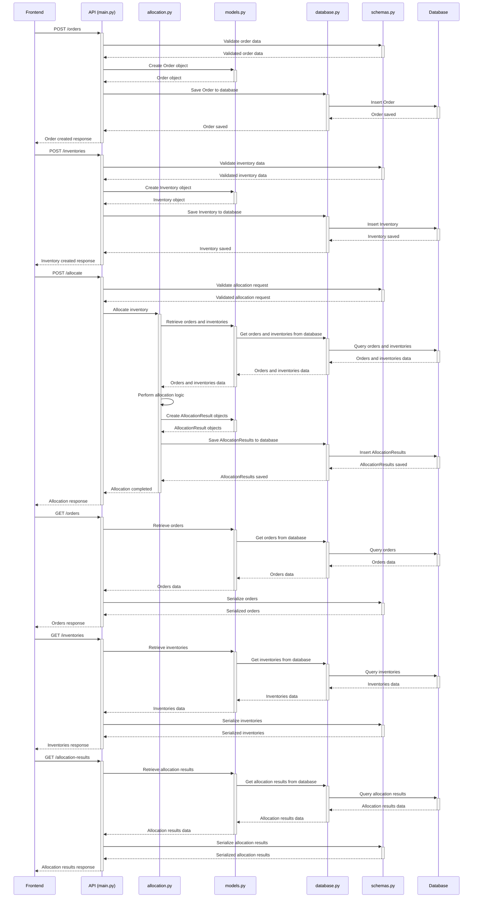

### シーケンス図

このシーケンス図は、フロントエンドアプリケーションとバックエンドのAPIおよびデータベースの間のインタラクションを示しています。

1. フロントエンドアプリケーションは、受注データを`/orders`エンドポイントに送信します。APIは受注データを検証し、データベースに保存します。

2. フロントエンドアプリケーションは、在庫データを`/inventories`エンドポイントに送信します。APIは在庫データを検証し、データベースに保存します。

3. フロントエンドアプリケーションは、`/allocate`エンドポイントに在庫引当のリクエストを送信します。APIはリクエストを検証し、`allocation.py`モジュールを呼び出して在庫引当処理を実行します。`allocation.py`は、`models.py`と`database.py`を使用して、必要なデータを取得し、引当ロジックを適用します。引当結果は、データベースに保存されます。

4. フロントエンドアプリケーションは、`/orders`エンドポイントにGETリクエストを送信して、受注データを取得します。APIは`models.py`と`database.py`を使用してデータを取得し、`schemas.py`を使用してシリアライズされた応答を返します。

5. フロントエンドアプリケーションは、`/inventories`エンドポイントにGETリクエストを送信して、在庫データを取得します。APIは`models.py`と`database.py`を使用してデータを取得し、`schemas.py`を使用してシリアライズされた応答を返します。

6. フロントエンドアプリケーションは、`/allocation-results`エンドポイントにGETリクエストを送信して、引当結果を取得します。APIは`models.py`と`database.py`を使用してデータを取得し、`schemas.py`を使用してシリアライズされた応答を返します。

このシーケンス図は、アプリケーションの主要なフローを示しています。実際のアプリケーションでは、エラーハンドリング、認証、認可などの追加の手順が含まれる場合があります。

