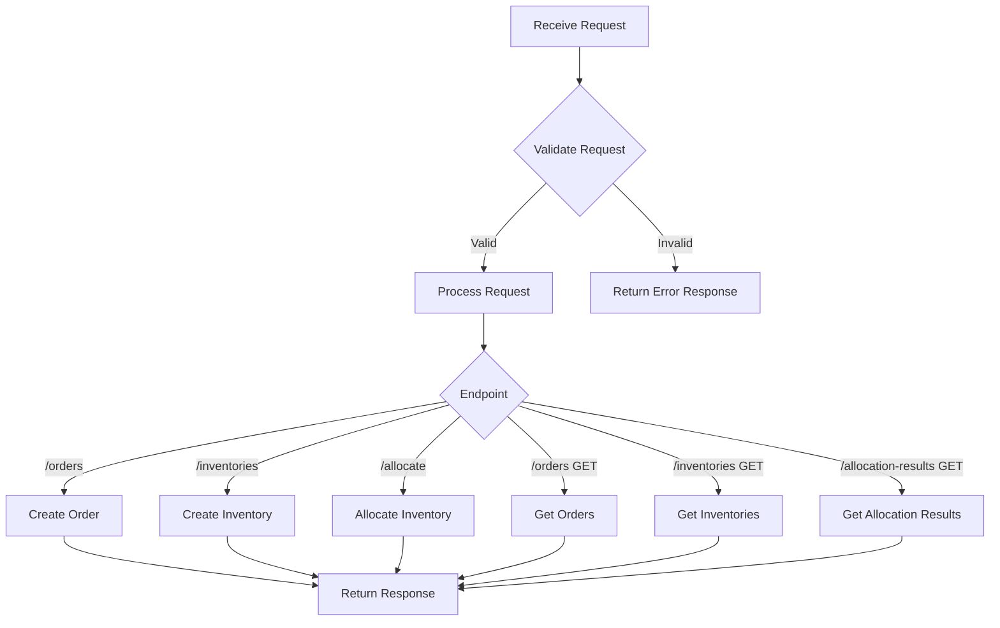
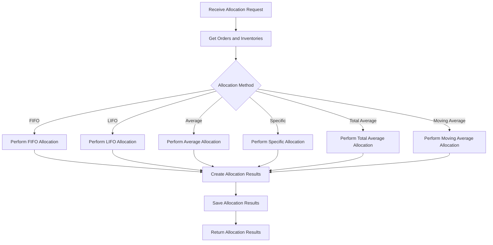
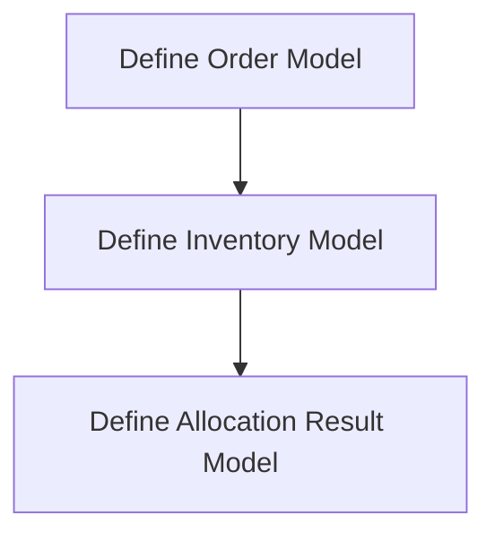
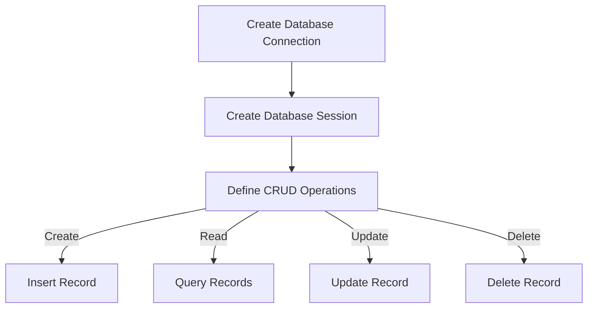
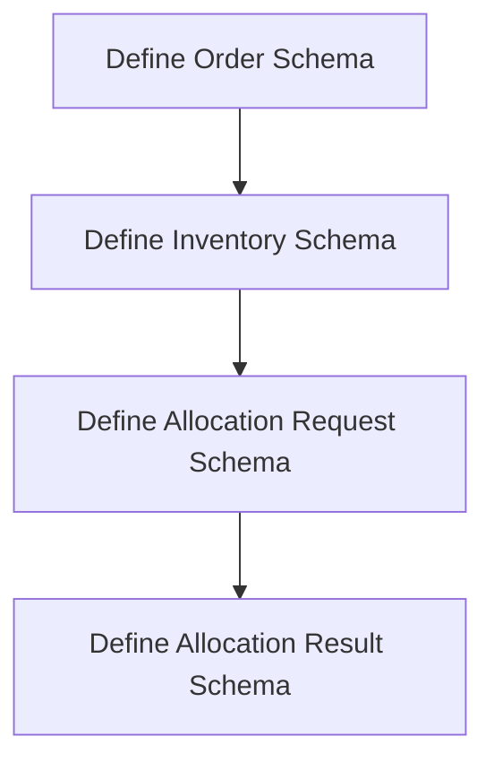

以下は、各モジュールのフロー図です。

1. main.py (API):

2. allocation.py:

3. models.py:

4. database.py:

5. schemas.py:

これらのフロー図は、各モジュールの主要な処理の流れを示しています。

1. `main.py`は、受信したリクエストを検証し、エンドポイントに基づいて適切な処理を行います。各エンドポイントは、対応するデータの作成、取得、または在庫引当を行います。

2. `allocation.py`は、在庫引当のリクエストを受信し、指定された引当方法に基づいて在庫の引当を行います。引当結果を作成し、データベースに保存します。

3. `models.py`は、データベースのテーブルに対応するデータモデルを定義します。

4. `database.py`は、データベース接続とセッション管理を行います。CRUD操作（作成、読取、更新、削除）を定義します。

5. `schemas.py`は、APIのリクエストとレスポンスのデータ構造を定義します。

これらのフロー図は、各モジュールの主要な処理の流れを示していますが、実際のコードではさらに詳細な実装やエラーハンドリングが含まれる場合があります。