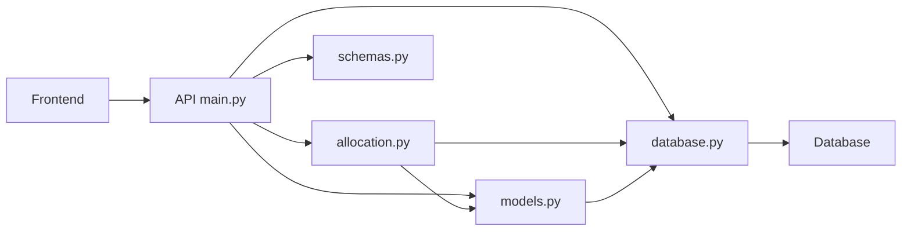

### ブロック図
このブロック図は、アプリケーションの主要なコンポーネントとそれらの相互関係を示しています。

1. フロントエンド（Frontend）:
   - ユーザーインターフェースを提供し、ユーザーの操作を処理します。
   - バックエンドのAPIと通信して、データの送受信を行います。

2. API (main.py):
   - FastAPIを使用して実装されたWebAPIアプリケーションのメインエントリーポイントです。
   - 受信したリクエストを処理し、適切なレスポンスを返します。
   - 他のモジュール（`allocation.py`, `models.py`, `database.py`, `schemas.py`）と連携して、必要な処理を行います。

3. allocation.py:
   - 在庫引当ロジックを実装したモジュールです。
   - 引当方法（FIFO、LIFO、平均法など）に基づいて、在庫の引当を行います。
   - `models.py`と`database.py`を使用して、必要なデータの取得と保存を行います。

4. models.py:
   - データベースのテーブルに対応するデータモデルを定義するモジュールです。
   - SQLAlchemyを使用して、データベースとのマッピングを行います。
   - `database.py`と連携して、データベースとのやり取りを行います。

5. database.py:
   - データベース接続とセッション管理を行うモジュールです。
   - SQLAlchemyを使用して、データベースとの接続を確立し、セッションを管理します。
   - `models.py`と連携して、データベースとのやり取りを行います。

6. schemas.py:
   - APIのリクエストとレスポンスのデータ構造を定義するモジュールです。
   - Pydanticを使用して、データの検証とシリアライズ/デシリアライズを行います。
   - APIとのデータのやり取りに使用されます。

7. Database:
   - アプリケーションのデータを永続的に保存するためのデータベースです。
   - PostgreSQLが使用されます。
   - `database.py`を介してアプリケーションとやり取りします。

これらのコンポーネントが連携して、在庫管理システムの在庫引当機能を提供します。フロントエンドからのリクエストがAPIに送信され、APIは適切なモジュールと連携して処理を行います。`allocation.py`は在庫引当ロジックを実装し、`models.py`と`database.py`を使用してデータベースとのやり取りを行います。`schemas.py`は、APIとのデータのやり取りに使用されます。

