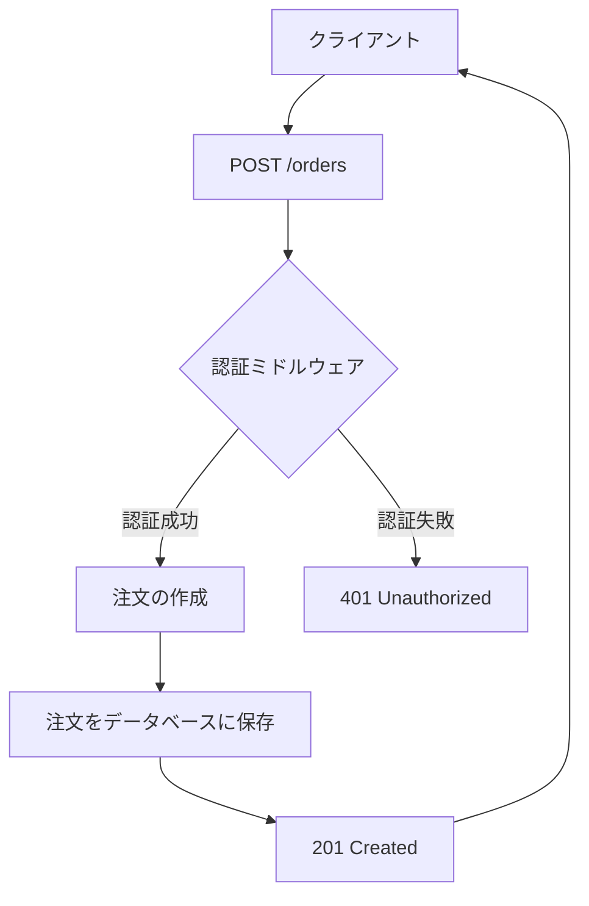
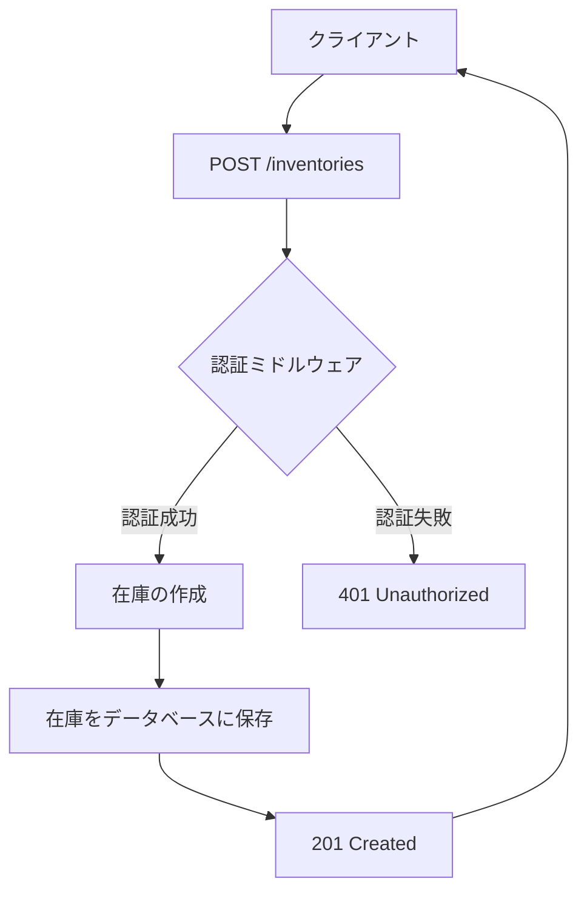
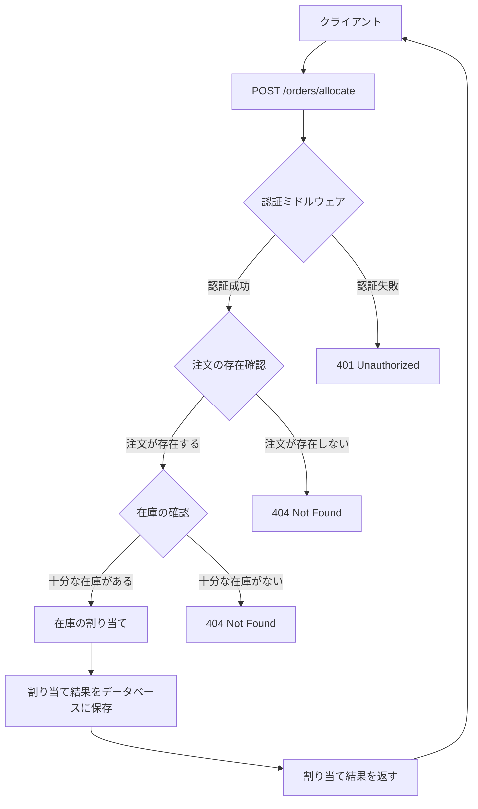
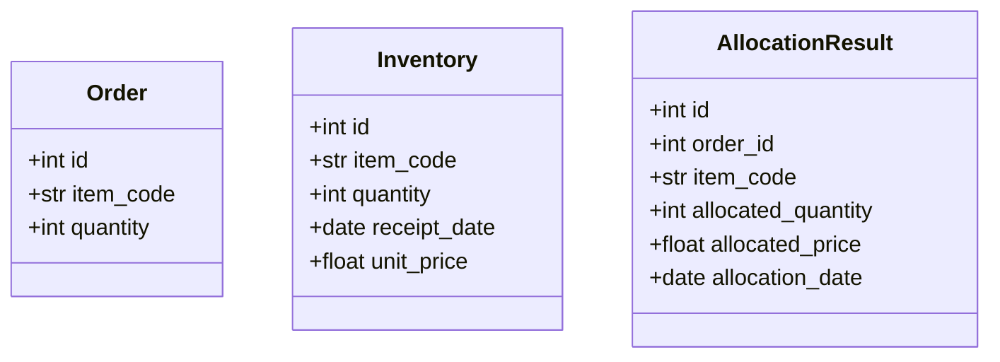
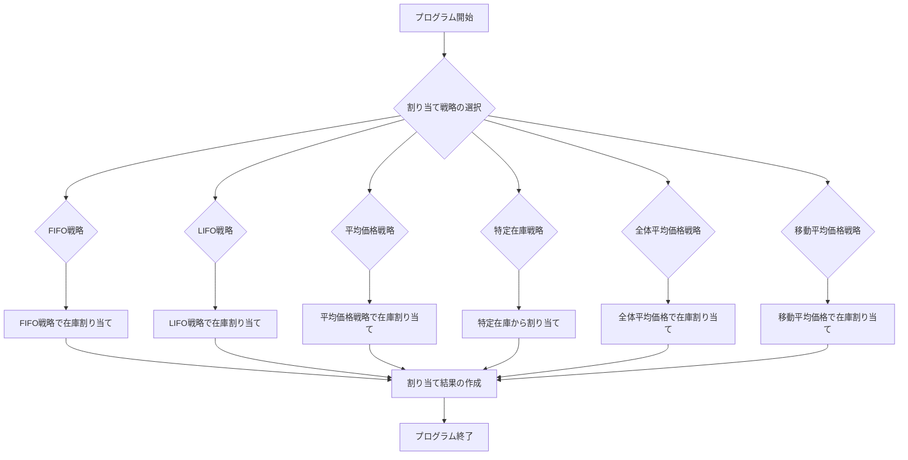
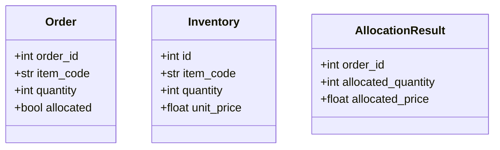
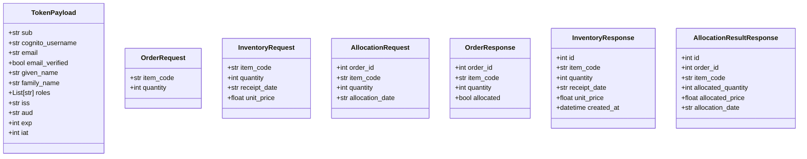
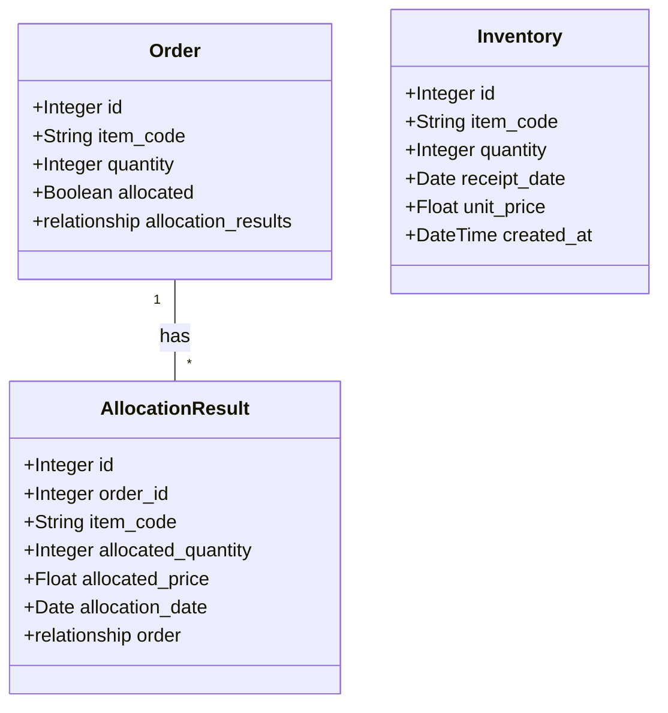
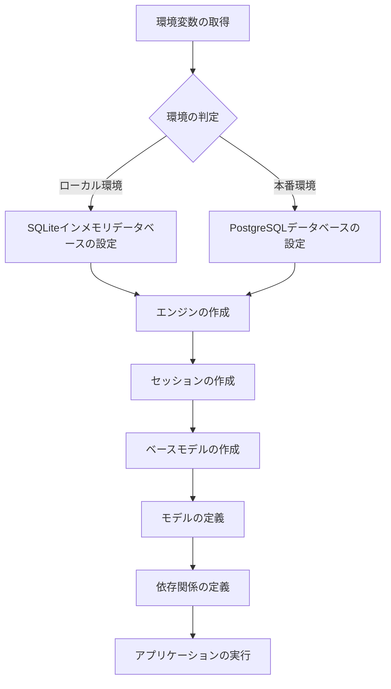

Note）本設計書及びプログラムの最新版はGitHubの[Rayoo-Nakano/InventoryAllocation](https://github.com/Rayoo-Nakano/InventoryAllocation "Rayoo-Nakano/InventoryAllocation")に常時更新しています。

# 目次
- [在庫管理システム API設計書](#在庫管理システム-api設計書)
- [在庫割り当てプログラム設計書](#在庫割り当てプログラム設計書)
- [スキーマ定義設計書](#スキーマ定義設計書)
- [データベースモデル設計書](#データベースモデル設計書)
- [データベース設定設計書](#データベース設定設計書)
- [AWS Cognito設定設計書](#aws-cognito設定設計書)
- [データベース接続設定設計書](#データベース接続設定設計書)

Note）本設計書及びプログラムの最新版はGitHubの[Rayoo-Nakano/InventoryAllocation](https://github.com/Rayoo-Nakano/InventoryAllocation "Rayoo-Nakano/InventoryAllocation")に常時更新しています。

<a id="在庫管理システム API設計書"></a>
# 在庫管理システム API設計書

## 1. 概要

本設計書は、在庫管理システムのAPI設計について説明します。このシステムは、注文の作成、在庫の管理、在庫の割り当てなどの機能を提供します。

## 2. システム構成

### 2.1 使用技術

- FastAPI: Pythonの高速なWebフレームワーク
- SQLAlchemy: Pythonのオブジェクトリレーショナルマッピング（ORM）ライブラリ
- JWT: JSON Web Tokenを使用した認証
- Amazon Cognito: 認証プロバイダ

### 2.2 主要なエンドポイント

- `/orders`: 注文の作成と取得
- `/inventories`: 在庫の作成と取得
- `/orders/{order_id}/allocate`: 在庫の割り当て
- `/allocation-results`: 割り当て結果の取得

## 3. 認証と認可

### 3.1 認証方式

本システムでは、Amazon Cognitoが発行するJWTトークンを使用して認証を行います。クライアントは、APIリクエストのヘッダーに有効なJWTトークンを含める必要があります。

### 3.2 認証ミドルウェア

`authentication_middleware`は、リクエストヘッダーからJWTトークンを取得し、トークンの検証を行います。検証に成功した場合、トークンのペイロードがリクエストの状態に追加されます。

### 3.3 トークン検証関数

`authenticate_token`関数は、Amazon CognitoのJWTトークンを検証するために使用されます。トークンのヘッダーからキーIDを取得し、対応する公開鍵を使用してトークンの署名を検証します。

## 4. プログラムフロー図

### 4.1 注文の作成フロー



### 4.2 在庫の作成フロー



### 4.3 在庫の割り当てフロー



## 5. データモデル

以下は、システムで使用されるデータモデルを示すブロック図です。



## 6. エンドポイント

### 6.1 注文の作成

- エンドポイント: `/orders`
- メソッド: POST
- リクエストボディ: `OrderRequest`
- レスポンス: `OrderResponse`
- ステータスコード: 201 (Created)

このエンドポイントは、新しい注文を作成するために使用されます。リクエストボディに注文の詳細を含める必要があります。

### 6.2 注文の取得

- エンドポイント: `/orders`
- メソッド: GET
- レスポンス: `list[OrderResponse]`

このエンドポイントは、すべての注文を取得するために使用されます。

### 6.3 在庫の作成

- エンドポイント: `/inventories`
- メソッド: POST
- リクエストボディ: `InventoryRequest`
- レスポンス: `InventoryResponse`
- ステータスコード: 201 (Created)

このエンドポイントは、新しい在庫を作成するために使用されます。リクエストボディに在庫の詳細を含める必要があります。

### 6.4 在庫の取得

- エンドポイント: `/inventories`
- メソッド: GET
- レスポンス: `list[InventoryResponse]`

このエンドポイントは、すべての在庫を取得するために使用されます。

### 6.5 在庫の割り当て

- エンドポイント: `/orders/{order_id}/allocate`
- メソッド: POST
- パスパラメータ: `order_id`
- リクエストボディ: `AllocationRequest`
- レスポンス: `AllocationResultResponse`

このエンドポイントは、特定の注文に在庫を割り当てるために使用されます。パスパラメータに注文IDを指定し、リクエストボディに割り当ての詳細を含める必要があります。

### 6.6 割り当て結果の取得

- エンドポイント: `/allocation-results`
- メソッド: GET
- レスポンス: `list[AllocationResultResponse]`

このエンドポイントは、すべての割り当て結果を取得するために使用されます。

## 7. ロギング

本システムでは、ロギング機能を提供しています。`logging`モジュールを使用して、ログメッセージをコンソールに出力します。ログレベルはDEBUGに設定されており、ログメッセージにはタイムスタンプ、ロガー名、ログレベル、メッセージが含まれます。

## 8. エラーハンドリング

APIエンドポイントでは、適切なエラーハンドリングを行っています。エラーが発生した場合、対応するHTTPステータスコードとエラーメッセージを返します。

- 認証エラー: 401 (Unauthorized)
- リソースが見つからない: 404 (Not Found)

## 9. 結論

本設計書では、在庫管理システムのAPI設計について説明しました。FastAPIを使用してエンドポイントを定義し、SQLAlchemyを使用してデータベースとのやり取りを行います。認証にはAmazon CognitoのJWTトークンを使用し、ミドルウェアで認証を処理します。各エンドポイントの機能とリクエスト/レスポンスの詳細を提供し、データモデルを示しました。また、ロギングとエラーハンドリングについても説明しました。プログラムフロー図を使用して、主要なAPIエンドポイントの処理の流れを視覚的に表現しました。


<a id="在庫割り当てプログラム設計書"></a>
# 在庫割り当てプログラム設計書

## 1. 概要

本設計書は、在庫割り当てプログラムの設計について説明します。このプログラムは、注文に対して在庫を割り当てるための様々な戦略を実装しています。

## 2. プログラム構成

### 2.1 ファイル構成

- `main.py`: メインプログラムファイル
- `models.py`: データモデルを定義するファイル
- `database.py`: データベース接続を管理するファイル

### 2.2 主要な関数

- `allocate_inventory`: 在庫割り当てを実行する関数
- `allocate_fifo`: FIFO戦略で在庫割り当てを実行する関数
- `allocate_lifo`: LIFO戦略で在庫割り当てを実行する関数
- `allocate_average`: 平均価格戦略で在庫割り当てを実行する関数
- `allocate_specific`: 特定の在庫から割り当てを実行する関数
- `allocate_total_average`: 全体の平均価格で在庫割り当てを実行する関数
- `allocate_moving_average`: 移動平均価格で在庫割り当てを実行する関数
- `create_allocation_result`: 割り当て結果を作成する関数

## 3. プログラムフロー

以下は、プログラムの全体的なフローを示すフロー図です。



## 4. 在庫割り当て戦略

### 4.1 FIFO (First-In-First-Out) 引当

- 説明: 先入先出法。最も古い在庫から順番に引き当てる方法。
- 数式:
  - 引当数量 = min(注文数量, 在庫数量)
  - 引当価格 = 引当数量 × 在庫単価

### 4.2 LIFO (Last-In-First-Out) 引当

- 説明: 後入先出法。最も新しい在庫から順番に引き当てる方法。
- 数式:
  - 引当数量 = min(注文数量, 在庫数量)
  - 引当価格 = 引当数量 × 在庫単価

### 4.3 平均引当 (Average Allocation)

- 説明: 在庫の平均単価を使用して引き当てる方法。
- 数式:
  - 平均単価 = (在庫数量1 × 在庫単価1 + 在庫数量2 × 在庫単価2 + ...) / (在庫数量1 + 在庫数量2 + ...)
  - 引当価格 = 注文数量 × 平均単価

### 4.4 特定在庫引当 (Specific Allocation)

- 説明: 特定の在庫から注文数量分を引き当てる方法。
- 数式:
  - 引当数量 = 注文数量
  - 引当価格 = 引当数量 × 特定在庫の単価

### 4.5 全体平均引当 (Total Average Allocation)

- 説明: 全ての在庫の平均単価を使用して引き当てる方法。
- 数式:
  - 全体平均単価 = (在庫数量1 × 在庫単価1 + 在庫数量2 × 在庫単価2 + ...) / (在庫数量1 + 在庫数量2 + ...)
  - 引当価格 = 注文数量 × 全体平均単価

### 4.6 移動平均引当 (Moving Average Allocation)

- 説明: 直近の一定数の在庫の平均単価を使用して引き当てる方法。
- 数式:
  - 移動平均単価 = (直近の在庫単価1 + 直近の在庫単価2 + ...) / ウィンドウサイズ
  - 引当価格 = 注文数量 × 移動平均単価

## 5. データモデル

以下は、プログラムで使用されるデータモデルを示すブロック図です。



## 6. API説明

本プログラムでは、以下のAPIを提供しています。

### 6.1 在庫割り当てAPI

- エンドポイント: `/allocate_inventory`
- メソッド: POST
- リクエストボディ:
  - `strategy`: 割り当て戦略 (文字列)
- レスポンス:
  - ステータスコード: 200 (成功)
  - ボディ: なし

このAPIは、指定された割り当て戦略に基づいて在庫割り当てを実行します。リクエストボディで割り当て戦略を指定する必要があります。

### 6.2 割り当て結果取得API

- エンドポイント: `/allocation_results`
- メソッド: GET
- レスポンス:
  - ステータスコード: 200 (成功)
  - ボディ: 割り当て結果のリスト
    - `order_id`: 注文ID
    - `allocated_quantity`: 割り当てられた数量
    - `allocated_price`: 割り当てられた価格

このAPIは、割り当て結果の一覧を取得するために使用されます。レスポンスとして、割り当て結果のリストが返されます。

## 7. 結論

本設計書では、在庫割り当てプログラムの設計について説明しました。プログラムは様々な割り当て戦略を実装しており、注文に対して在庫を効率的に割り当てることができます。また、APIを通じて在庫割り当ての実行と結果の取得が可能です。プログラムのフローとデータモデルを理解することで、プログラムの動作を把握し、必要に応じて拡張や修正を行うことができます。

<a id="スキーマ定義設計書"></a>

# スキーマ定義設計書

## 1. 概要

本設計書は、在庫管理システムで使用されるPydanticモデルについて説明します。これらのモデルは、APIリクエストとレスポンスのデータ構造を定義し、データの検証とシリアライズを行います。

## 2. モデル定義

### 2.1 TokenPayload

`TokenPayload`モデルは、JWTトークンのペイロードを表します。

- `sub`: ユーザーの一意の識別子
- `cognito_username`: Cognito上のユーザー名
- `email`: ユーザーのメールアドレス
- `email_verified`: メールアドレスが検証済みかどうかを示すフラグ
- `given_name`: ユーザーの名
- `family_name`: ユーザーの姓
- `roles`: ユーザーが持つロールのリスト
- `iss`: トークンの発行者
- `aud`: トークンの対象者
- `exp`: トークンの有効期限
- `iat`: トークンの発行日時

### 2.2 OrderRequest

`OrderRequest`モデルは、注文リクエストのデータ構造を定義します。

- `item_code`: 商品コード
- `quantity`: 数量

### 2.3 InventoryRequest

`InventoryRequest`モデルは、在庫リクエストのデータ構造を定義します。

- `item_code`: 商品コード
- `quantity`: 数量
- `receipt_date`: 入荷日
- `unit_price`: 単価

`receipt_date`フィールドには、`parse_receipt_date`バリデーターが適用されます。このバリデーターは、入力された日付文字列を`datetime`オブジェクトに変換し、ISOフォーマットで返します。

### 2.4 AllocationRequest

`AllocationRequest`モデルは、在庫割り当てリクエストのデータ構造を定義します。

- `order_id`: 注文ID
- `item_code`: 商品コード
- `quantity`: 数量
- `allocation_date`: 割当日

`allocation_date`フィールドには、`parse_allocation_date`バリデーターが適用されます。このバリデーターは、入力された日付文字列を`datetime`オブジェクトに変換し、ISOフォーマットで返します。

### 2.5 OrderResponse

`OrderResponse`モデルは、注文レスポンスのデータ構造を定義します。

- `order_id`: 注文ID
- `item_code`: 商品コード
- `quantity`: 数量
- `allocated`: 割当済みかどうかを示すフラグ

このモデルには、`Config`クラスが定義されており、`orm_mode`が`True`に設定されています。これにより、SQLAlchemyモデルインスタンスから直接Pydanticモデルへの変換が可能になります。

### 2.6 InventoryResponse

`InventoryResponse`モデルは、在庫レスポンスのデータ構造を定義します。

- `id`: 在庫ID
- `item_code`: 商品コード
- `quantity`: 数量
- `receipt_date`: 入荷日
- `unit_price`: 単価
- `created_at`: 作成日時

このモデルにも、`Config`クラスが定義されており、`orm_mode`が`True`に設定されています。また、`json_encoders`が定義されており、`datetime`オブジェクトをISOフォーマットの文字列に変換します。

### 2.7 AllocationResultResponse

`AllocationResultResponse`モデルは、在庫割り当て結果レスポンスのデータ構造を定義します。

- `id`: 割当結果ID
- `order_id`: 注文ID
- `item_code`: 商品コード
- `allocated_quantity`: 割当数量
- `allocated_price`: 割当価格
- `allocation_date`: 割当日

このモデルにも、`Config`クラスが定義されており、`orm_mode`が`True`に設定されています。

## 3. モデル関連図

以下は、モデル間の関連を示すブロック図です。



## 4. 結論

本設計書では、在庫管理システムで使用されるPydanticモデルについて説明しました。これらのモデルは、APIリクエストとレスポンスのデータ構造を定義し、データの検証とシリアライズを行います。モデル間の関連を示すブロック図も提供しました。これらのモデルを使用することで、APIエンドポイントとのデータのやり取りを円滑に行うことができます。

<a id="データベースモデル設計書"></a>

# データベースモデル設計書

## 1. 概要

本設計書は、在庫管理システムで使用されるSQLAlchemyモデルについて説明します。これらのモデルは、データベースのテーブル構造を定義し、データの永続化と取得を行います。

## 2. モデル定義

### 2.1 Order

`Order`モデルは、注文情報を表します。

- `id`: 注文ID（プライマリキー）
- `item_code`: 商品コード
- `quantity`: 数量
- `allocated`: 割当済みかどうかを示すフラグ

`Order`モデルは、`AllocationResult`モデルとのリレーションシップを持ちます。

### 2.2 Inventory

`Inventory`モデルは、在庫情報を表します。

- `id`: 在庫ID（プライマリキー）
- `item_code`: 商品コード
- `quantity`: 数量
- `receipt_date`: 入荷日
- `unit_price`: 単価
- `created_at`: 作成日時

### 2.3 AllocationResult

`AllocationResult`モデルは、在庫割り当て結果を表します。

- `id`: 割当結果ID（プライマリキー）
- `order_id`: 注文ID（外部キー）
- `item_code`: 商品コード
- `allocated_quantity`: 割当数量
- `allocated_price`: 割当価格
- `allocation_date`: 割当日

`AllocationResult`モデルは、`Order`モデルとのリレーションシップを持ちます。

## 3. モデル関連図

以下は、モデル間の関連を示すブロック図です。



## 4. テーブル定義

以下は、各モデルに対応するテーブル定義です。

### 4.1 orders

| カラム名 | データ型 | 制約 |
|----------|----------|------|
| id | Integer | PRIMARY KEY |
| item_code | String | INDEX |
| quantity | Integer | |
| allocated | Boolean | DEFAULT False |

### 4.2 inventories

| カラム名 | データ型 | 制約 |
|------------|----------|------|
| id | Integer | PRIMARY KEY |
| item_code | String | INDEX |
| quantity | Integer | |
| receipt_date | Date | |
| unit_price | Float | |
| created_at | DateTime | DEFAULT CURRENT_TIMESTAMP |

### 4.3 allocation_results

| カラム名 | データ型 | 制約 |
|------------------|----------|------|
| id | Integer | PRIMARY KEY |
| order_id | Integer | FOREIGN KEY (orders.id) |
| item_code | String | INDEX |
| allocated_quantity | Integer | |
| allocated_price | Float | |
| allocation_date | Date | |

## 5. 結論

本設計書では、在庫管理システムで使用されるSQLAlchemyモデルについて説明しました。これらのモデルは、データベースのテーブル構造を定義し、データの永続化と取得を行います。モデル間の関連を示すブロック図とテーブル定義も提供しました。これらのモデルを使用することで、データベースとのやり取りを円滑に行うことができます。

<a id="データベース設定設計書"></a>

# データベース設定設計書

## 1. 概要

本設計書は、在庫管理システムのデータベース設定について説明します。データベースとの接続、セッションの作成、および環境に応じた設定の切り替えを行います。

## 2. 環境設定

### 2.1 環境変数

- `ENVIRONMENT`: 実行環境を指定する環境変数。デフォルトは "production"。

### 2.2 ローカル環境

ローカル環境では、以下の設定が適用されます。

- `SQLALCHEMY_DATABASE_URL`: "sqlite:///:memory:" を使用してインメモリSQLiteデータベースに接続します。
- `TestingSessionLocal`: SQLAlchemyのセッションメーカーを作成し、自動コミットと自動フラッシュを無効にします。

### 2.3 本番環境

本番環境では、以下の環境変数を使用してPostgreSQLデータベースに接続します。

- `DB_HOST`: データベースのホスト名
- `DB_PORT`: データベースのポート番号
- `DB_NAME`: データベース名
- `DB_USER`: データベースユーザー名
- `DB_PASSWORD`: データベースパスワード

これらの環境変数を使用して、`SQLALCHEMY_DATABASE_URL`を構築します。

## 3. データベース接続

### 3.1 エンジンの作成

`create_engine`関数を使用して、データベースエンジンを作成します。環境に応じて、適切な`SQLALCHEMY_DATABASE_URL`を使用します。

### 3.2 セッションの作成

`sessionmaker`関数を使用して、データベースセッションのファクトリを作成します。`autocommit`と`autoflush`を`False`に設定し、作成したエンジンをバインドします。

## 4. 依存関係

### 4.1 get_db

`get_db`関数は、データベースセッションを提供するための依存関係です。セッションを作成し、`yield`を使用してセッションを返します。最後に、セッションを適切にクローズします。

## 5. ベースモデル

`declarative_base`関数を使用して、SQLAlchemyのベースモデルを作成します。このベースモデルを継承することで、各モデルクラスを定義できます。

## 6. フロー図

以下は、データベース設定のフロー図です。



## 7. 結論

本設計書では、在庫管理システムのデータベース設定について説明しました。環境に応じてデータベースの設定を切り替え、SQLAlchemyを使用してデータベース接続とセッション管理を行います。また、依存関係の注入を使用して、データベースセッションをアプリケーション内で利用できるようにしています。フロー図を用いて、データベース設定の流れを視覚的に表現しました。

<a id="AWS Cognito設定設計書"></a>

# AWS Cognito設定設計書

## 1. 概要

本設計書は、在庫管理システムにおけるAWS Cognitoの設定情報について説明します。AWS Cognitoは、ユーザー認証と認可を提供するマネージドサービスであり、システムのセキュリティを強化するために使用されます。

## 2. 設定情報

### 2.1 COGNITO_JWKS_URL

`COGNITO_JWKS_URL`は、AWS CognitoのJWKS（JSON Web Key Set）のURLを指定します。JWKSは、トークンの署名検証に使用される公開鍵の情報を含んでいます。

URLの形式は以下のようになります：

```
https://cognito-idp.<region>.amazonaws.com/<user-pool-id>/.well-known/jwks.json
```

- `<region>`: AWS Cognitoユーザープールが存在するリージョン
- `<user-pool-id>`: AWS Cognitoユーザープールの一意の識別子

### 2.2 COGNITO_AUDIENCE

`COGNITO_AUDIENCE`は、AWS Cognitoユーザープールクライアントの一意の識別子を指定します。この識別子は、トークンの検証時にオーディエンス（aud）クレームと照合されます。

### 2.3 COGNITO_ISSUER

`COGNITO_ISSUER`は、AWS Cognitoユーザープールの発行者（issuer）URLを指定します。この値は、トークンの検証時に発行者（iss）クレームと照合されます。

URLの形式は以下のようになります：

```
https://cognito-idp.<region>.amazonaws.com/<user-pool-id>
```

- `<region>`: AWS Cognitoユーザープールが存在するリージョン
- `<user-pool-id>`: AWS Cognitoユーザープールの一意の識別子

## 3. 設定の適用

これらの設定情報は、アプリケーション内でトークンの検証と認可に使用されます。以下は、設定情報の適用例です：

```python
from fastapi import Depends, HTTPException
from fastapi.security import OAuth2PasswordBearer
from jose import jwt, JWTError

oauth2_scheme = OAuth2PasswordBearer(tokenUrl="token")

async def get_current_user(token: str = Depends(oauth2_scheme)):
    try:
        payload = jwt.decode(token, COGNITO_JWKS_URL, audience=COGNITO_AUDIENCE, issuer=COGNITO_ISSUER)
        username = payload.get("cognito:username")
        if username is None:
            raise HTTPException(status_code=401, detail="Invalid authentication credentials")
        return username
    except JWTError:
        raise HTTPException(status_code=401, detail="Invalid authentication credentials")
```

上記の例では、`OAuth2PasswordBearer`を使用してトークンを取得し、`jwt.decode`関数を使用してトークンを検証しています。検証には、`COGNITO_JWKS_URL`、`COGNITO_AUDIENCE`、`COGNITO_ISSUER`の設定情報が使用されます。

## 4. 結論

本設計書では、在庫管理システムにおけるAWS Cognitoの設定情報について説明しました。`COGNITO_JWKS_URL`、`COGNITO_AUDIENCE`、`COGNITO_ISSUER`の設定情報を適切に定義することで、AWS Cognitoを使用したユーザー認証と認可を実現できます。これらの設定情報は、トークンの検証と認可に使用され、システムのセキュリティを強化します。

<a id="データベース接続設定設計書"></a>

# データベース接続設定設計書

## 1. 概要

本設計書は、在庫管理システムにおけるデータベース接続の設定情報について説明します。これらの設定情報は、システムがデータベースに接続するために必要な詳細を提供します。

## 2. 設定情報

### 2.1 DB_HOST

`DB_HOST`は、データベースサーバーのホスト名またはIPアドレスを指定します。この設定では、データベースサーバーがローカルホスト（`localhost`）上で実行されていることを示しています。

### 2.2 DB_PORT

`DB_PORT`は、データベースサーバーが受信しているポート番号を指定します。この設定では、ポート番号は`5432`に設定されています。これは、PostgreSQLのデフォルトのポート番号です。

### 2.3 DB_NAME

`DB_NAME`は、接続するデータベースの名前を指定します。この設定では、データベース名は`testdb`に設定されています。

### 2.4 DB_USER

`DB_USER`は、データベースに接続するためのユーザー名を指定します。この設定では、ユーザー名は`testuser`に設定されています。

### 2.5 DB_PASSWORD

`DB_PASSWORD`は、データベースに接続するためのパスワードを指定します。この設定では、パスワードは`testpassword`に設定されています。

## 3. 設定の適用

これらの設定情報は、データベース接続文字列の構築に使用されます。以下は、設定情報を使用してデータベース接続文字列を構築する例です：

```python
SQLALCHEMY_DATABASE_URL = f"postgresql://{DB_USER}:{DB_PASSWORD}@{DB_HOST}:{DB_PORT}/{DB_NAME}"
```

上記の例では、設定情報を使用して`SQLALCHEMY_DATABASE_URL`変数を構築しています。この変数は、SQLAlchemyを使用してデータベースに接続するために使用されます。

## 4. セキュリティ上の考慮事項

データベースの接続情報は機密性が高いため、適切に保護する必要があります。以下は、セキュリティを強化するためのいくつかの推奨事項です：

- 設定情報を環境変数として保存し、コードに直接記述しないようにする。
- データベースユーザーに必要最小限の権限のみを付与する。
- データベースサーバーへのアクセスを制限し、信頼できるネットワークからのみ接続を許可する。
- データベースの接続情報を暗号化し、安全な方法で保存する。

## 5. 結論

本設計書では、在庫管理システムにおけるデータベース接続の設定情報について説明しました。`DB_HOST`、`DB_PORT`、`DB_NAME`、`DB_USER`、`DB_PASSWORD`の設定情報を適切に定義することで、システムがデータベースに接続できるようになります。これらの設定情報は、データベース接続文字列の構築に使用されます。また、データベースの接続情報を保護するために、セキュリティ上の考慮事項にも注意を払う必要があります。