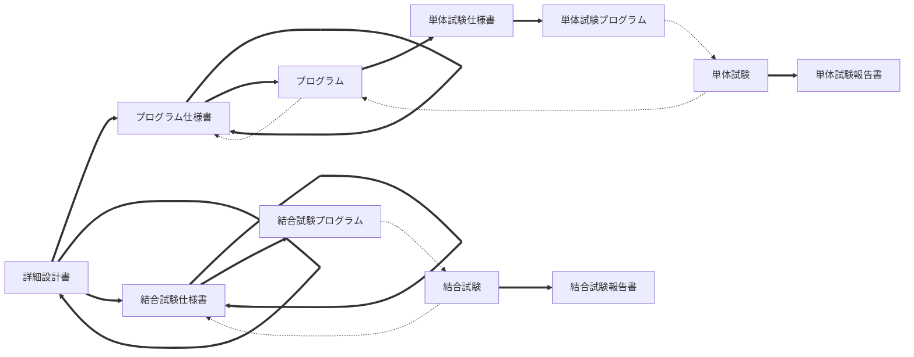

```mermaid
graph LR
    C[詳細設計書] ==> G[プログラム仕様書]
    C ==> C
    G ==> G
    G ==> H[プログラム]
    H -.-> G

    H ==> K[単体試験仕様書]
    K ==> L[単体試験プログラム]

    L -.-> M[単体試験]
    M -.-> H
    M ==> N[単体試験報告書]

    C ==> E[結合試験仕様書]
    E ==> E

    E ==> T[結合試験プログラム]
    T -.-> Q[結合試験]
    Q -.-> E
    Q ==> V[結合試験報告書]
```
実線が生成AI利用箇所、点線はCIフレームワーク