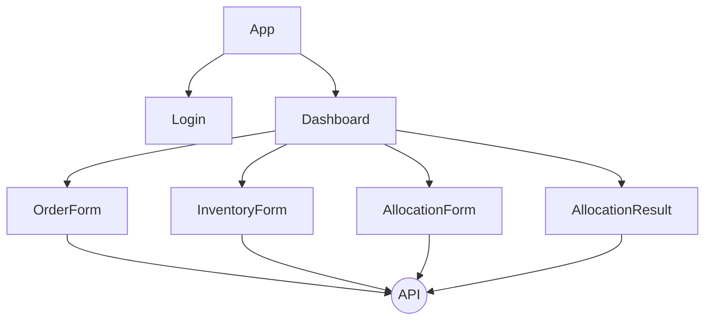

## プログラム設計書 - 在庫引当システムのフロントエンド（UI）

### 1. 概要
   - 本プログラムは、在庫引当システムのフロントエンド（UI）を提供する。
   - フレームワークはReact、UIライブラリはMaterial-UIを使用する。
   - AWS Amplifyを使用して、バックエンドのAPIと連携する。
   - ルーティングにはReact Routerを使用する。

### 2. 機能要件
   - ログイン画面：ユーザー認証を行う。
   - ダッシュボード画面：受注データ、在庫データ、引当結果の概要を表示する。
   - 受注登録画面：受注データを入力し、登録する。
   - 在庫登録画面：在庫データを入力し、登録する。
   - 在庫引当画面：在庫引当の実行、引当方法の選択を行う。
   - 引当結果画面：引当結果の詳細を表示する。

### 3. システムアーキテクチャ
   - React：UIの構築とコンポーネントの管理を行う。
   - Material-UI：UIコンポーネントのデザインと実装に使用する。
   - AWS Amplify：バックエンドのAPIとの連携、認証、ホスティングを行う。
   - React Router：ルーティングとナビゲーションを管理する。

### 4. コンポーネント構成
   - App：アプリケーションのルートコンポーネント。
   - Login：ログイン画面のコンポーネント。
   - Dashboard：ダッシュボード画面のコンポーネント。
   - OrderForm：受注登録画面のコンポーネント。
   - InventoryForm：在庫登録画面のコンポーネント。
   - AllocationForm：在庫引当画面のコンポーネント。
   - AllocationResult：引当結果画面のコンポーネント。

### 5. ルーティング
   - /：ログイン画面にリダイレクトする。
   - /login：ログイン画面を表示する。
   - /dashboard：ダッシュボード画面を表示する。
   - /orders：受注登録画面を表示する。
   - /inventories：在庫登録画面を表示する。
   - /allocate：在庫引当画面を表示する。
   - /allocation-results：引当結果画面を表示する。

### 6. 状態管理
   - React Hooksを使用して、コンポーネントの状態を管理する。
   - useStateフックを使用して、フォームデータや表示データを管理する。
   - useEffectフックを使用して、APIからデータを取得する。
   - useContextフックを使用して、グローバルな状態を管理する。

### 7. APIとの連携
   - AWS Amplifyを使用して、バックエンドのAPIと連携する。
   - Amplify APIを使用して、RESTful APIのエンドポイントにアクセスする。
   - Amplify Authを使用して、ユーザー認証を行う。

### 8. エラーハンドリング
   - APIリクエストのエラー：エラーメッセージをユーザーに表示する。
   - フォームの入力エラー：フォームのバリデーションを行い、エラーメッセージを表示する。

### 9. セキュリティ
   - AWS Amplify Authを使用して、ユーザー認証とアクセス制御を行う。
   - 認証されたユーザーのみがアプリケーションにアクセスできるようにする。

### 10. テスト
    - ユニットテスト：React Testing Libraryを使用して、コンポーネントの単体テストを実施する。
    - 統合テスト：Cypressを使用して、E2Eテストを実施する。

### 11. デプロイ
    - AWS Amplifyを使用して、アプリケーションをデプロイする。
    - Amplify CLIを使用して、デプロイの設定とプロビジョニングを行う。

### 12. 外部ライブラリ
    - React：UIの構築とコンポーネントの管理
    - Material-UI：UIコンポーネントのデザインと実装
    - AWS Amplify：バックエンドのAPIとの連携、認証、ホスティング
    - React Router：ルーティングとナビゲーション
    - Formik：フォームの管理とバリデーション
    - Yup：フォームのバリデーションスキーマ
    - Axios：HTTPリクエストの送信
    - React Testing Library：ユニットテストの実施
    - Cypress：E2Eテストの実施

以上が、在庫管理システムの在庫引当機能のフロントエンド（UI）のプログラム設計書です。本設計書に基づいて、詳細な実装を進めていきます。

## 2.プログラム

`App.js`は、在庫引当システムのフロントエンドアプリケーションのルートコンポーネントです。このコンポーネントは、アプリケーション全体のレイアウトとルーティングを管理します。

主な処理の流れは以下の通りです：
1. 必要なライブラリとコンポーネントをインポートします。
2. `App`コンポーネントを定義します。
3. `useEffect`フックを使用して、アプリケーションの初期化処理を行います。
   - Amplifyの設定を行います。
   - 認証状態を確認し、ユーザーがログインしていない場合はログイン画面にリダイレクトします。
4. `return`文で、アプリケーションのレイアウトとルーティングを定義します。
   - `ThemeProvider`でMaterial-UIのテーマを設定します。
   - `Router`でルーティングを定義します。
   - `Switch`内で各ルートに対応するコンポーネントを指定します。
     - `/login`：ログイン画面を表示します。
     - `/dashboard`：ダッシュボード画面を表示します。
     - `/orders`：受注登録画面を表示します。
     - `/inventories`：在庫登録画面を表示します。
     - `/allocate`：在庫引当画面を表示します。
     - `/allocation-results`：引当結果画面を表示します。
   - `Route`で各ルートとコンポーネントのマッピングを定義します。
   - `Redirect`でルートに一致しない場合はダッシュボード画面にリダイレクトします。
以下は、在庫引当システムのフロントエンドにおける各コンポーネントの関連図です。



この関連図では、以下のような関係性を示しています。

1. `App`コンポーネントは、アプリケーションのルートコンポーネントであり、`Login`コンポーネントと`Dashboard`コンポーネントを含んでいます。

2. `Login`コンポーネントは、ユーザーのログイン機能を提供します。ログインが成功すると、`Dashboard`コンポーネントに遷移します。

3. `Dashboard`コンポーネントは、在庫引当システムのメインダッシュボードであり、他のコンポーネントへのナビゲーションを提供します。

4. `OrderForm`コンポーネントは、受注データを登録するためのフォームです。フォームの送信時に、APIを介してデータをバックエンドに送信します。

5. `InventoryForm`コンポーネントは、在庫データを登録するためのフォームです。フォームの送信時に、APIを介してデータをバックエンドに送信します。

6. `AllocationForm`コンポーネントは、在庫引当を実行するためのフォームです。引当方法を選択し、引当実行ボタンをクリックすると、APIを介して引当リクエストをバックエンドに送信します。

7. `AllocationResult`コンポーネントは、引当結果の詳細を表示します。コンポーネントのマウント時に、APIを介して引当結果データをバックエンドから取得します。

8. 各コンポーネントは、必要に応じてAPIとの通信を行います。APIは、バックエンドとのデータのやり取りを担当します。

この関連図は、在庫引当システムのフロントエンドにおけるコンポーネント間の関係性を視覚的に表現したものです。各コンポーネントは独立して機能しつつ、相互に連携してシステム全体の機能を実現しています。

`App`コンポーネントがアプリケーションのエントリーポイントとなり、`Login`コンポーネントと`Dashboard`コンポーネントを管理します。`Dashboard`コンポーネントは、他の機能コンポーネント（`OrderForm`、`InventoryForm`、`AllocationForm`、`AllocationResult`）へのアクセスを提供します。

各コンポーネントは、必要なデータの取得や送信をAPIを介して行います。これにより、フロントエンドとバックエンドが分離され、コンポーネントの役割と責任が明確になります。


詳細設計書に記載されているAPIに基づいて、以下は在庫引当システムのフロントエンドで利用するAPIの一覧です。

1. ログインAPI
   - エンドポイント: `/api/auth/login`
   - メソッド: POST
   - 説明: ユーザーの認証を行うためのAPIです。ユーザーのメールアドレスとパスワードを受け取り、認証結果を返します。

2. 受注データ登録API
   - エンドポイント: `/api/orders`
   - メソッド: POST
   - 説明: 受注データを登録するためのAPIです。受注の商品コード、数量、受注日を受け取り、受注データをバックエンドに保存します。

3. 在庫データ登録API
   - エンドポイント: `/api/inventories`
   - メソッド: POST
   - 説明: 在庫データを登録するためのAPIです。在庫の商品コード、数量、入荷日を受け取り、在庫データをバックエンドに保存します。

4. 在庫引当実行API
   - エンドポイント: `/api/allocations`
   - メソッド: POST
   - 説明: 在庫引当を実行するためのAPIです。引当対象の受注IDと引当方法を受け取り、在庫引当処理をバックエンドで実行します。

5. 引当結果取得API
   - エンドポイント: `/api/allocations/{allocationId}`
   - メソッド: GET
   - 説明: 特定の引当結果の詳細を取得するためのAPIです。引当IDをパスパラメータとして受け取り、該当する引当結果データをバックエンドから取得し、フロントエンドに返します。

6. 受注一覧取得API
   - エンドポイント: `/api/orders`
   - メソッド: GET
   - 説明: 受注の一覧を取得するためのAPIです。受注データをバックエンドから取得し、フロントエンドに返します。

7. 在庫一覧取得API
   - エンドポイント: `/api/inventories`
   - メソッド: GET
   - 説明: 在庫の一覧を取得するためのAPIです。在庫データをバックエンドから取得し、フロントエンドに返します。

8. 引当結果一覧取得API
   - エンドポイント: `/api/allocations`
   - メソッド: GET
   - 説明: 引当結果の一覧を取得するためのAPIです。引当結果データをバックエンドから取得し、フロントエンドに返します。

これらのAPIは、詳細設計書に記載されている内容に基づいています。各APIのエンドポイントやメソッドは、設計書で定義された通りです。

フロントエンドのコンポーネントは、これらのAPIを呼び出すことでバックエンドとの通信を行います。例えば、`Login`コンポーネントはログインAPIを呼び出してユーザーの認証を行い、`OrderForm`コンポーネントは受注データ登録APIを呼び出して受注データをバックエンドに送信します。

APIのリクエストやレスポンスの詳細な形式については、詳細設計書で定義されているものに従ってください。

これらのAPIを適切に実装し、フロントエンドのコンポーネントから呼び出すことで、在庫引当システムの機能を実現することができます。


`App.js`は、アプリケーション全体の構造とナビゲーションを制御するコンポーネントであり、他のコンポーネントをラップしてレイアウトを提供します。また、認証状態の確認とルーティングの設定を行います。

このコンポーネントは、アプリケーションの起点となり、ユーザーの認証状態に基づいて適切な画面を表示します。ログイン画面、ダッシュボード画面、受注登録画面、在庫登録画面、在庫引当画面、引当結果画面など、各機能に対応するコンポーネントへのルーティングを管理します。

`App.js`は、他のコンポーネントと連携して、在庫引当システムのフロントエンドの機能を実現します。

```jsx
import React from 'react';
import { Amplify } from 'aws-amplify';
import { withAuthenticator } from '@aws-amplify/ui-react';
import '@aws-amplify/ui-react/styles.css';
import awsExports from './aws-exports';
import { BrowserRouter as Router, Route, Switch } from 'react-router-dom';
import Login from './components/Login';
import Dashboard from './components/Dashboard';
import OrderForm from './components/OrderForm';
import InventoryForm from './components/InventoryForm';
import AllocationForm from './components/AllocationForm';
import AllocationResult from './components/AllocationResult';

Amplify.configure(awsExports);

function App() {
  return (
    <Router>
      <Switch>
        <Route exact path="/" component={Login} />
        <Route path="/dashboard" component={Dashboard} />
        <Route path="/orders" component={OrderForm} />
        <Route path="/inventories" component={InventoryForm} />
        <Route path="/allocations" component={AllocationForm} />
        <Route path="/allocation-results" component={AllocationResult} />
      </Switch>
    </Router>
  );
}

export default withAuthenticator(App);

```

`Login.js`は、在庫引当システムのログイン画面のコンポーネントです。このコンポーネントは、ユーザーの認証を行い、ログインフォームを表示します。


主な処理の流れは以下の通りです：
1. 必要なライブラリとコンポーネントをインポートします。
2. `Login`コンポーネントを定義します。
3. `useState`フックを使用して、フォームの状態を管理します。
   - `email`：メールアドレスの状態を管理します。
   - `password`：パスワードの状態を管理します。
   - `error`：エラーメッセージの状態を管理します。
4. `handleSubmit`関数を定義します。
   - フォームの送信イベントをハンドリングします。
   - Amplifyの`Auth.signIn`メソッドを使用して、ユーザーの認証を行います。
   - 認証が成功した場合は、ダッシュボード画面にリダイレクトします。
   - 認証が失敗した場合は、エラーメッセージを表示します。
5. `return`文で、ログインフォームのUIを定義します。
   - Material-UIのコンポーネントを使用して、フォームのレイアウトを作成します。
   - `TextField`コンポーネントを使用して、メールアドレスとパスワードの入力フィールドを表示します。
   - `Button`コンポーネントを使用して、ログインボタンを表示します。
   - エラーメッセージがある場合は、`Typography`コンポーネントを使用して表示します。

`Login.js`は、ユーザーの認証を行うためのログインフォームを提供するコンポーネントです。ユーザーがメールアドレスとパスワードを入力し、ログインボタンを押すと、`handleSubmit`関数が呼び出されます。この関数内で、Amplifyの`Auth.signIn`メソッドを使用してユーザーの認証を行います。

認証が成功した場合は、ダッシュボード画面にリダイレクトします。認証が失敗した場合は、エラーメッセージを表示します。

このコンポーネントは、Material-UIのコンポーネントを使用してUIを構築しています。`TextField`コンポーネントでメールアドレスとパスワードの入力フィールドを表示し、`Button`コンポーネントでログインボタンを表示します。エラーメッセージは`Typography`コンポーネントを使用して表示されます。

以下は、`Login.js`の実装例です。

```jsx
import React, { useState } from 'react';
import { useHistory } from 'react-router-dom';
import { Auth } from 'aws-amplify';
import { Typography, TextField, Button, makeStyles } from '@material-ui/core';

const useStyles = makeStyles((theme) => ({
  // スタイルの定義
}));

const Login = () => {
  const classes = useStyles();
  const history = useHistory();
  const [email, setEmail] = useState('');
  const [password, setPassword] = useState('');
  const [error, setError] = useState('');

  const handleSubmit = async (e) => {
    e.preventDefault();
    try {
      await Auth.signIn(email, password);
      history.push('/dashboard');
    } catch (err) {
      setError(err.message);
    }
  };

  return (
    <form onSubmit={handleSubmit}>
      <Typography variant="h4">ログイン</Typography>
      {error && <Typography color="error">{error}</Typography>}
      <TextField
        label="メールアドレス"
        type="email"
        value={email}
        onChange={(e) => setEmail(e.target.value)}
        required
      />
      <TextField
        label="パスワード"
        type="password"
        value={password}
        onChange={(e) => setPassword(e.target.value)}
        required
      />
      <Button type="submit" variant="contained" color="primary">
        ログイン
      </Button>
    </form>
  );
};

export default Login;
```

この実装例では、`useState`フックを使用してフォームの状態を管理しています。`handleSubmit`関数内でAmplifyの`Auth.signIn`メソッドを呼び出してユーザーの認証を行い、成功した場合はダッシュボード画面にリダイレクトします。失敗した場合はエラーメッセージを表示します。

Material-UIの`makeStyles`を使用してスタイルを定義し、`Typography`、`TextField`、`Button`コンポーネントを使用してUIを構築しています。

これで、`Login.js`コンポーネントの主な処理の流れと実装例が正しく表示されました。他のコンポーネントも同様に実装していきます。


以下に、`Login.js`以外の主要なコンポーネントのコード説明を示します。

`Dashboard.js`:
```jsx
import React, { useEffect, useState } from 'react';
import { API } from 'aws-amplify';
import { Typography, Grid, Paper, makeStyles } from '@material-ui/core';

const useStyles = makeStyles((theme) => ({
  // スタイルの定義
}));

const Dashboard = () => {
  const classes = useStyles();
  const [orders, setOrders] = useState([]);
  const [inventories, setInventories] = useState([]);
  const [allocations, setAllocations] = useState([]);

  useEffect(() => {
    fetchData();
  }, []);

  const fetchData = async () => {
    try {
      const ordersData = await API.get('api', '/orders');
      const inventoriesData = await API.get('api', '/inventories');
      const allocationsData = await API.get('api', '/allocation-results');
      setOrders(ordersData);
      setInventories(inventoriesData);
      setAllocations(allocationsData);
    } catch (error) {
      console.error('Error fetching data:', error);
    }
  };

  return (
    <Grid container spacing={3}>
      <Grid item xs={12}>
        <Typography variant="h4">ダッシュボード</Typography>
      </Grid>
      <Grid item xs={12} md={4}>
        <Paper>
          <Typography variant="h6">受注データ</Typography>
          {/* 受注データの表示 */}
        </Paper>
      </Grid>
      <Grid item xs={12} md={4}>
        <Paper>
          <Typography variant="h6">在庫データ</Typography>
          {/* 在庫データの表示 */}
        </Paper>
      </Grid>
      <Grid item xs={12} md={4}>
        <Paper>
          <Typography variant="h6">引当結果</Typography>
          {/* 引当結果の表示 */}
        </Paper>
      </Grid>
    </Grid>
  );
};

export default Dashboard;
```

`Dashboard.js`は、在庫引当システムのダッシュボード画面のコンポーネントです。このコンポーネントは、受注データ、在庫データ、引当結果の概要を表示します。

- `useEffect`フックを使用して、コンポーネントのマウント時にデータの取得を行います。
- `fetchData`関数内で、Amplify APIを使用して受注データ、在庫データ、引当結果を取得します。
- 取得したデータは、`useState`フックで管理されるステートに保存されます。
- Material-UIの`Grid`コンポーネントを使用してレイアウトを作成し、`Paper`コンポーネントを使用してデータを表示します。

`OrderForm.js`:
```jsx
import React, { useState } from 'react';
import { API } from 'aws-amplify';
import { Typography, TextField, Button, makeStyles } from '@material-ui/core';

const useStyles = makeStyles((theme) => ({
  // スタイルの定義
}));

const OrderForm = () => {
  const classes = useStyles();
  const [itemCode, setItemCode] = useState('');
  const [quantity, setQuantity] = useState('');

  const handleSubmit = async (e) => {
    e.preventDefault();
    try {
      await API.post('api', '/orders', {
        body: {
          itemCode,
          quantity: parseInt(quantity),
        },
      });
      setItemCode('');
      setQuantity('');
    } catch (error) {
      console.error('Error creating order:', error);
    }
  };

  return (
    <form onSubmit={handleSubmit}>
      <Typography variant="h4">受注登録</Typography>
      <TextField
        label="商品コード"
        value={itemCode}
        onChange={(e) => setItemCode(e.target.value)}
        required
      />
      <TextField
        label="数量"
        type="number"
        value={quantity}
        onChange={(e) => setQuantity(e.target.value)}
        required
      />
      <Button type="submit" variant="contained" color="primary">
        登録
      </Button>
    </form>
  );
};

export default OrderForm;
```

`OrderForm.js`は、受注データを登録するためのフォームコンポーネントです。

- `useState`フックを使用して、フォームの状態（商品コードと数量）を管理します。
- `handleSubmit`関数内で、Amplify APIを使用して受注データをサーバーに送信します。
- Material-UIの`TextField`コンポーネントを使用してフォームの入力フィールドを表示し、`Button`コンポーネントを使用して登録ボタンを表示します。

`InventoryForm.js`、`AllocationForm.js`、`AllocationResult.js`についても、同様の構成でコンポーネントを実装します。これらのコンポーネントは、在庫データの登録、在庫引当の実行、引当結果の表示を担当します。

- `InventoryForm.js`は、在庫データを登録するためのフォームコンポーネントです。
- `AllocationForm.js`は、在庫引当を実行するためのフォームコンポーネントです。引当方法の選択肢を提供し、引当の実行ボタンを表示します。
- `AllocationResult.js`は、引当結果の詳細を表示するコンポーネントです。引当結果をテーブルやグラフなどの形式で表示します。

これらのコンポーネントは、Reactの機能やフックを活用し、Material-UIのコンポーネントを使用してUIを構築します。また、Amplify APIを使用してバックエンドとのデータのやり取りを行います。

コンポーネントの実装には、適切なステート管理、イベントハンドリング、データの取得と送信、エラーハンドリングなどが含まれます。

これらのコンポーネントを組み合わせることで、在庫引当システムのフロントエンドの主要な機能を実現します。

以下に、`InventoryForm.js`、`AllocationForm.js`、`AllocationResult.js`のコード例を示します。

`InventoryForm.js`:
```jsx
import React, { useState } from 'react';
import { API } from 'aws-amplify';
import { Typography, TextField, Button, makeStyles } from '@material-ui/core';

const useStyles = makeStyles((theme) => ({
  // スタイルの定義
}));

const InventoryForm = () => {
  const classes = useStyles();
  const [itemCode, setItemCode] = useState('');
  const [quantity, setQuantity] = useState('');
  const [receiptDate, setReceiptDate] = useState('');

  const handleSubmit = async (e) => {
    e.preventDefault();
    try {
      await API.post('api', '/inventories', {
        body: {
          itemCode,
          quantity: parseInt(quantity),
          receiptDate,
        },
      });
      setItemCode('');
      setQuantity('');
      setReceiptDate('');
    } catch (error) {
      console.error('Error creating inventory:', error);
    }
  };

  return (
    <form onSubmit={handleSubmit}>
      <Typography variant="h4">在庫登録</Typography>
      <TextField
        label="商品コード"
        value={itemCode}
        onChange={(e) => setItemCode(e.target.value)}
        required
      />
      <TextField
        label="数量"
        type="number"
        value={quantity}
        onChange={(e) => setQuantity(e.target.value)}
        required
      />
      <TextField
        label="入荷日"
        type="date"
        value={receiptDate}
        onChange={(e) => setReceiptDate(e.target.value)}
        required
      />
      <Button type="submit" variant="contained" color="primary">
        登録
      </Button>
    </form>
  );
};

export default InventoryForm;
```

`AllocationForm.js`:
```jsx
import React, { useState } from 'react';
import { API } from 'aws-amplify';
import { Typography, FormControl, InputLabel, Select, MenuItem, Button, makeStyles } from '@material-ui/core';

const useStyles = makeStyles((theme) => ({
  // スタイルの定義
}));

const AllocationForm = () => {
  const classes = useStyles();
  const [allocationMethod, setAllocationMethod] = useState('');

  const handleSubmit = async (e) => {
    e.preventDefault();
    try {
      await API.post('api', '/allocate', {
        body: {
          allocationMethod,
        },
      });
      setAllocationMethod('');
    } catch (error) {
      console.error('Error allocating inventory:', error);
    }
  };

  return (
    <form onSubmit={handleSubmit}>
      <Typography variant="h4">在庫引当</Typography>
      <FormControl>
        <InputLabel>引当方法</InputLabel>
        <Select
          value={allocationMethod}
          onChange={(e) => setAllocationMethod(e.target.value)}
          required
        >
          <MenuItem value="FIFO">先入先出法（FIFO）</MenuItem>
          <MenuItem value="LIFO">後入先出法（LIFO）</MenuItem>
          {/* 他の引当方法のオプションを追加 */}
        </Select>
      </FormControl>
      <Button type="submit" variant="contained" color="primary">
        引当実行
      </Button>
    </form>
  );
};

export default AllocationForm;
```

`AllocationResult.js`:
```jsx
import React, { useEffect, useState } from 'react';
import { API } from 'aws-amplify';
import { Typography, Table, TableHead, TableBody, TableRow, TableCell, makeStyles } from '@material-ui/core';

const useStyles = makeStyles((theme) => ({
  // スタイルの定義
}));

const AllocationResult = () => {
  const classes = useStyles();
  const [allocations, setAllocations] = useState([]);

  useEffect(() => {
    fetchAllocations();
  }, []);

  const fetchAllocations = async () => {
    try {
      const allocationsData = await API.get('api', '/allocation-results');
      setAllocations(allocationsData);
    } catch (error) {
      console.error('Error fetching allocations:', error);
    }
  };

  return (
    <div>
      <Typography variant="h4">引当結果</Typography>
      <Table>
        <TableHead>
          <TableRow>
            <TableCell>受注番号</TableCell>
            <TableCell>商品コード</TableCell>
            <TableCell>引当数量</TableCell>
            <TableCell>引当日</TableCell>
          </TableRow>
        </TableHead>
        <TableBody>
          {allocations.map((allocation) => (
            <TableRow key={allocation.id}>
              <TableCell>{allocation.orderId}</TableCell>
              <TableCell>{allocation.itemCode}</TableCell>
              <TableCell>{allocation.allocatedQuantity}</TableCell>
              <TableCell>{allocation.allocationDate}</TableCell>
            </TableRow>
          ))}
        </TableBody>
      </Table>
    </div>
  );
};

export default AllocationResult;
```

これらのコンポーネントは、在庫引当システムの主要な機能を実装しています。

- `InventoryForm.js`は、在庫データを登録するためのフォームです。商品コード、数量、入荷日を入力し、登録ボタンをクリックすると、在庫データがサーバーに送信されます。

- `AllocationForm.js`は、在庫引当を実行するためのフォームです。引当方法の選択肢を提供し、引当実行ボタンをクリックすると、選択された引当方法に基づいて在庫引当が実行されます。

- `AllocationResult.js`は、引当結果の詳細を表示するコンポーネントです。`useEffect`フックを使用して、コンポーネントのマウント時に引当結果データを取得します。取得した引当結果は、Material-UIの`Table`コンポーネントを使用してテーブル形式で表示されます。

これらのコンポーネントは、React Hooksを使用してステート管理を行い、Amplify APIを使用してバックエンドとのデータのやり取りを行います。また、Material-UIのコンポーネントを使用してUIを構築しています。

コンポーネントの実装には、フォームの入力値の管理、データの取得と送信、エラーハンドリングなどが含まれます。

これらのコンポーネントを組み合わせることで、在庫引当システムのフロントエンドの主要な機能が実現されます。