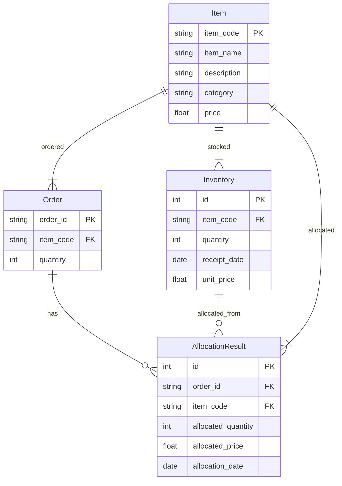

## 詳細設計書 - 在庫引当機能

### 1. 概要
   本詳細設計書は、在庫管理システムの在庫引当機能を提供するWebAPIアプリケーションの設計について記述したものです。
   プログラム仕様書に基づいて、各モジュールの詳細な設計を行います。

### 2. 前提条件
    2.1. 開発環境
        - Python 3.9以上
        - FastAPI 0.68.0以上
        - SQLAlchemy 1.4.0以上
        - PostgreSQL 13以上
    2.2. 運用環境
        - AWS Lambda
        - Amazon RDS（PostgreSQL）
    2.3. 外部システム
        - 在庫管理システムのフロントエンドアプリケーション
        - 在庫データを提供する外部システム（例：倉庫管理システム）

### 3. モジュール詳細設計
    3.1. main.py
        - FastAPIを使用してWebAPIのエンドポイントを定義する
        - 各エンドポイントのリクエストハンドラを実装する
        - リクエストデータの検証を行う
        - 必要に応じて他のモジュールの関数を呼び出す
        - レスポンスデータを生成してクライアントに返却する
    3.2. allocation.py
        - 在庫引当ロジックを実装する
        - 引当方法（FIFO、LIFO、平均法、個別法、総平均法、移動平均法）に基づいて在庫の引当を行う
        - 引当結果を生成し、データベースに保存する
        - 引当結果をmain.pyに返却する
    3.3. models.py
        - SQLAlchemyを使用してデータベースのテーブルに対応するデータモデルを定義する
        - Orderモデル：受注データを表すモデル
        - Inventoryモデル：在庫データを表すモデル
        - AllocationResultモデル：引当結果を表すモデル
        - Itemモデル：商品マスタを表すモデル
        - 各モデルの属性とリレーションシップを定義する
    3.4. database.py
        - SQLAlchemyを使用してデータベース接続を確立する
        - セッションの作成と管理を行う
        - データベースとのやり取りに必要な関数を提供する
    3.5. schemas.py
        - Pydanticを使用してAPIのリクエストとレスポンスのデータ構造を定義する
        - 受注データ、在庫データ、引当結果、商品マスタなどのスキーマを定義する
        - データの検証とシリアライズ/デシリアライズを行う

### 4. API詳細設計
    4.1. POST /orders
        - 受注データを登録するエンドポイント
        - リクエストボディ：OrderSchema
        - レスポンス：登録された受注データ（OrderSchema）
    4.2. GET /orders
        - 受注データを取得するエンドポイント
        - クエリパラメータ：limit（取得件数）、offset（オフセット）
        - レスポンス：受注データのリスト（List[OrderSchema]）
    4.3. POST /inventories
        - 在庫データを登録するエンドポイント
        - リクエストボディ：InventorySchema
        - レスポンス：登録された在庫データ（InventorySchema）
    4.4. GET /inventories
        - 在庫データを取得するエンドポイント
        - クエリパラメータ：item_code（商品コード）、limit（取得件数）、offset（オフセット）
        - レスポンス：在庫データのリスト（List[InventorySchema]）
    4.5. POST /allocate
        - 在庫引当処理を実行するエンドポイント
        - リクエストボディ：AllocationSchema
        - レスポンス：引当結果（AllocationResultSchema）
    4.6. GET /allocation-results
        - 引当結果を取得するエンドポイント
        - クエリパラメータ：order_id（受注ID）、item_code（商品コード）、limit（取得件数）、offset（オフセット）
        - レスポンス：引当結果のリスト（List[AllocationResultSchema]）
    4.7. POST /items
        - 商品マスタを登録するエンドポイント
        - リクエストボディ：ItemSchema
        - レスポンス：登録された商品マスタ（ItemSchema）
    4.8. GET /items
        - 商品マスタを取得するエンドポイント
        - クエリパラメータ：item_code（商品コード）、limit（取得件数）、offset（オフセット）
        - レスポンス：商品マスタのリスト（List[ItemSchema]）

### 5. データベース設計
5.1. ER図

     5.2. テーブル定義
        - ordersテーブル
          - order_id（主キー）：str
          - item_code（外部キー）：str
          - quantity：int
        - inventoriesテーブル
          - id（主キー）：int
          - item_code（外部キー）：str
          - quantity：int
          - receipt_date：date
          - unit_price：float
        - allocation_resultsテーブル
          - id（主キー）：int
          - order_id（外部キー）：str
          - item_code（外部キー）：str
          - allocated_quantity：int
          - allocated_price：float
          - allocation_date：date
        - itemsテーブル
          - item_code（主キー）：str
          - item_name：str
          - description：str
          - category：str
          - price：float

### 7. UI設計
     7.1. 技術スタック
         - React（フロントエンドライブラリ）
         - TypeScript（静的型付けを提供するJavaScriptスーパーセット）
         - React Router（クライアントサイドルーティング）
         - Axios（HTTPクライアント）
         - Material-UI（UIコンポーネントライブラリ）
         - Formik（フォーム管理ライブラリ）
         - Yup（フォームバリデーションライブラリ）
     7.2. コンポーネント構成
         - App.tsx
           - アプリケーションのルートコンポーネント
           - React Routerを使用してルーティングを定義する
         - Layout.tsx
           - 共通のレイアウトを提供するコンポーネント
           - ヘッダー、フッター、ナビゲーションを含む
         - OrderList.tsx
           - 受注一覧を表示するコンポーネント
           - APIから受注データを取得し、一覧表示する
           - 検索、ページネーション、ソートの機能を提供する
         - OrderForm.tsx
           - 受注登録フォームを表示するコンポーネント
           - Formikを使用してフォームの状態を管理する
           - Yupを使用してフォームのバリデーションを行う
         - InventoryList.tsx
           - 在庫一覧を表示するコンポーネント
           - APIから在庫データを取得し、一覧表示する
           - 検索、ページネーション、ソートの機能を提供する
         - InventoryForm.tsx
           - 在庫登録フォームを表示するコンポーネント
           - Formikを使用してフォームの状態を管理する
           - Yupを使用してフォームのバリデーションを行う
         - AllocationResult.tsx
           - 引当結果を表示するコンポーネント
           - APIから引当結果データを取得し、表示する
         - ItemList.tsx
           - 商品マスタ一覧を表示するコンポーネント
           - APIから商品マスタデータを取得し、一覧表示する
           - 検索、ページネーション、ソートの機能を提供する
         - ItemForm.tsx
           - 商品マスタ登録フォームを表示するコンポーネント
           - Formikを使用してフォームの状態を管理する
           - Yupを使用してフォームのバリデーションを行う
     7.3. 状態管理
         - React Contextを使用して、アプリケーション全体で共有する状態を管理する
         - ログイン状態、ユーザー情報、通知メッセージなどを管理する
     7.4. ルーティング
         - React Routerを使用して、クライアントサイドルーティングを実装する
         - 以下のルートを定義する
           - /orders：受注一覧ページ
           - /orders/new：受注登録ページ
           - /inventories：在庫一覧ページ
           - /inventories/new：在庫登録ページ
           - /allocation-results：引当結果ページ
           - /items：商品マスタ一覧ページ
           - /items/new：商品マスタ登録ページ
     7.5. API通信
         - Axiosを使用して、バックエンドAPIとの通信を行う
         - APIのエンドポイントに対応するメソッドを定義する
         - 受注データ、在庫データ、引当結果、商品マスタデータの取得と登録を行う
     7.6. エラーハンドリング
         - APIとの通信エラーをキャッチし、適切なエラーメッセージを表示する
         - フォームのバリデーションエラーを表示する
         - 認証エラー、権限エラーなどのエラーを適切に処理する
     7.7. UIデザイン
         - Material-UIを使用して、一貫性のあるUIデザインを実装する
         - レスポンシブデザインを適用し、モバイルデバイスにも対応する
         - ユーザーエクスペリエンスを考慮し、わかりやすいナビゲーションとフィードバックを提供する

### 8. エラーハンドリング
   - 各エンドポイントでは、適切なエラーハンドリングを行う
   - リクエストデータの検証エラー（HTTPステータスコード400）
   - 認証エラー（HTTPステータスコード401）
   - 権限エラー（HTTPステータスコード403）
   - リソースが見つからない場合（HTTPステータスコード404）
   - サーバーエラー（HTTPステータスコード500）
   - エラーレスポンスには、エラーメッセージとエラーコードを含める

### 9. ロギング
   - 各モジュールでは、適切なロギングを行う
   - ログレベル（DEBUG、INFO、WARNING、ERROR）に応じてログ出力を行う
   - ログには、タイムスタンプ、ログレベル、モジュール名、関数名、メッセージを含める
   - ログ出力先は、コンソール、ファイル、またはログ管理サービスを使用する

### 10. テスト
   - 各モジュールに対応するテストモジュールを作成する
   - ユニットテスト：各関数の機能を独立してテストする
   - 統合テスト：複数のモジュールを組み合わせてテストする
   - テストデータを準備し、期待される結果と実際の結果を比較する
   - テストカバレッジを計測し、一定以上のカバレッジを確保する

### 11. デプロイ
   - AWS Lambdaを使用してアプリケーションをデプロイする
   - Dockerを使用してアプリケーションをパッケージ化する
   - AWS APIGatewayを使用してエンドポイントを公開する
   - AWS RDSを使用してPostgreSQLデータベースをセットアップする
   - 必要な環境変数を設定する（データベース接続情報など）

### 12. 今後の拡張性
   - 新しい引当方法を追加する際は、allocation.pyモジュールに新しい関数を追加する
   - レポート機能を追加する際は、新しいエンドポイントとモジュールを追加する
   - 在庫補充機能を追加する際は、新しいエンドポイントとモジュールを追加する
   - 権限管理を導入する際は、認証・認可のミドルウェアを追加し、エンドポイントに適用する

以上が、在庫管理システムの在庫引当機能を提供するWebAPIアプリケーションの詳細設計書です。
この設計書に基づいて、アプリケーションの実装を進めていきます。
また、テストとデプロイのプロセスを適切に実施し、品質と信頼性を確保していきます。
