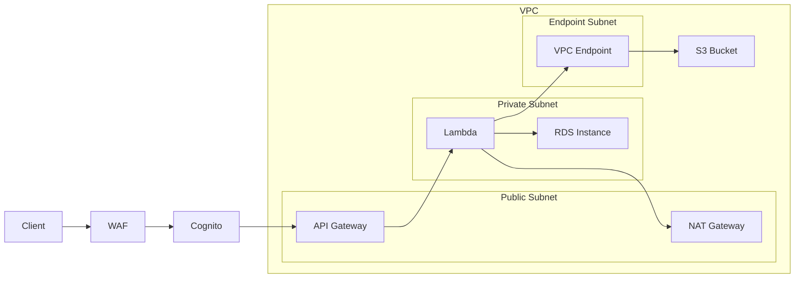
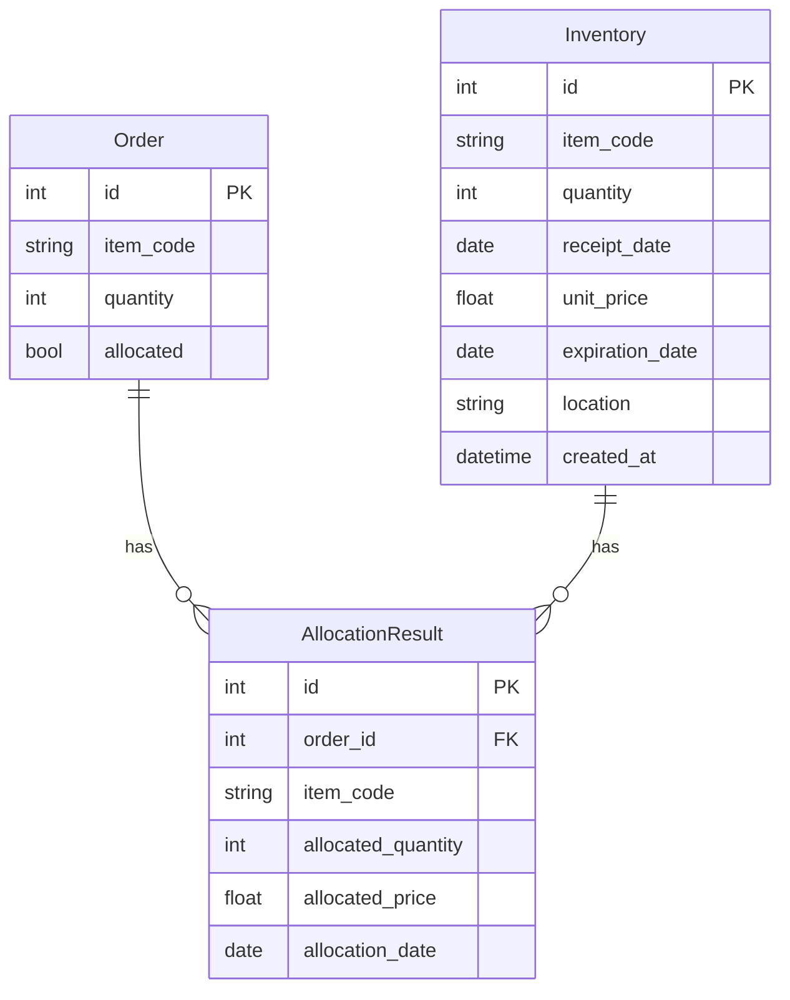
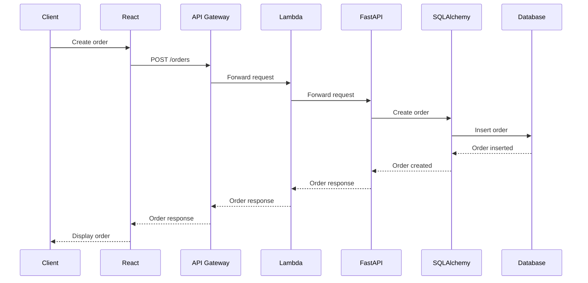
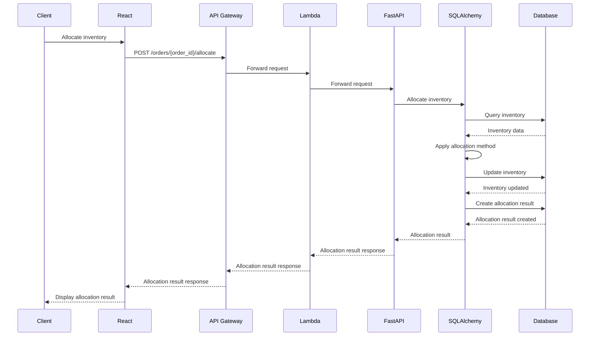
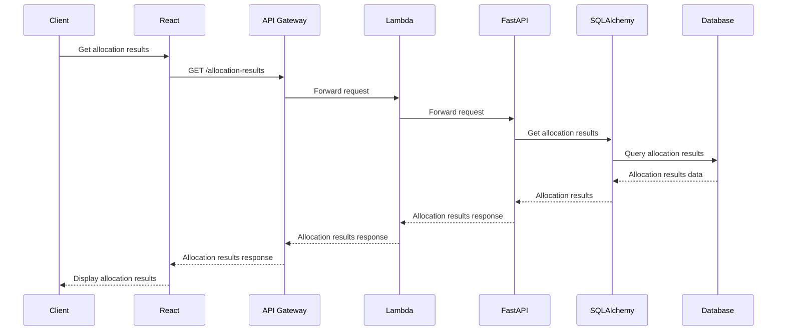

Note）本設計書及びプログラムの最新版はGitHubの[Rayoo-Nakano/InventoryAllocation](https://github.com/Rayoo-Nakano/InventoryAllocation "Rayoo-Nakano/InventoryAllocation")に常時更新しています。


# 在庫管理システム基本設計書

## 1. 概要
本設計書は、在庫管理システムの基本設計について説明する。システムはFastAPIを用いて実装され、注文の作成、在庫の管理、在庫の割り当てなどの機能を提供する。UIにはReactを採用し、API Gatewayを介して認証を行う。バックエンドの処理にはAWS Lambdaを使用し、スケーラビリティと柔軟性を確保する。

## 2. 前提条件
- システムはクラウド環境（AWS）で運用される
- 認証にはAmazon CognitoとAPI Gatewayを使用する
- データベースにはAmazon RDSを使用し、Private Subnetに配置する
- 注文と在庫の情報は、外部システムとのAPI連携により取得される
- 在庫割り当ては、先入先出法（FIFO）に基づいて行われる
- 在庫の補充は、外部システムからの入荷情報に基づいて行われる
- インフラストラクチャのプロビジョニングにはIaCを採用し、AWS CloudFormationを使用してコード化する
- システムの開発にはCI/CDパイプラインを構築し、自動化されたビルド、テスト、デプロイメントを行うことで生産性を向上させる

## 3. システム構成
- React: UIの構築に使用するJavaScriptライブラリ
- FastAPI: Pythonの高速なWebフレームワーク
- AWS Lambda: サーバーレスコンピューティングサービス
- SQLAlchemy: PythonのORMライブラリ
- JWT: 認証にはJSON Web Tokenを使用
- Amazon Cognito: 認証プロバイダ
- Amazon API Gateway: APIの管理とセキュリティの提供
- Amazon RDS: リレーショナルデータベースサービス
- AWS CloudFormation: インフラストラクチャのコード化とプロビジョニング
- AWS CodePipeline: CI/CDパイプラインの構築

### 3.1 システムアーキテクチャ
```mermaid
graph LR
graph LR
    A[Client] --> B[React]
    B --> C[API Gateway]
    C --> D[Lambda]
    D --> E[FastAPI]
    E --> F[SQLAlchemy]
    F --> G[Amazon RDS]
    C --> H[Amazon Cognito]
    I[AWS CloudFormation] --> J[Infrastructure]
    K[AWS CodePipeline] --> L[Build/Test/Deployment]
```

このシステムアーキテクチャ図は、在庫管理システムの主要なコンポーネントとその関係を示しています。クライアントはReactを使用してUIを構築し、API GatewayとAmazon Cognitoを介してLambdaにアクセスします。LambdaはFastAPIを呼び出し、FastAPIはSQLAlchemyを使用してAmazon RDSとやり取りします。AWS CloudFormationを使用してインフラストラクチャをコード化し、AWS CodePipelineを使用してCI/CDパイプラインを構築します。

### 3.2 VPC構成



在庫管理システムは、以下のVPC構成を採用します。

- VPC外:
  - クライアント、WAF、およびCognitoを配置し、インターネットからアクセス可能な層を形成する
- Public Subnet:
  - API GatewayとNAT Gatewayを配置する
- Private Subnet:
  - Lambdaをデプロイし、NAT Gateway経由でインターネットにアクセスする
  - RDSインスタンスを配置し、データベースを保護する
- Endpoint Subnet:
  - VPC EndpointとしてS3エンドポイントを配置し、LambdaがS3バケットにアクセスできるようにする

注）Lambdaは直接Privateサブネットにデプロイすることはできません。ただし、VPC内のPrivateサブネットにLambda関数をデプロイし、NAT Gateway経由でインターネットにアクセスすることで、実質的にPrivateサブネットで動作させることが可能です。

## 4. 機能一覧
| 機能 | 説明 |
|------|------|
| 注文の作成 | 外部システムから受け取った注文情報を登録する |
| 在庫の管理 | 外部システムから受け取った入荷情報に基づいて在庫を更新する |
| 在庫の割り当て | 注文に対して、指定された引当方法に基づいて在庫を割り当てる |
| 割り当て結果の取得 | 在庫割り当ての結果を取得する |
| 在庫引当方法の選択 | 以下の6種類の在庫引当方法から選択する |
| - 先入先出法（FIFO） | 最も古い在庫から順に割り当てる |
| - 後入先出法（LIFO） | 最も新しい在庫から順に割り当てる |
| - 単価の安い在庫から引当 | 単価の安い在庫から優先的に割り当てる |
| - 単価の高い在庫から引当 | 単価の高い在庫から優先的に割り当てる |
| - 賞味期限の近い在庫から引当 | 賞味期限が近い在庫から優先的に割り当てる |
| - ロケーション優先引当 | 指定されたロケーションの在庫から優先的に割り当てる |

## 5. データベース設計
### 5.1 ERD


### 5.2 テーブル定義
#### Orderテーブル
| カラム名 | データ型 | 説明 |
|----------|----------|------|
| id | int | 注文ID（プライマリキー） |
| item_code | string | 商品コード |
| quantity | int | 数量 |
| allocated | bool | 割当済みフラグ |

#### Inventoryテーブル
| カラム名 | データ型 | 説明 |
|-----------|-----------|------|
| id | int | 在庫ID（プライマリキー） |
| item_code | string | 商品コード |
| quantity | int | 数量 |
| receipt_date | date | 入荷日 |
| unit_price | float | 単価 |
| expiration_date | date | 賞味期限 |
| location | string | ロケーション |
| created_at | datetime | 作成日時 |

#### AllocationResultテーブル
| カラム名 | データ型 | 説明 |
|---------------|-----------|------|
| id | int | 割当結果ID（プライマリキー） |
| order_id | int | 注文ID（外部キー） |
| item_code | string | 商品コード |
| allocated_quantity | int | 割当数量 |
| allocated_price | float | 割当価格 |
| allocation_date | date | 割当日 |

## 6. API設計
### 6.1 エンドポイント一覧
| エンドポイント | メソッド | 説明 |
|----------------|----------|------|
| /orders | POST | 注文の作成 |
| /orders | GET | 注文の取得 |
| /inventories | POST | 在庫の作成 |
| /inventories | GET | 在庫の取得 |
| /orders/{order_id}/allocate | POST | 在庫の割り当て |
| /allocation-results | GET | 割り当て結果の取得 |

### 6.2 リクエスト/レスポンス例
#### 注文の作成
- リクエスト
  ```json
  {
    "item_code": "ABC123",
    "quantity": 10
  }
  ```
- レスポンス
  ```json
  {
    "order_id": 1,
    "item_code": "ABC123",
    "quantity": 10,
    "allocated": false
  }
  ```

#### 在庫の作成
- リクエスト
  ```json
  {
    "item_code": "ABC123",
    "quantity": 100,
    "receipt_date": "2023-06-01",
    "unit_price": 9.99
  }
  ```
- レスポンス
  ```json
  {
    "id": 1,
    "item_code": "ABC123",
    "quantity": 100,
    "receipt_date": "2023-06-01",
    "unit_price": 9.99,
    "created_at": "2023-06-01T10:00:00Z"
  }
  ```

#### 在庫の割り当て
- リクエスト
  ```json
  {
    "order_id": 1,
    "item_code": "ABC123",
    "quantity": 5,
    "allocation_date": "2023-06-02"
  }
  ```
- レスポンス
  ```json
  {
    "id": 1,
    "order_id": 1,
    "item_code": "ABC123",
    "allocated_quantity": 5,
    "allocated_price": 49.95,
    "allocation_date": "2023-06-02"
  }
  ```


### 6.3 シーケンス図
#### 注文の作成


#### 在庫の割り当て


#### 割り当て結果の取得


以上が、在庫管理システムの基本設計書のAPI設計セクションに含まれるシーケンス図です。これらのシーケンス図は、注文の作成、在庫の割り当て、および割り当て結果の取得の各プロセスにおけるコンポーネント間の相互作用を示しています。

## 7. 非機能要件
### 7.1 セキュリティ
- 認証にはAmazon CognitoとAPI Gatewayを使用し、JWTトークンによるアクセス制御を行う
- VPCを使用し、APIサーバーをPublic Subnet、データベースをPrivate Subnetに配置することで、セキュリティを向上させる

### 7.2 パフォーマンス
- FastAPIを使用することで、高速なレスポンスを実現する
- システムは、1日あたり1,000件以上の注文を処理できる必要がある
- システムは、99.9%以上の可用性を維持する必要がある
- システムは、ピーク時でも3秒以内にレスポンスを返す必要がある

### 7.3 拡張性
- SQLAlchemyを使用することで、データベースの変更に柔軟に対応できる
- AWS Lambdaを使用することで、スケーラビリティと柔軟性を確保する

### 7.4 ログ出力
- 開発・運用の目的で、システムの動作状況や例外情報をログに出力する
- ログレベルを適切に設定し、必要な情報を出力する
- ログ出力先はファイルまたはログ管理システムとする

### 7.5 自動化
- インフラストラクチャのプロビジョニングにはAWS CloudFormationを使用し、コード化することで環境の再現性を確保する
- CI/CDパイプラインを構築し、自動化されたビルド、テスト、デプロイメントを行うことで、開発の効率化と品質の向上を図る

### 7.6 データ保護
- システムは、個人情報を含む機密データを安全に保護する必要がある

### 7.7 監査証跡
- システムは、監査証跡を提供し、トレーサビリティを確保する必要がある

## 8. 今後の課題
- 在庫割り当ての最適化
- 在庫の自動補充機能の実装
- 注文のキャンセル機能の追加
- 外部システムとのAPI連携の拡張
- モニタリングとアラート機能の追加
- UIのユーザビリティの向上
- モバイルアプリの開発
- 国際化対応
- パフォーマンスチューニング
- セキュリティ監査の実施
- 在庫補充プロセスの自動化
- 在庫最適化アルゴリズムの導入
- 異常検知とアラート機能の実装
- パフォーマンスとスケーラビリティのテストと最適化

## 9. 参考資料
- React公式ドキュメント: https://react.dev/
- FastAPI公式ドキュメント: https://fastapi.tiangolo.com/
- SQLAlchemy公式ドキュメント: https://docs.sqlalchemy.org/
- Amazon Cognito公式ドキュメント: https://aws.amazon.com/jp/cognito/
- Amazon API Gateway公式ドキュメント: https://aws.amazon.com/jp/api-gateway/
- AWS CloudFormation公式ドキュメント: https://aws.amazon.com/jp/cloudformation/
- AWS CodePipeline公式ドキュメント: https://aws.amazon.com/jp/codepipeline/

## 10. 変更履歴
| バージョン | 日付 | 変更内容 |
|------------|------|----------|
| 1.0 | 2023-06-01 | 初版作成 |
| 1.1 | 2023-06-02 | UIにReactを採用、API Gatewayによる認証を追加 |
| 1.2 | 2023-06-02 | VPC構成を追加、RDSをPrivate Subnetに配置 |
| 1.3 | 2023-06-03 | 非機能要件を更新、今後の課題を追加 |

以上が、在庫管理システムの基本設計書の最新版です。非機能要件を更新し、セキュリティ、パフォーマンス、拡張性、ログ出力、自動化、データ保護、監査証跡の各項目を詳細化しました。また、今後の課題に新たな項目を追加し、システムの継続的な改善と拡張に向けた計画を示しました。

今後は、この設計書に基づいてシステムの実装を進めていきます。実装の過程で新たな課題や改善点が見つかった場合は、適宜設計書をアップデートしていきます。